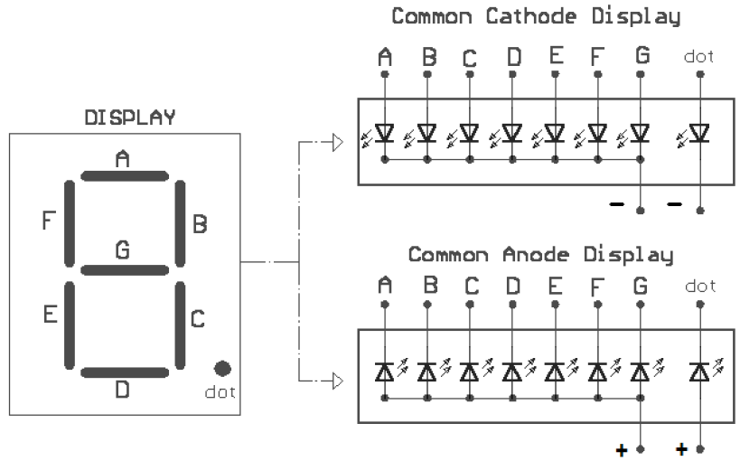

---
mathjax:
  presets: '\def\lr#1#2#3{\left#1#2\right#3}'
---

# Zeven Segment Display

Een 7-segmentdisplay zijn 7 of meer rechthoekige leds die kunnen gebruikt worden om cijfers en alfanumerieke tekens op een scherm te vormen zoals in de figuur, zoals bijvoorbeeld het beeldscherm van een klokradio.

<!---

--->

> #### Er bestaan twee types 7-segmentdisplays die voorgesteld zijn in de volgende figuur, namelijk:!
>
> - Die met gemeenschappelijke anode (Common Anode CA).
> - Die met gemeenschappelijke kathode (Common Cathode CC).
>
>  Door het *type-nummer* van het betreffende device op te zoeken kan je weten over welk type het gaat.

Bij een display van het CA-type zijn alle anodes van de 8 leds met elkaar en met de + van de voeding verbonden. Als er op één van de kathodes van de leds een lage spanning (ongeveer 0V of een logische 0) staat, dan zal deze LED oplichten.

Bij een display van het CC-type zijn de kathodes van de 8 leds met elkaar verbonden en aangesloten op de massa van de voeding. Als er op het display een LED moet oplichten, dan moet er op zijn anode een positieve spanning aangesloten worden (meestal de voedingsspanning of een logisch 1).

Op deze displays kunnen verschillende tekens zichtbaar gemaakt worden door de gepaste leds te laten oplichten.

In de volgende tabel staat de code om het getal 0 op een 7-segmentsdisplay van het CC-type te vormen. Kunnen jullie de andere codes in de tabel aanvullen?

