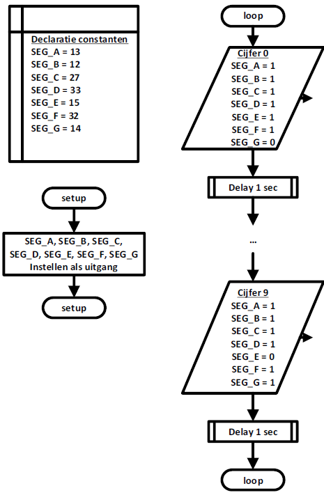

# Flowchart

Het programma laat een 7-segment display optellen van 0 naar 9. Tussen ieder cijfer is er een delay van één seconde. De voorgaande cyclus wordt in een oneindige lus herhaald.

In de volgende figuur is de flowchart weergegeven. In het begin gebeurt de declaratie van de uitgangen waarbij er bij de pinnen een duidelijke naam wordt gegeven. Alle pinnen zijn digitale uitgangen. Het cijfer 9 en 0 is weergegeven in de flowchart. De overige cijfers moeten jullie aanvullen.

