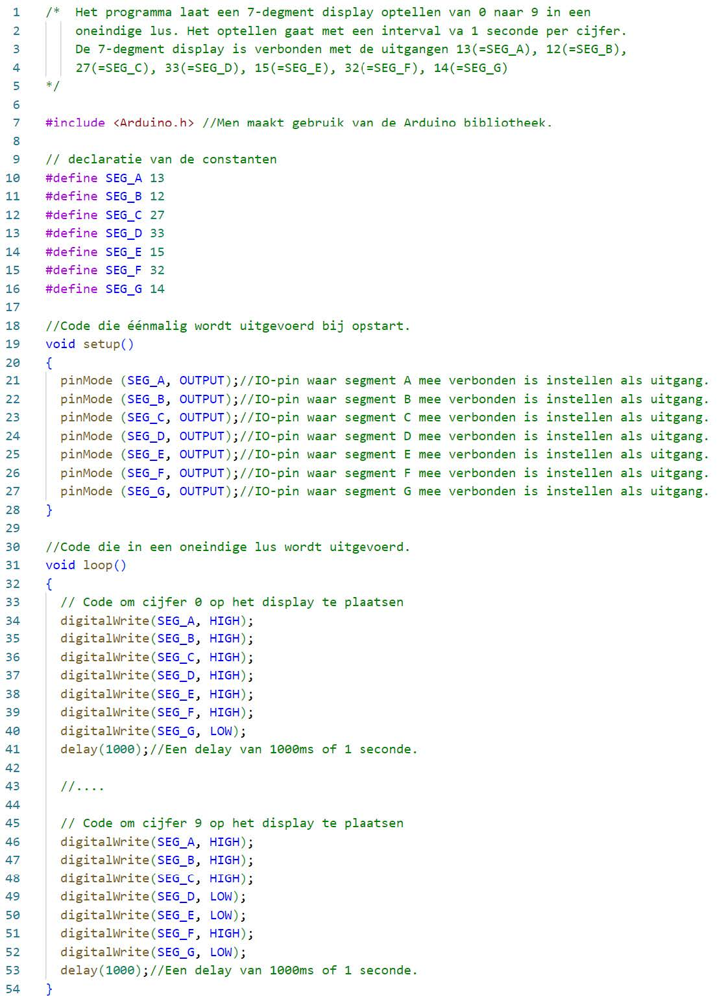

# Software

Een deel van het programma om de 7-segment display op te laten tellen is afgebeeld in de volgende figuur. Enkel het eerste cijfer 0 en het laatste cijfer 9 staat in het programma. De cijfers 1, 2, 3, 4, 5, 6, 7 en 8 moeten jullie zelf nog aanvullen.

# Opdracht

Opdracht: Een 7-segment display laten optellen:
<ul style="color: white;">
<li>Schrijf een programma die een 7-segment display laat optellen van 0 naar 9. Tussen ieder cijfer plaats je een delay van 1 seconde. Herhaal de voorgaande cyclus in een oneindige lus.</li>
<li>Maak gebruik van de ESP32 feather van Adafruit, een 7-segment display (SC56-11EWA), een breadbord, voorschakelweerstanden en de nodige verbindingsdraden.</li>
<li>Teken eerst het schema in Visio</li>
<li>Bouw vervolgens de schakeling</li>
<li>Programmeer het programma en test het</li>
<li>Toon de werking aan de docent</li>
</ul>

