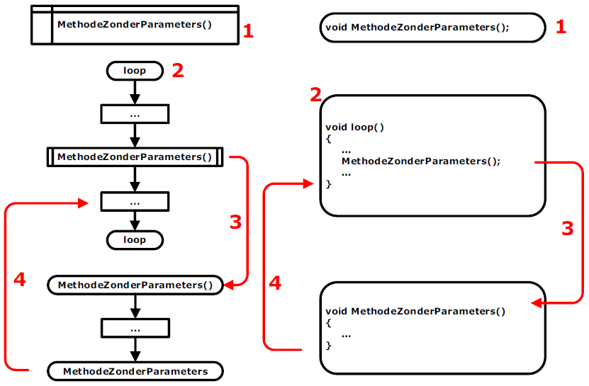
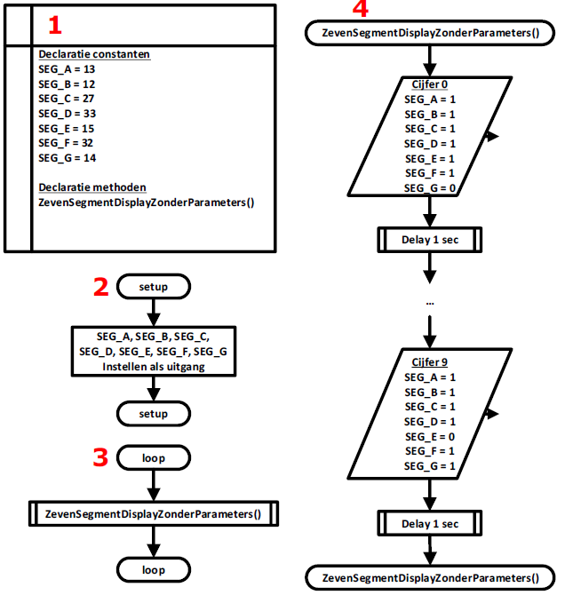
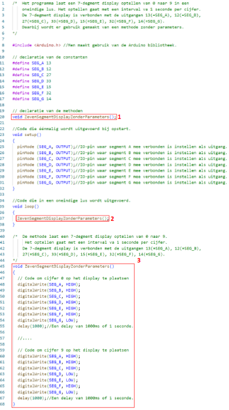

---
mathjax:
  presets: '\def\lr#1#2#3{\left#1#2\right#3}'
---

# Methoden

Methoden worden voornamelijk gebruikt als je in een programma steeds dezelfde stukken C-code herhaalt, om complexe code te vereenvoudigen of als je stukken van je programma wil opdelen in verschillende onderdelen.
Met een goede kennis en verstandig gebruik van functies kan je programma’s sneller en leesbaarder maken en dat maakt van je een goede programmeur.

:::warning
Het dient hier heel duidelijk vermeld te worden dat ieder eigen geschreven methode in C++, afzonderljk moet gedeclareerd worden. Dit wordt als volgt gedaan.
:::

```cpp
#include <Arduino.h>
void EigenMethode(); //declacratie van de eigen methode

void setup()
{
  ...;
}
void loop()
{
  ...;
}
void EigenMethode() //eigen methode
{
  ...;
}
```


Methoden kan men indelen in drie groepen, namelijk:
- Een methode zonder parameters;
- Een methode die iets uitvoert afhankelijk van één of meerdere variabelen die wordt meegegeven aan die methode;
- Een functiemethode die iets uitvoert afhankelijk van een meegegeven variabele maar die ook een resultaat teruggeeft.

# Methode zonder parameters.

In de volgende figuur is de werking uitgelegd van een methode zonder parameters. Links van de figuur is de werking aan de hand van een flowchart uitgelegd en rechts de werking met de code in C.




Voor het setup of loop methoden moeten in C, de methode gedeclareerd worden (1). Dit is eigenlijk de eerste regel van de methode gevolgd door een puntkomma. We zien dat in de C-code het eerste woordje void is. Void betekent leeg en wil zeggen dat die functie niets teruggeeft. Tussen de haakjes ‘()’ staat er niets geschreven. Dit wil zeggen dat er geen parameters meegegeven worden aan de methode.

Het tweede grote deel is de loop-methode (2). Dit is waar de werking van het hoofdprogramma begint waar er allerlei bewerkingen worden uitgevoerd. In het hoofdprogramma wordt de methode ‘MethodeZonderParameters’ aangeroepen. Het aanroepen gebeurt in een rechthoek met voor- en achteraan nog twee extra verticale lijnen. Bij de aanroep wordt er gesprongen naar de methode en wordt deze uitgevoerd (3).

De methode zal allerlei code uitvoeren. Als het einde van de methode bereikt is zal er teruggegaan worden naar de regel code, net na de aanroep van de methode (4). De code in het hoofdprogramma zal verder worden uitgevoerd.

## Voorbeeldprogramma methode zonder parameters

In deze paragraaf zal er een voorbeeldprogramma besproken worden dat gebruik maakt van een functie zonder parameters. Het programma laat een 7-segment display optellen van 0 naar 9. Tussen ieder cijfer is er een delay van één seconde. De voorgaande cyclus wordt in een oneindige lus herhaald. Het programma is hetzelfde programma met dit verschil dat het aansturen van het 7-segment display gebeurt door gebruik te maken van een methode zonder parameters.

### Flowchart

De flowchart bestaat uit 4 delen. In het eerste deel worden alle declaraties gedaan (1). Daar gebeurt de declaratie van de methoden en van de uitgangen die de 7-segment display aansturen. Het tweede deel is de setup-methode waar alle uitgangen ingesteld worden die het 7-segment display aansturen (2). Het derde deel is de loop-methode waar de methode ‘ZevenSegmentDisplayZonderParameters’ in een oneindige lus wordt aangeroepen (3). Het laatste deel is de methode waar de code om het 7-segment display wordt uitgevoerd (4).



### Programma



Het programma is afgebeeld in Figuur 13. Bij (1) is de declaratie van de methode gedaan. In punt (2) wordt de methode aangeroepen en in (3) staat de eigenlijke code van de methode.


<div style="background-color:darkgreen; text-align:left; vertical-align:left; padding:15px;">
<p style="color:lightgreen; margin:10px">
Opdracht: 7-segment display aansturen met een methode zonder parameters
<ul style="color: white;">
<li>Schrijf een programma (met een methode) die een 7-segment display laat optellen van 0 naar 9. Tussen ieder cijfer plaats je een delay van 1 seconde. Herhaal de voorgaande cyclus in een oneindige lus.</li>
<li>Maak gebruik van de ESP32 feather van Adafruit, een 7-segment display (SC56-11EWA), een breadbord, voorschakelweerstanden en de nodige verbindingsdraden.</li>
<li>Teken eerst het schema in Visio</li>
<li>Bouw vervolgens de schakeling</li>
<li>Programmeer het programma en test het</li>
<li>Toon de werking aan de docent</li>
</ul>
</p>
</div>


