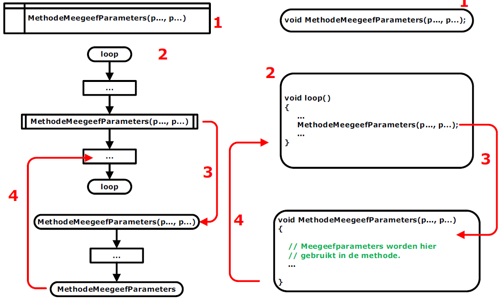
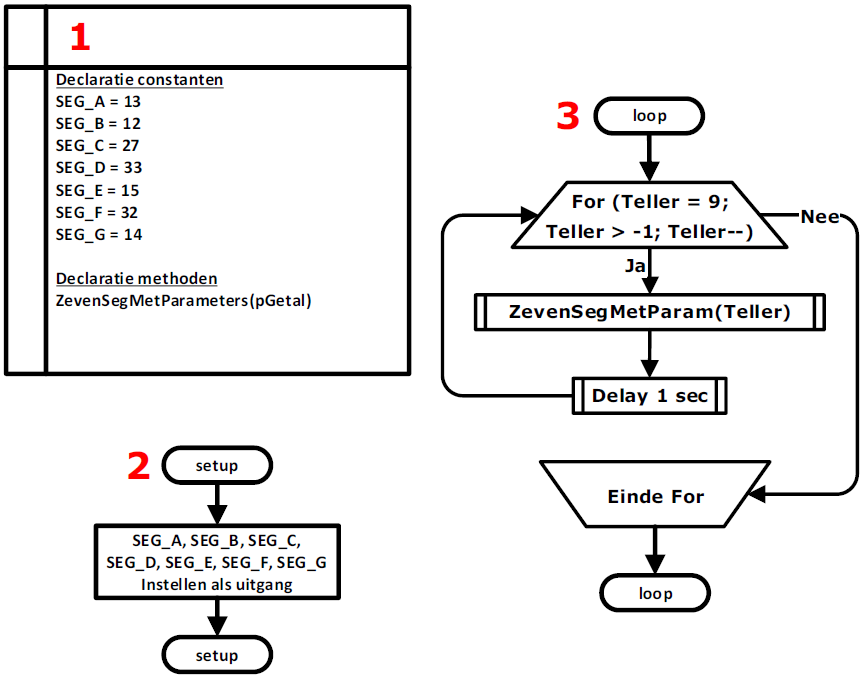
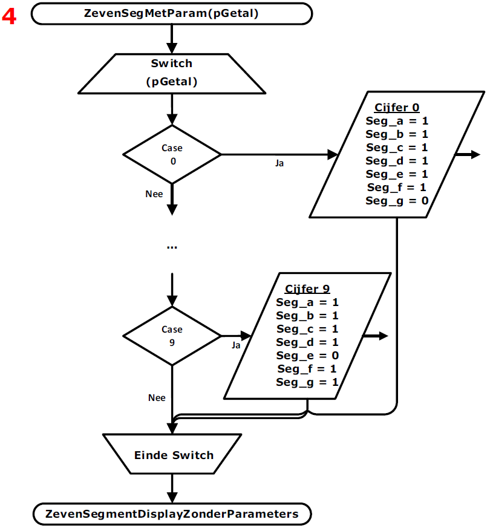
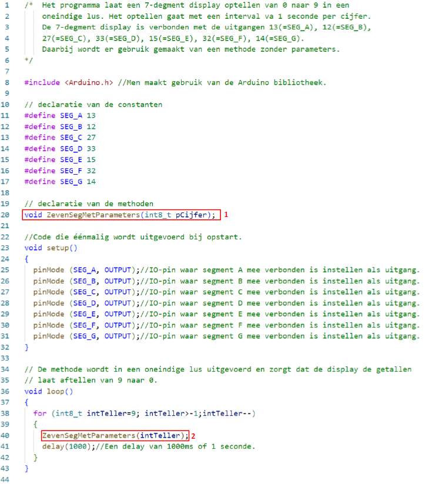

---
mathjax:
  presets: '\def\lr#1#2#3{\left#1#2\right#3}'
---

# Methode met meegeefparameters.

In de volgende figuur is de werking uitgelegd van een methode met parameters. Links van de figuur is de werking aan de hand van een flowchart uitgelegd en rechts de werking met de code in C.

Voor de methoden moeten in C de functies gedeclareerd worden (1). We zien dat in de C-code het eerste woordje void is. Void betekent leeg en wil zeggen dat die methode niets teruggeeft. Tussen de haakjes ‘()’ staan er twee parameters. Dit wil zeggen dat er twee parameters worden meegegeven aan die methode die in de methode gebruikt worden. Dit kan ook één parameter of meer dan twee parameters zijn.

Het tweede grote deel is de loop-routine (2). Dit is waar er allerlei bewerkingen worden uitgevoerd. In de loop-methode wordt de methode ‘MethodeMeegeefParameters’ aangeroepen. Het aanroepen gebeurt in een rechthoek met voor- en achteraan nog twee extra verticale lijnen. Bij de aanroep worden de parameters meegegeven. Bij de aanroep wordt er gesprongen naar de methode en wordt deze uitgevoerd (3).

De methode zal allerlei code uitvoeren en zal in de verwerking de meegegeven parameters gebruiken. Als het einde van de methode bereikt is, zal er teruggegaan worden naar de regel code net na de aanroep van de methode (4). De code in de loop-methode zal verder worden uitgevoerd.

## Voorbeeldprogramma methode zonder parameters

In deze paragraaf zal er een voorbeeldprogramma besproken worden dat gebruik maakt van een
methode met meegeefparameters.
Het programma laat een 7-segment display aftellen van 9 naar 0. Tussen ieder cijfer is er een delay van één seconde. De voorgaande cyclus wordt in een oneindige lus herhaald.

### Flowchart

De flowchart bestaat uit 4 delen die zijn weergegeven in de volgende figuren. In het eerste deel worden alle declaraties gedaan (1). Daar gebeurt de declaratie van de methode en van de uitgangen die de 7-segment display aansturen.

Het tweede deel is de setup-methode waar alle uitgangen ingesteld worden die het 7-segment display aansturen (2).

Het derde deel is de loop-methode waar de methode 'ZevenSegMetParam(pGetal)' in een For-lus wordt aangeroepen om zo de getallen 9 dalend naar 0 aan de methode mee te geven (3). Deze cyclus wordt voortdurend herhaald.

Het vierde deel is de methode zelf (4). In de methode wordt er gekeken welk getal er via de parameter wordt meegegeven en dit getal wordt op de display getoond.

### Programma

Het programma is hieronder afgebeeld. Bij (1) is de declaratie van de methode gedaan. In punt (2) wordt de methode aangeroepen waarbij dat er een parameter wordt meegegeven en in (3) staat de eigenlijke methode.

Opdracht: 7-segment display aansturen met een methode MET parameters
<ul style="color: white;">
<li>Schrijf een programma (met een methode die een parameter bezit om het getal mee te geven) die een 7-segment display laat aftellen van 9 naar 0. Tussen ieder cijfer plaats je een delay van 1 seconde. Herhaal de voorgaande cyclus in een oneindige lus.</li>
<li>Maak gebruik van de ESP32 feather van Adafruit, een 7-segment display (SC56-11EWA), een breadbord, voorschakelweerstanden en de nodige verbindingsdraden.</li>
<li>Teken eerst het schema in Visio</li>
<li>Bouw vervolgens de schakeling</li>
<li>Programmeer het programma en test het</li>
<li>Toon de werking aan de docent</li>
</ul>

