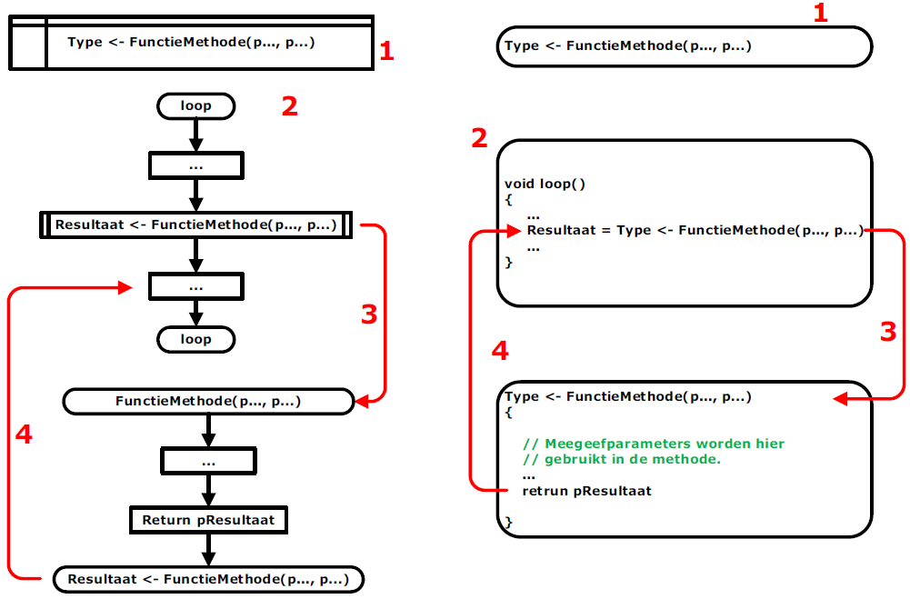

---
mathjax:
  presets: '\def\lr#1#2#3{\left#1#2\right#3}'
---

# Functie methode

In de volgende figuur is de werking uitgelegd van een functiemethode. Een functiemethode is een methode die een parameter teruggeeft. Links van de figuur is de werking aan de hand van een flowchart uitgelegd en rechts de werking met de code in C.

Voor de methoden moeten in C de functies gedeclareerd worden (1). We zien dat in de C-code het eerste woordje type is. Type wil zeggen dat je hier het type van de teruggeefparameter moet geven zoals een integer, een boolean, … . Tussen de haakjes ‘()’ staan er twee parameters. Dit wil zeggen dat er twee parameters worden meegegeven aan die methode die in de methode kunnen gebruikt worden. Dit kan ook één parameter of meer dan twee parameters zijn. Het is zelfs mogelijk om een functiemethode te maken waarbij er geen enkele parameter wordt meegegeven.

Het tweede grote deel is de routine waar de functiemethode wordt gebruikt (2). In de loop-methode wordt de methode ‘FunctieMethode’ aangeroepen. Het aanroepen gebeurt in een rechthoek met voor- en achteraan nog twee extra verticale lijnen. Bij de aanroep worden de parameters meegegeven. Bij de aanroep wordt er gesprongen naar de methode en wordt deze uitgevoerd (3).

De methode zal allerlei code uitvoeren en zal in de verwerking de meegegeven parameters gebruiken. Als het einde van de methode bereikt is zal de functie een parameter teruggeven (4). De code in de loop-methode zal de teruggeven parameter gebruiken bij de verdere verwerking.

