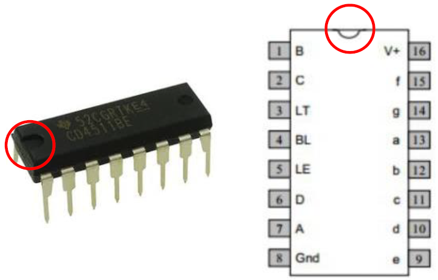

---
mathjax:
  presets: '\def\lr#1#2#3{\left#1#2\right#3}'
---

# CD4511BE

In vorige opdrachten werden de afzonderlijke LED's van het zevensegment display aangestuurd door afzonderlijke output pinnen van de microcontroller. Stel dat er meerdere dergelijke dsiplay's moeten worden aangestuurd (denk aan een klokje), dan zijn er al vlug pinnen tekort aan de microcontroller. Dit kan efficienter door gebruik te maken van een BCD naar 7-segment converter IC. 

Nu kan een 7-segment display aangestuurd worden met slechts 4 bits (= aantal output pinnen). Over die 4 bits wordt dan een BCD code verstuurd die aangeeft welk getal er moet worden gedisplayed. 

Een CD4511BE is een IC dat een BCD-waarde converteert naar de signalen voor een 7-segment display zoals weergegeven in de volgende figuur.

Bij de meeste IC’s is er een stip of een inkeping aangebracht zodat je vlug kan weten welke aansluiting pin 1 is. Plaats je de stip of inkeping (=zie rode cirkel in de figuur) naar boven, dan is de linkse bovenste aansluiting de aansluiting met nummer 1. De aansluitingen worden dan oplopend genummerd naar onderen. Bij de CD4511BE gaat dit tot pinnummer 8. De onderste rechtse pin is dan pin 9 en de pinnen worden naar boven toe oplopend verhoogd. Bij de CD4511BE is de bovenste rechter aansluiting pin 16.

Het intern schema van de CD4511BE is weergegeven in de volgende figuur.

Het voordeel om een CD4511BE te gebruiken is dat je maar 4 uitgangen van een microcontroller nodig hebt om een 7-segment display aan te sturen. Dit zijn 3 uitgangen minder dan in de voorgaande voorbeelden.

Nog een ander voordeel is dat het programma veel eenvoudiger wordt.

Een nadeel is dat de schakeling groter en duurder wordt (meer hardware).

Aan het intern schema van de volgende figuur is te zien is dat de BCD-ingangen A, B, C en D heten die aan de microcontroller verbonden moeten worden. De 7-segment uitgangen moeten aan het 7-segment display worden verbonden.

