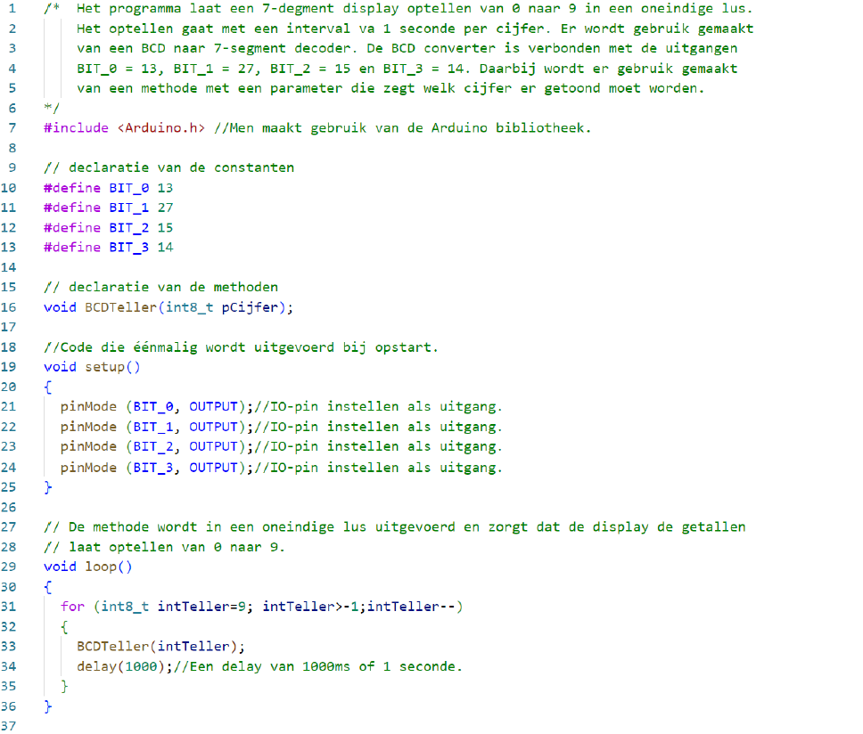

---
mathjax:
  presets: '\def\lr#1#2#3{\left#1#2\right#3}'
---

# Programma

Opdracht: 7-segment display aansturen met een BCD naar 7 segment converter.
<ul style="color: white;">
<li>Bouw het schema en laadt de code in de ESP32 feather van Adafruit (pas de functiemethode aan).</li>
<li>Maak gebruik van de ESP32 feather van Adafruit, een 7-segment display (SC56-11EWA), een breadbord, voorschakelweerstanden en de nodige verbindingsdraden.</li>
<li>Teken eerst het schema in Visio</li>
<li>Bouw vervolgens de schakeling</li>
<li>Programmeer het programma en test het</li>
<li>Toon de werking aan de docent</li>
<li>Bespreek de werking van harware en software in het verslag</li>
</ul>

