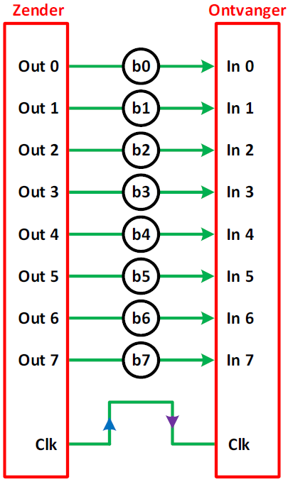
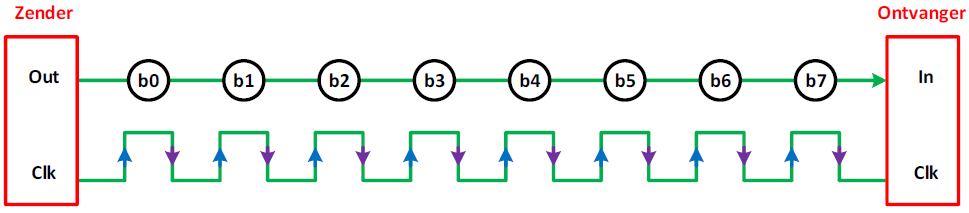

---
mathjax:
  presets: '\def\lr#1#2#3{\left#1#2\right#3}'
---

# Parallelle communicatie

In dit hoofdstuk wordt er uitgelegd hoe je digitale uitgangen kan bundelen tot een geheel om een toestel aan te sturen. Als voorbeeld wordt er een 2x16 LCD gebruikt.

Als opdracht wordt er verwacht dat je een lichtsensor maakt die de gemeten lichtsterkte op een LCD
toont.

## Parallel versus serieel

Parallelle interfaces verzenden meerdere bits op hetzelfde ogenblik. Ze maken meestal gebruik van meerdere datalijnen, dat soms een bus wordt genoemd. Zo kan een bus bijvoorbeeld 8 bits op hetzelfde ogenblik versturen door gebruik te maken van 8 datalijnen zoals in volgende figuur. Bij moderne computers worden er bussen gebruikt met 64 datalijnen. Data zal verstuurd worden met een hoge dichtheid van enen en nullen.

Conventionele PCI, parallel ATA en PCMCIA zijn voorbeelden van parallelle bussen.

Seriële interfaces laten hun data bit-na-bit stromen doorheen 1 verbindingslijn zoals in de volgende figuur.
Er wordt dus maar 1 bit terzelfdertijd verstuurd. Deze interfaces functioneren over 1 draad, meestal zijn er enkele meer (max 4).

Voorbeelden van seriële interfaces zijn Ethernet, FireWire, USB, I2C en SPI.

Als een datastroom zou vergeleken worden met een stroom van wagens, dan zou een 8-bit brede parallelle communicatie een 8 vakken brede autosnelweg zijn. Terwijl een seriële communicatie een gewone rijweg van 1 rijvak is. Binnen een bepaalde tijdspanne kan er gesteld worden dat de snelweg dus 8 keer meer wagens kan verplaatsen, dan de gewone rijweg. Dus parallelle communicatie is sneller dan seriële, maar een 8 vakken brede autosnelweg kost in opbouw veel meer dan een gewone rijweg. Dit is in de digitale wereld ook zo.

Parallelle communicatie bezit dus een aantal voordelen. Het is snel, rechtdoor, en relatief eenvoudig te implementeren. Maar er is nood aan een heleboel bedrading die zorgen voor meerdere input/output (I/O) lijnen. Dit is sterk afhankelijk van het type processor waar je mee werkt. Er kan zich een probleem voordoen wanneer er bij een bepaalde toepassing van processor wordt gewijzigd. Om die reden wordt er meestal gewerkt met seriële interfaces. De snelheid van vele seriële interfaces is gedurende verdere ontwikkeling steeds toegenomen.

De ontvanger weet aan de hand van het kloksignaal wanneer het begin en het einde is van een bepaalde bit. De zender genereert meestal ook het kloksignaal. De zender zal bijvoorbeeld op de stijgende flank (= blauwe pijl van vorige figuren) de waarde van de te versturen bit of bits op de lijn of lijnen plaatsen. De ontvanger zal dan op bijvoorbeeld op de dalende flank (= paarse pijl in vorige figuren) de waarde van de bit of bits van de lijn of lijnen halen. De ontvanger doet dit omdat hij dan zeker weet dat de data op de dalende flank stabiel is.

