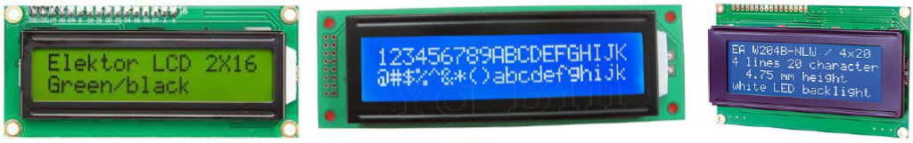
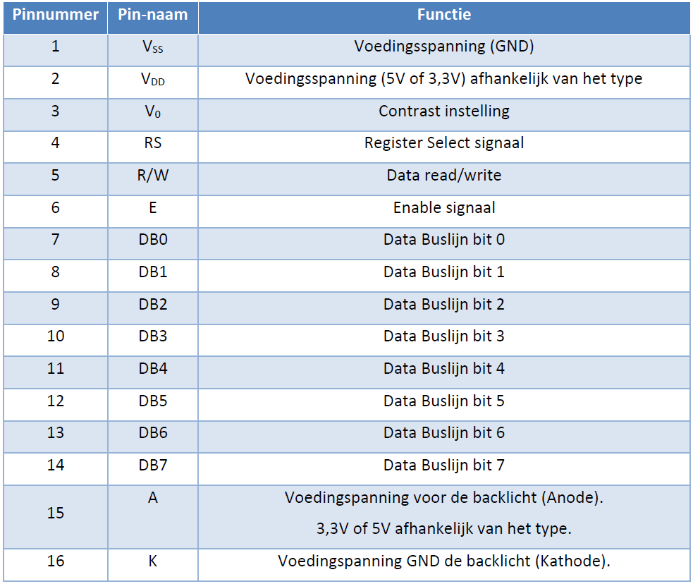
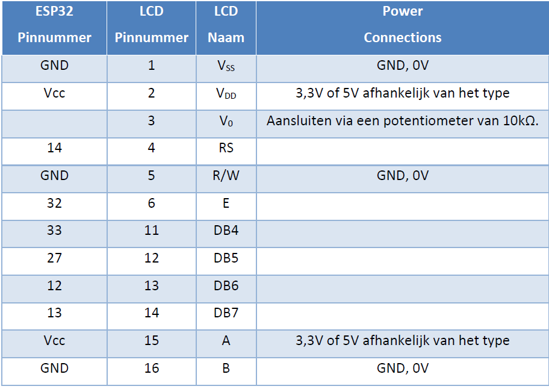
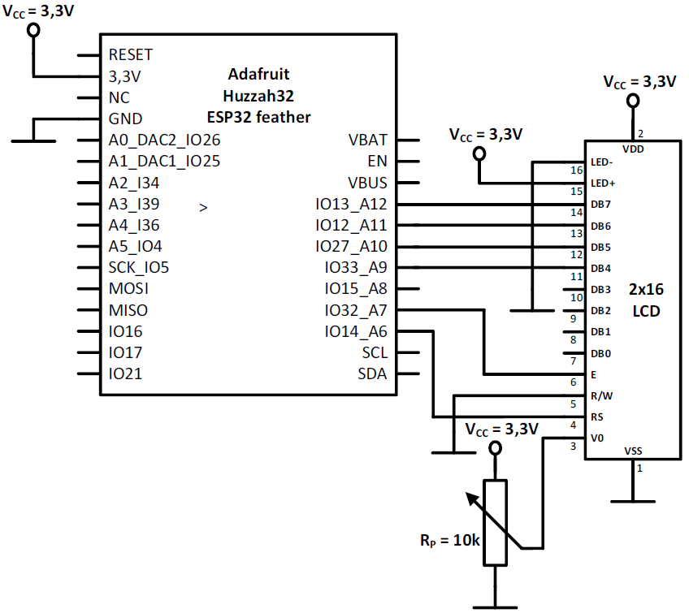
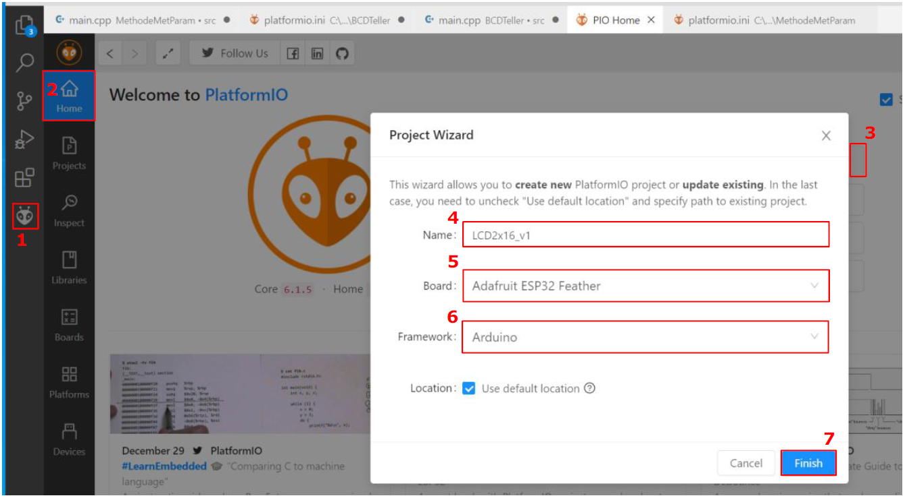
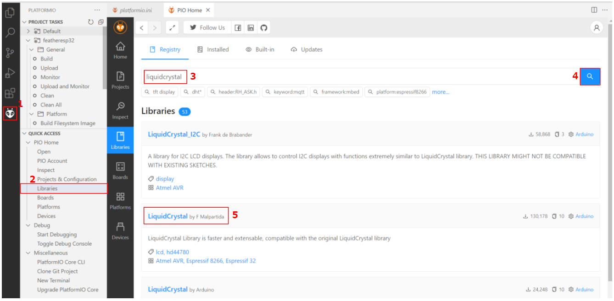
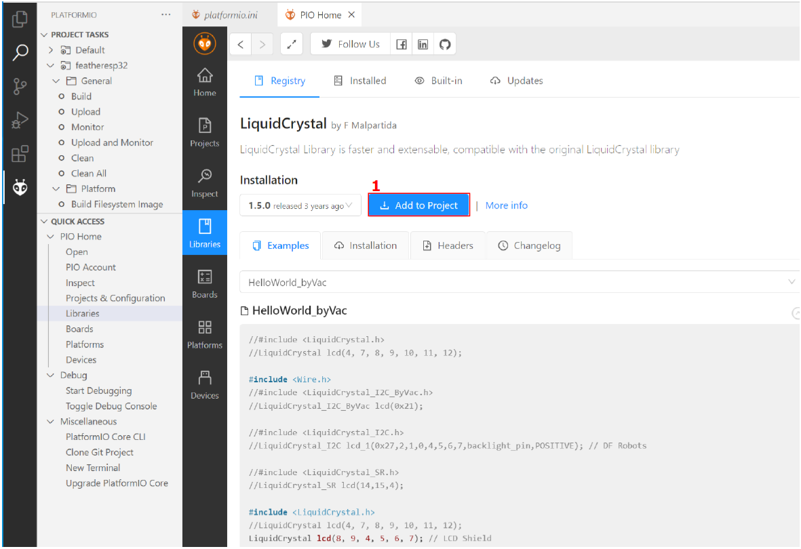
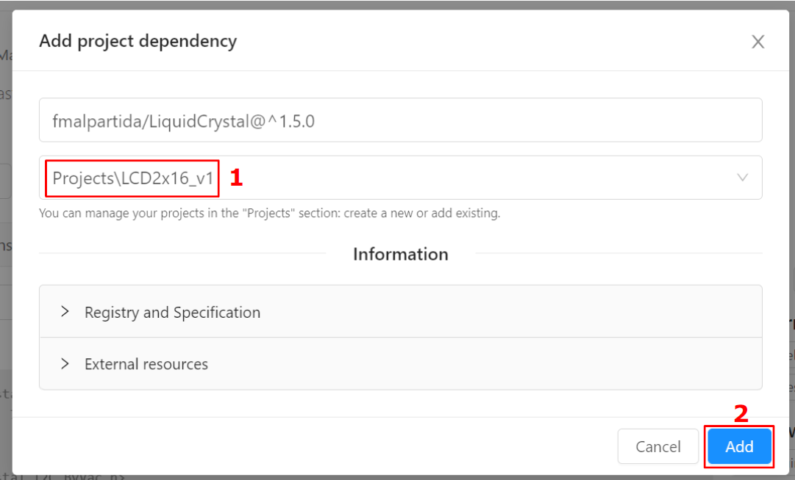
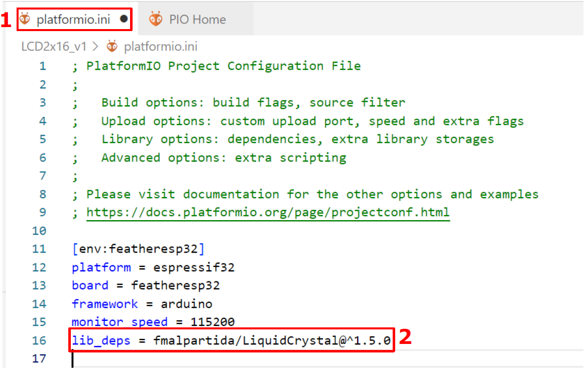
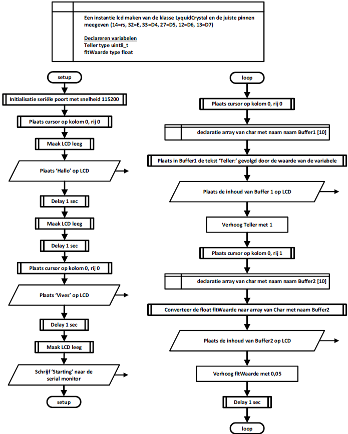

---
mathjax:
  presets: '\def\lr#1#2#3{\left#1#2\right#3}'
---

# Parallel LCD-display

We zullen een 2x16 LCD-karakter display gebruiken dat werkt met de HD44780 parallelle interface
met een voedingsspanning van 3,3V. Er zijn veel vergelijkbare LCD’s te vinden met dezelfde
hardware-configuratie en functionaliteit maar met een voedingsspanning van 5V, bij deze LCD’s komt
een logisch 1 van de IO’s overeen met 5V. Bij onze 1 x2 LCD is alles 3,3V en dus ook het logisch 1
niveau van het LCD.
Het schema en een de code is identiek als er gebruik gemaakt wordt van een 2x20 of 4x20 LCD.



> **Het volgende moet worden bereikt om het LCD-scherm aan te sluiten:**
>
> - Hardware-integratie: we moeten het LCD-scherm op de juiste IO-pinnen aansluiten.
> - Modulaire codering: aangezien er veel processen moeten worden voltooid, is het zinvol om
LCD-functies in modulaire bestanden te definiëren. Daarvoor gaan we gebruik maken van
een bibliotheek LiquidCrystal die we eerst moeten importeren.
> - Initialisatie van het LCD: een specifieke reeks stuursignalen moet naar de LCD worden
gestuurd om deze te initialiseren.
> - Gegevens uitvoeren: we zullen moeten begrijpen hoe het LCD-scherm controlegegevens
omzet in leesbare tekens.

Het is een display dat we gebruiken heeft 2x16 tekens met een ingebouwde datacontrollerchip (=HD44780) en een geïntegreerde achtergrondverlichting.
Het LCD-scherm heeft 16 aansluitingen, zoals in volgende tabel is weergegeven.




> **De bediening en interface van het LCD wordt als volgt samengevat:**
> - Het display wordt geïnitialiseerd door besturingsinstructies naar de relevante configuratieregisters in het LCD-scherm te sturen. Dit wordt gedaan door RS, R/W en E allemaal laag in te stellen en vervolgens de juiste gegevens via bits DB0-DB7 te verzenden.
> - We zullen het LCD-scherm in een 4-bit-modus gebruiken, wat betekent dat we alleen de laatste 4-bits van de databus (DB4-DB7) gebruiken. Dit betekent dat we het LCD kunnen bedienen met slechts 7 digitale lijnen, in plaats van 11 die nodig zijn voor de 8-bits modus.
> - Nadat elke databyte is verzonden, moet de Enable-bit hoog en laag worden gemaakt. Dit vertelt het LCD dat de gegevens gereed zijn en verwerkt moeten worden.
> - Zodra het LCD-scherm is geïnitialiseerd, kunnen weergavegegevens worden verzonden door de RS-bit in te stellen. Nogmaals, nadat elke byte met weergavegegevens is verzonden, moet de Enable-bit hoog en laag worden gemaakt.

We hebben uiteraard digitale IO-pinnen nodig om aan elk van de LCD-datapinnen aan te sluiten. We hebben 4 digitale uitgangen nodig voor de 4-bits instructies en 3 digitale uitgangen voor de RS-, R/W- en E-besturingsvlaggen te manipuleren.
In volgende tabel zijn de pinnen die we gaan gebruiken om aan het display aan te sluiten weergegeven.



::: tip
In het algemeen gebruiken we het LCD alleen in de schrijfmodus, dus verbinden we de R/W pin permanent aan de GND.
:::

## Schema



## Bibliotheek importeren en gebruiken

Als je een bibliotheek wilt gebruiken in een programma maak je eerst een project aan zoals in de volgende figuur. Selecteer het icoon van PlatformIo (1), Klik vervolgens op ‘Home’ (2). Klik dan op ‘Nieuw project’ (3). Geef het project een naam (4), Selecteer het bord dat je wil gebruiken (5) en vul het juiste Framework (6). Klik als laatste op ‘Finisch’ (7) om het aanmaken te beëindigen.



Vervolgens zoek je de bibliotheek die je wil gebruiken en voeg je hem toe aan het project zoials in de volgende figuur. Selecteer het PlatformIo-icoon (1) en klik op ‘Libraries’ (2). Vul de te zoeken bibliotheek in, in het zoekveld (3). Wij zoeken de bibliotheek ‘LiquidCrystal’. Klik op het zoeksymbool (4). Er komt een lijst tevoorschijn. Selecteer deze zoals afgebeeld in (5).



Klik vervolgens op ‘Add to Project’ (1) zoals in de volgende figuur.



Selecteer het project (1) waar de gezochte bibliotheek moet toegevoegd worden en klik op ‘Add’ (2) zoals in volgende figuur.



Klik je nu op de ‘platformio.ini’- file (1). Dan zie je dat er een lijn is toegevoegd (2) zoals in de volgende figuur.



## Programma

Het programma dat we gaan gebruiken is in de volgende figuur afgebeeld. Op lijn 6 en 7 zijn de gebruikte bibliotheken die het programma nodig heeft toegevoegd. Zonder deze twee lijnen zal de compiler de nodige gegevens niet vinden.


```cpp
#include <Arduino.h>
#include <Wire.h>
#include <LiquidCrystal.h>

LiquidCrystal lcd(14, 32, 33, 27, 12, 13 );//RS,E,D4,D5,D6,D7

uint teller = 0;
void setup()
{
  // put your setup code here, to run once:
  Serial.begin(115200); // open the serial port at 115200 bps:
 
  lcd.begin(16,2);
  lcd.clear();
  lcd.setCursor(0,0);
  lcd.print("Hallo");
  lcd.setCursor(0,1);
  lcd.print("VIVES");
  delay(3000);
  lcd.clear();
  lcd.setCursor(0,0);
  lcd.print("VIVES");
  Serial.print("Starting. ");
}

void loop()
{
  // put your main code here, to run repeatedly:
 
   
    //lcd.print("tel:");
    //lcd.print(millis() / 1000);
    char buffer[10];
    sprintf(buffer, "tel:%d", teller);
    //Serial.println(buffer);
    lcd.setCursor(0,1);
    lcd.printf(buffer);
    teller++;
    delay(100);
 

}
```

## Flowchart



<div style="background-color:darkgreen; text-align:left; vertical-align:left; padding:15px;">
<p style="color:lightgreen; margin:10px">
Opdracht: Realiseer het bovenstaand project.
<ul style="color: white;">
<li>Maak gebruik van de ESP32 feather van Adafruit, een 2x16 LCD, een breadbord.</li>

<li>Bouw vervolgens de schakeling</li>
<li>Programmeer het programma en test het</li>
<li>Toon de werking aan de docent</li>
<li>Bespreek de werking van harware en software in het verslag</li>
</ul>
</p>
</div>

