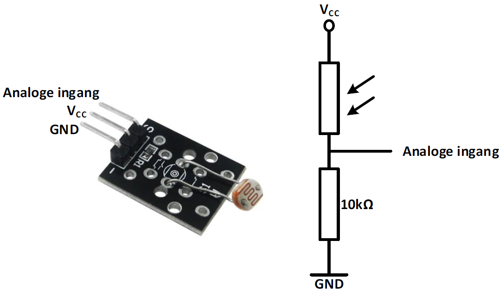

---
mathjax:
  presets: '\def\lr#1#2#3{\left#1#2\right#3}'
---

# Opdrachten

## Test het LCD display

Opdracht: Schrijf een programma dat éénmalig uw naam op het LCD toont.
<ul style="color: white;">
<li>Maak gebruik van de ESP32 feather van Adafruit, een 2x16 LCD, een breadbord.</li>
<li>Zorg dat uw voornaam op de bovenste rij van het display staat, en uw familienaam op de tweede lijn.</li>
<li>Gebruik hiervoor het SetCursor commando.</li>
<li>Bouw vervolgens de schakeling</li>
<li>Programmeer het programma en test het</li>
<li>Toon de werking aan de docent</li>
<li>Bespreek de werking van harware en software in het verslag</li>
</ul>

## Lichtsensor die de waarde op de LCD toont

Opdracht: Schrijf een programma dat de waarde van de lichtsensor op een LCD toont.
<ul style="color: white;">
<li>Maak gebruik van de ESP32 feather van Adafruit, een 2x16 LCD, een breadbord en een LDR.</li>
<li>Als lichtsensor kan je de KY-018 gebruiken of een LDR met een weerstand van 10kΩ. Een afbeelding van de sensor en/of de schakeling is te zien in de vorige figuur.</li>
<li>Zet op de eerste lijn: Lichtsterkte:</li>
<li>Zet op de tweede lijn de waarde van het invallend licht, Zorg dat donker een Nul-waarde is.</li>
<li>Teken eerst het schema in Visio</li>
<li>Bouw vervolgens de schakeling</li>
<li>Programmeer het programma en test het</li>
<li>Toon de werking aan de docent</li>
<li>Bespreek de werking van harware en software in het verslag</li>
</ul>

