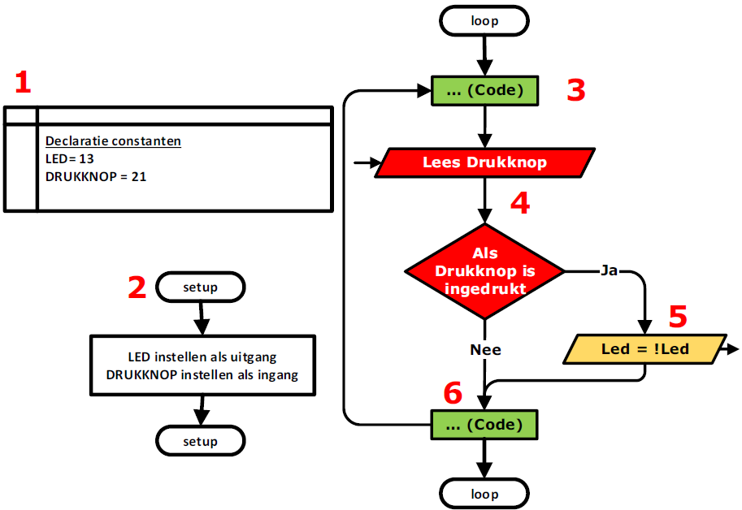
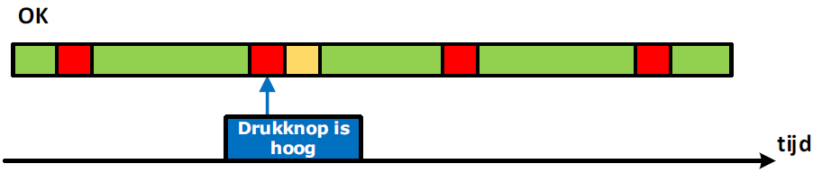
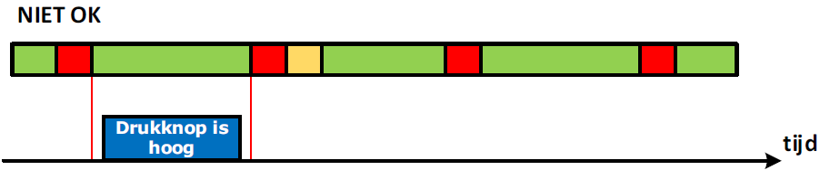

---
mathjax:
  presets: '\def\lr#1#2#3{\left#1#2\right#3}'
---

Er bestaan twee manieren om na te gaan of de digitale toestand van een ingang is gewijzigd. Dit kan via polling gebeuren of via interrupts. 

Het gebruik van interrupts zorgt ervoor dat de microcontroller onmiddellijk kan reageren op bepaalde gebeurtenissen of events.
Om de werking van interrupts uit te leggen illustreren we eerst het systeem van polling.

# Polling

Bij polling wordt er zoals gewoonlijk eerst de declaratie van de constanten uitgevoerd (1). Vervolgens wordt in de setup-methode alle instellingen gedaan (2). In de loop-methode, die oneindig wordt uitgevoerd, wordt bijvoorbeeld eerst wat code uitgevoerd (3) Vervolgens wordt de toestand van de drukknop ingelezen en wordt er vergeleken of deze is ingedrukt (4). Als dat zo is, wordt het oranje stukje code (5) in volgende figuur uitgevoerd. Als dat niet zo is, springt het programma er meteen over. Er wordt verder gewerkt met de andere code (6) en we beginnen het programma terug van voor af aan (3).

Als dit even op een tijdlijn wordt weergeven in (zie figuur), dan stellen de groene blokken de tijd voor dat het programma bezig is met het uitvoeren van code en de rode blokken stellen de momenten voor dat er wordt gecontroleerd of de drukknop is ingedrukt.

Het blauwe blokje stelt het niveau van de drukknop voor. In het programma wordt er gecontroleerd of de drukknop hoog is. Het antwoord op dit moment is ja en het oranje blokje wordt direct uitgevoerd.

Het nadeel is dat de drukknop al een tijdje hoog was voordat er gecontroleerd wordt. Dit resulteert dat er vertraging zit op het hoog zijn van de drukknop en het werkelijk uitvoeren van de code. Dit kan opgelost worden met interrupts.
In de situatie zoals in de volgende figuur loopt het mis. De drukknop wordt degelijk hoog, maar is telkens laag op de momenten dat de drukknop getest wordt in het programma. We missen dus in het programma het event met de polling methode omdat het programma te lang bezig is met het uitvoeren van andere code.

Het gebruik van interrupts kan dit probleem verhelpen.

::: details
Nog een nadeel van de polling methode is dat er heel veel gecontroleerd wordt of de drukknop wordt ingedrukt. Dit kan je zien aan de rode blokjes in de vorige figuren. De drukknop wordt in minder dan 50% van de keren maar hoog als er gecontroleerd worden. Het controleren of de drukknop hoog wordt neemt veel processortijd in beslag. Die tijd zou beter gebruikt kunnen worden bij het uitvoeren van andere code. Met interrupts kan dit opgelost worden.
:::

