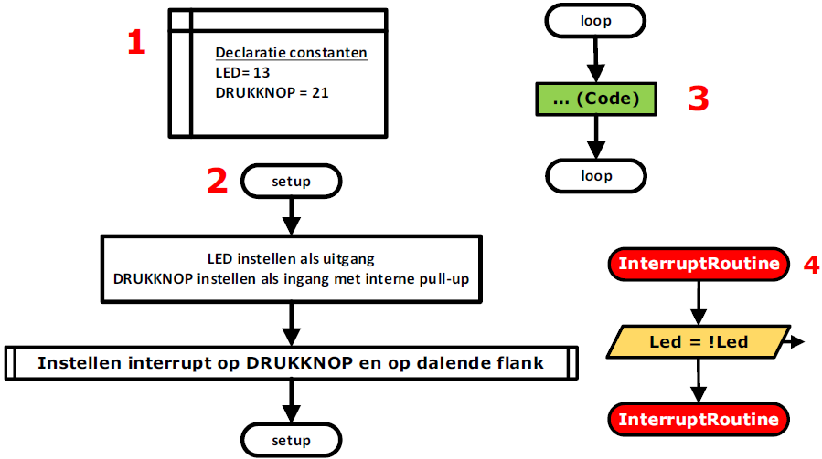
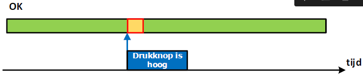

---
mathjax:
  presets: '\def\lr#1#2#3{\left#1#2\right#3}'
---

# Principe van interrupts

Als we willen gebruik maken van interrupts moeten we in het begin van het programma de interrupt initialiseren (2). We zeggen welke pin we als interrupt-pin willen gebruiken en op wat de interruptpin moet reageren en welke functie er moet uitgevoerd worden (2). In het voorbeeld van volgende figuur wordt de functie ‘InterruptRoutine’ uitgevoerd bij het indrukken van de drukknop.
In de loop-methode wordt er voortdurend code uitgevoerd, zonder hierin te testen wat de toestand van de drukknop is (3).

Vanaf dat er op de drukknop gedrukt wordt, wordt de groene code (3) onderbroken en wordt de interrupt code (aanroepen en springen naar de functie: interrupt routine)uitgevoerd (4). Als de interrupt routine volledig is uitgevoerd wordt de groene code (3) terug hervat.
Op de tijdlijn zien we dat de microcontroller de volledige tijd de oneindige lus uitvoert. Op het moment dat drukknop laag wordt, wordt de uitvoering van de loop-methode onderbroken en wordt er meteen gesprongen naar de interrupt-code zoals in Figuur 40 wordt voorgesteld. Na het uitvoeren van de interrupt wordt de code van de oneindige lus hervat.

:::warning
Belangrijk bij interrupts is om de interruptroutine zo kort mogelijk te maken en er niet te veel code in te plaatsen die veel tijd in beslag neemt. Men kan de interruptroutine gebruiken om de tijd kritische dingen uit te voeren en de minder belangrijke dingen in de loop-methode.
:::

Er wordt dus niet meer, zoals bij polling, in een constante loop gecheckt of een digitale input gewijzigd is van toestand, maar er wordt automatisch naar een ISR (interrupt service routine) gesprongen als de voorwaarde van een digitale ingang voldoet.

::: tip
Meestal zal de voorwaarde van een interrupt bij een digitale ingang een flankvoorwaarde zijn. Dit kan een stijgende- of een dalende flank zijn.
:::

