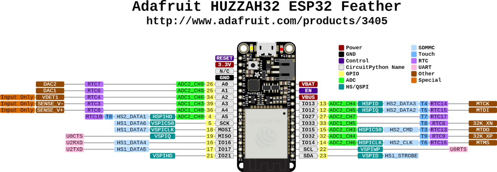

---
mathjax:
  presets: '\def\lr#1#2#3{\left#1#2\right#3}'
---

# Hardware interrupts

Microprocessors kunnen worden ingesteld om specifieke taken uit te voeren wanneer er hardware- gebeurtenissen zich voordoen. Het principe van hardware interrupts is in vorige paragraaf al uitgelegd.
Hierdoor kan de hoofdcode zijn taken uitvoeren, en alleen naar bepaalde subroutines of functies springen als er iets fysieks gebeurt (Bijvoorbeeld een drukknop wordt ingedrukt of een signaalingang verandert van status).

Interrupts of onderbrekingen worden gebruikt om te zorgen voor snelle reactietijden als er iets gebeurt. Het enige echte nadeel van interrupt-systemen is het feit dat de programmeer- en codestructuren complexer zijn.

Het programmeren van hardware-interrupts bestaat uit drie delen, namelijk:
> - Instellen van de pin als ingang;
> - Koppelen van een interrupt aan de ingang, het meegeven van de naam van de methode (ISR) die moet uigevoerd worden samen met wanneer deze moet uitgevoerd worden (interrupt voorwaarde);
> - Als laatste het schrijven van de interruptroutine (ISR).

## Mogelijke pinnen die interrupts ondersteunen

Wij gebruiken de Huzzah32 feather van Adafruit zoals in volgende figuur is weergegeven.

Enkel de pinnen met de gele labels, zoals in vorige figuur, kunnen als digitale ingangen gebruikt worden. Behalve pin 12 is niet aan te raden om te gebruiken als ingang omdat deze standaard is voorzien van een pull-down weerstand en deze mag bij het booten (=opstarten) niet beïnvloed worden. Het maximum aantal is dus 20. 

:::tip
Alle pinnen die als ingangen gebruikt kunnen worden kunnen voorzien worden van een interrupt.
:::

## Instellen van de pin als ingang.

Als men een IO-pin als ingang wil gebruiken moet men de pinMode van de IO-pin instellen als ingang zoals in vorige figuur. Het is het gemakkelijkst om hier de gele pinbenaming te gebruiken zoals in vorige figuur.

De pinMode van de IO-pin stel je in bij opstart van de controller en dit gebeurt in de setup-methode. Aan de methode pinMode worden er twee parameters meegegeven tussen haakjes. De eerste parameter is de IO-pin waarover het gaat en de tweede parameter is hoe deze ingesteld moet worden, hier is dit als ingang. De instructie wordt afgesloten met een puntkomma.

Een goede programmeur zal een duidelijkere naam willen voor de uitgang en zo weinig mogelijk gebruik maken van de IO-nummers. Daarom gaat men gebruik maken van constanten. De constanten declareert men voor de setup routine in het begin van het programma.
Op lijn 3 is te zien dat de constante de naam ‘DRUKKNOP’ heeft en dat er 21 wordt toegewezen. ‘# define’ geeft weer dat DRUKKNOP gelijk staat aan 21. In de code wordt bij het compileren overal DRUKKNOP vervangen door 21.

Natuurlijk kan er ook gebruik gemaakt worden van de interne- pull-up of pull-down weerstand. Dan is de tweede parameter gelijk aan INPUT_PULLUP of INPUT_PULLDOWN. In het labo wordt steeds gebruik gemaakt van een externe pullup waarstand en moet dus deze optie niet geprogrammeerd worden.

## Het koppelen van een interruptroutine aan een ingang.

Het volgend dat moet gebeuren is de methode attachInterrupt uitvoeren die de knop koppelt aan een interruptmethode.

De attachInterrupt methode heeft 3 parameters. De eerste parameter is de drukknop waaraan een interruptpin moet gekoppeld worden. In het voorbeeld is dit pin 13 die de naam DRUKKNOP heeft.
De tweede parameter is de naam van de methode (ISR) die moet uitgevoerd worden. In het voorbeeld is dit ToggleLed.
De derde en laatste parameter is wanneer de interruptmethode moet uitgevoerd worden. In het voorbeeld is dit de dalende flank. 

De derde parameter kan de volgende waarden aannemen:
> - LOW : Triggeren van de interrupt wanneer de pin laag is.
> - HIGH Triggeren van de interrupt wanneer de pin hoog is.
> - CHANGE Triggeren van de interrupt wanneer de pin wijzigt van toestand.
> - FALLING Triggeren van de interrupt bij een dalende flank van de ingang.
> - RISING Triggeren van de interrupt bij een stijgende flank van de ingang.

## De interruptroutine.

Een voorbeeld van een interruptroutine (ISR) is weergegeven in de volgende figuur. De interruptroutine begint met ‘void IRAM_ATTR’ gevold door de naam van de routine. Aan een interruptroutine worden er geen parameters meegegeven.

De body en de code van de routine wordt geplaatst tussen accolades.

## De ontkoppelen van een interruptroutine van een ingang.

Als je in de code de interruptroutine niet meer wenst te gebruiken kan de je interruptroutine altijd ontkoppelen. Dit kan je doen door gebruik te maken van de detachInterrupt methode. Aan deze methode moet je de pin meegeven waarvan je de interrupt wil ontkoppelen.

