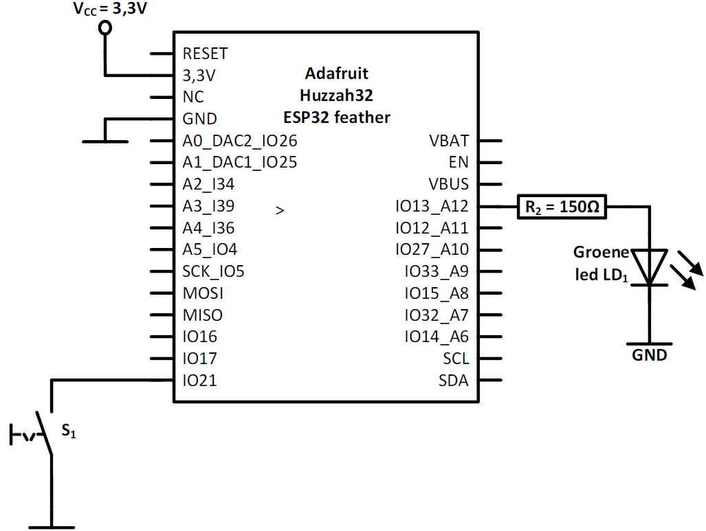
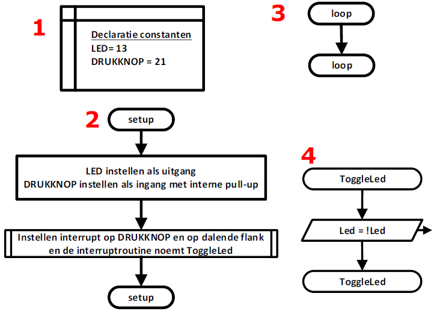
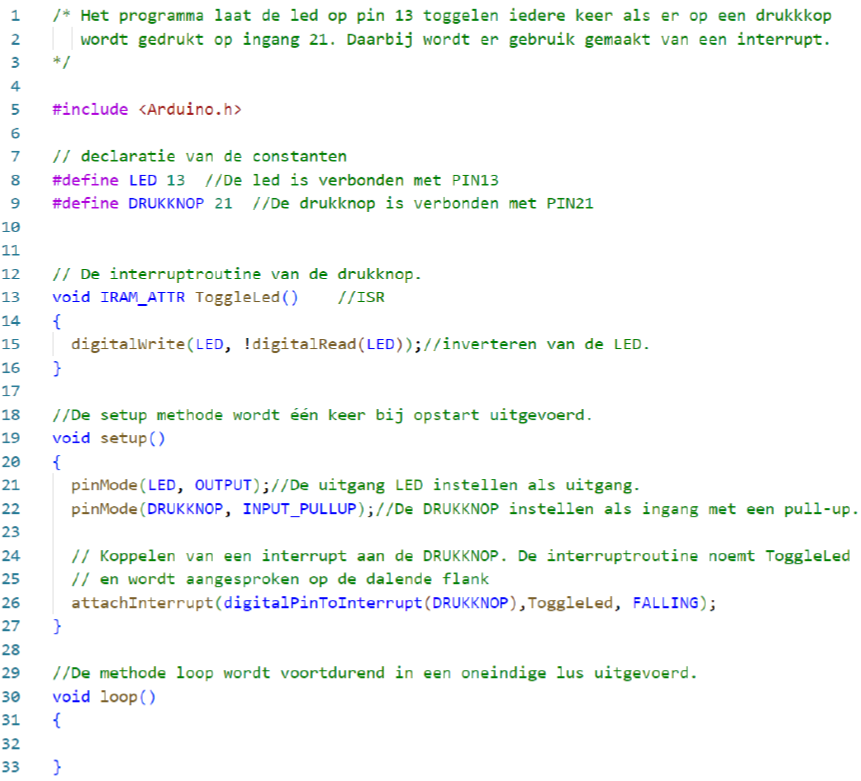

---
mathjax:
  presets: '\def\lr#1#2#3{\left#1#2\right#3}'
---

# Voorbeeld: Het toggelen van een led bij het indrukken van een drukknop

## Hardware

Bij de drukknop S1 wordt er gebruik gemaakt van een interne pull-up weerstand.
De led en de voorschakelweerstand is al voorzien op de ESP32 feather van Adafruit en moet extern niet meer voorzien worden.

## Flowchart

In de volgende figuur is de flowchart voorgesteld. Bij de declaratie zeggen we dat we de naam LED gelijkgesteld is met 13 en dat DRUKKNOP met 21. Dit zijn constanten en stellen de overeenkomende IO-pinnen voor (1).

In de setup-methode (2) wordt er verteld dat de LED een uitgang is en dat DRUKKNOP een ingang is met een interne pull-up weerstand. We stellen de DRUKKNOP in als externe interrupt. De interruptroutine noemt ToggleLed en deze wordt aangesproken bij een dalende flank.

Vervolgens gaat de microcontroller in een oneindige lus (3), namelijk de loop-methode waar de controller eigenlijk niets doet.

Als de drukknop wordt ingedrukt dan komt er een dalende flank op het signaal en wordt de interruptroutine ToggleLed aangesproken (4), waar de toestand van de Led wordt geïnverteerd. Na het beëindigen van de interruptroutine ToggleLed wordt er teruggesprongen naar de loop-methode (3).

## Software

