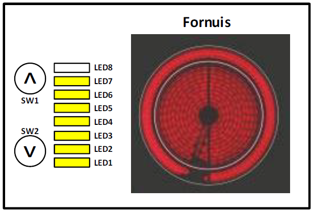

---
mathjax:
  presets: '\def\lr#1#2#3{\left#1#2\right#3}'
---

# Opdracht: Het besturen van een kookvlak van een fornuis.

Opdracht: Kookvlak bediening
<ul style="color: white;">
<li>Schrijf een programma die het vermogen van een kookvlak van een fornuis aanstuurt met twee drukknoppen van de ESP32 shield. De stand van het vermogens gaan we visueel voorstellen door de 8 leds op de Nucleo-shield.
</li>
<li>Veronderstel dat je het vermogen van een kookvlak van een fornuis kan verhogen met de drukknop SW1 op de ESP32-shield.</li>
<li>Het vermogen kan je verlagen met de knop SW2 op de shield.</li>
<li>Gebruik voor de drukknoppen twee interrupts</li>
<li>De stand van het vermogen van het kookvlak visualiseer je met de 8 leds op de shield.</li>
<li>Bij start brandt er geen enkele led en staat het kookvlak uit.</li>
<li>Schrijf het programma door gebruik te maken van drie functies, namelijk een functie verhoogVermogen, een functie verlaagVermogen en een functie StuurLeds.</li>
<li>Maak gebruik van een variabele Vermogen die een waarde kan hebben van 0 t.e.m. 8.</li>
<li>Toon de werking aan de docent</li>
<li>Bespreek de werking van harware en software in het verslag</li>
</ul>

