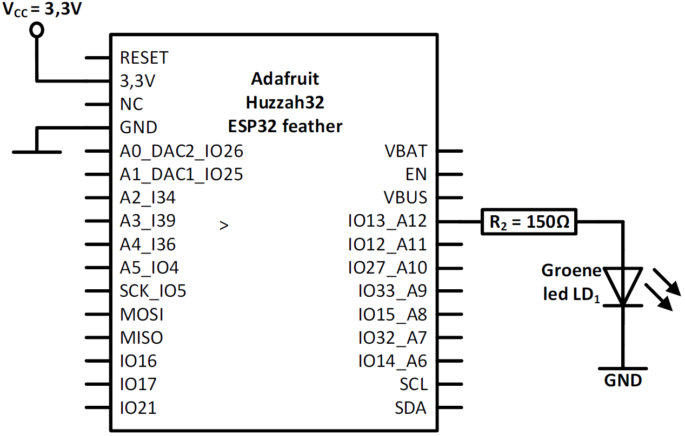
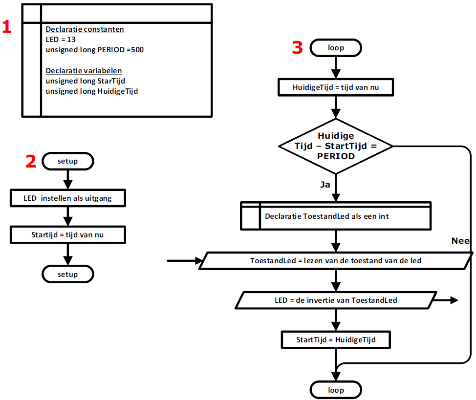
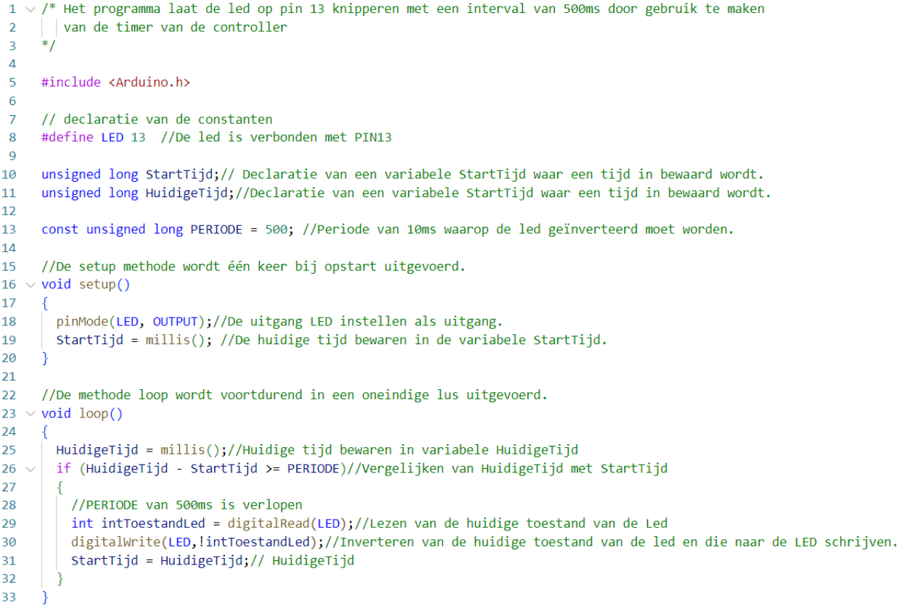

---
mathjax:
  presets: '\def\lr#1#2#3{\left#1#2\right#3}'
---

# Timers met de functie millis()

De meest gebruikte methode om iets uit te voeren na een bepaalde tijd is om de tijd te bewaren in een variabele en deze voortdurend vergelijken met de huidige, nieuwe, verlopen tijd.

Als men bijvoorbeeld een halve seconde later iets wil uitvoeren dan zal men het uitvoeren starten als het verschil tussen de variabele en de huidige tijd gelijk is aan een halve seconde.

Deze methode is veel beter dan de voordien gebruikte methode delay. Het nadeel van delay is dat men de controller laat wachten en dat er gedurende de delay, de controller niets anders kan doen. Dit geeft een probleem als de delay meerdere seconden is en men wil zien of er bijvoorbeeld op een knop gedrukt wordt.
Doordat de delay meerdere seconden is kan het zijn dat de software het drukken op de knop niet gedetecteerd heeft omdat de controller meerdere seconden aan het wachten was.

:::tip
Een microprocessor wordt trouwens niet aangewend in een applicatie om *niets* te doen (wachten binnen een delay()).
:::

Door gebruik te maken van de functie millis() kan men de waarde van een teller van de microcontroller ophalen. De controller laat op de achtergrond een teller om de milliseconde verhogen. Bij de start van het programma staat die op 0 en zolang dat de controller werkt wordt die verhoogd. Door op regelmatige tijdstippen de teller op te halen en deze te vergelijken met een startwaarde kan men zo een tijd meten en bijvoorbeeld een delay programmeren.

## Een knipperende led door gebruik te maken van millis()

Het voorbeeld laat een led knipperen met een interval van een halve seconde door gebruik te maken van de tijd van de controller.

::: details
Zonder gebruik te maken van de delay-methode. 
:::

### Schema

In de volgende figuur is het schema weergegeven. We gebruiken de ESP32 feather van Adafruit met de led die
verbonden is met IO-pin 13 die standaard op het bord staat.

### Flowchart

Bij de declaratie (1) wordt er een twee constanten aangemaakt. LED is de nummer van de IO-pin en is hier 13. De constante PERIOD geeft de tijd weer dat de led zal moet knipperen en dat is om de halve seconde of 500 milliseconden.
Er worden ook nog twee variabelen gedeclareerd waar twee tijden worden ingeladen, namelijk de StartTijd en de HuidigeTijd. 

Bij de setup (2) van het programma wordt de IO-pin 13 die LED noemt ingesteld als uitgang.
De variabele StartTijd wordt gevuld met de huidige tijd van de controller.
In de methode loop (3) die voortdurend wordt uitgevoerd wordt de tijd van de controller in de variabele HuidigeTijd gevuld. De twee tijden worden vergeleken. Als het verschil van de twee tijden groter is dan de constante PERIODE (hier 500ms) dan wordt de toestand van de LED geïnverteerd en maakt men de StartTijd gelijk aan de HuidigeTijd om zo opnieuw te kunnen starten met een cyclus van een halve seconde.
Is de 500ms (=PERIODE) niet verstreken, dan zal men niets doen en de methdoe loop terug uitvoeren van in het begin.

### Software

Op lijn 8 maakt men een constante LED die men gelijk stelt aan 13. Overal in het programma zal LED vervangen worden door 13.
Men declareert nog twee variabelen StartTijd en HuidigeTijd op lijn 10 en 11. Op lijn 13 declareert men een constante PERIODE die men gelijk stelt aan 500. Dit is de tijd waarop men iedere keer iets wil laten uitvoeren.
In de setup methode zegt men dat de IO-pin met de naam led een uitgang is. Op lijn 19 vult men de constante StartTijd met de tijd van de controller die achterliggend om de milliseconde wordt verhoogd.
In de loop-methode vanaf lijn 23 zal men voortdurend de tijd van de controller opvragen en deze in de variabele HuidigeTijd plaatsen (=lijn 25).
Op lijn 26 zal men kijken als er 500milliseconden (=constante PERIODE) verstreken zijn. Is dit zo dan zal men de toestand van de led inverteren (lijn 29 en 30) en zal men De huidige tijd gelijkmaken aan Starttijd om terug een verschil van 500ms te kunnen vergelijken.
Is de 500ms niet versterken, dan zal men niets doen en voorrdurend kijken of deze wel is verstreken.

## Opdracht

Opdracht: Blokgolf met millis
<ul style="color: white;">
<li>Schrijf een programma die een blokgolfspanning op uitgang 12 voorziet met een frequentie van 100Hz en een duty-cycle van 50%.
</li>
<li>Meet, controlleer en visualiseer het signaal met een oscilloscoop</li>
<li>Schrijf de millis waarde om de 100Hz naar de Serial monitor</li>
<li>Toon de werking aan de docent</li>
<li>Bespreek de werking van harware en software in het verslag</li>
</ul>

