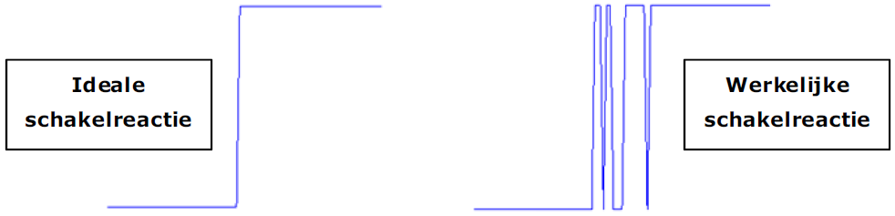

---
mathjax:
  presets: '\def\lr#1#2#3{\left#1#2\right#3}'
---

# Anti-dender

De meeste programma’s waarbij een drukknop wordt gebruikt werken niet helemaal zoals verwacht.
Het is mogelijk dat de knop niet iedere keer reageert of meestal te veel reageert. Dit komt door een veelvoorkomend probleem dat het denderen van een schakelaar of knop wordt genoemd. Wanneer de knop wordt ingedrukt, schakelt deze niet netjes van laag naar hoog of omgekeerd, er is wat ‘dender’, zoals in volgende figuur is weergegeven.

Het is daarom gemakkelijk te zien hoe een enkele druk op de knop meerdere onderbrekingen kan veroorzaken en dat men merkt dat bij het indrukken van een knop de code meerdere keren wordt uitgevoerd.

> Daarom moeten we de schakelaar of drukknop ‘anti-denderen’. Dit kan op twee manieren, namelijk:
> - Hardwarematig
> - Softwarematig

Softwarematig wordt het meest toegepast omdat dit het eenvoudigst is.
Als je het hardwarematig doet moet men externe componenten bijplaatsen. In sommige gevallen kan het dit met een eenvoudig RC-netwerk en soms kan men gebruik maken van een flipflop.

