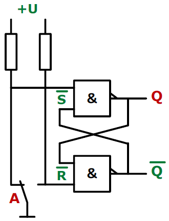
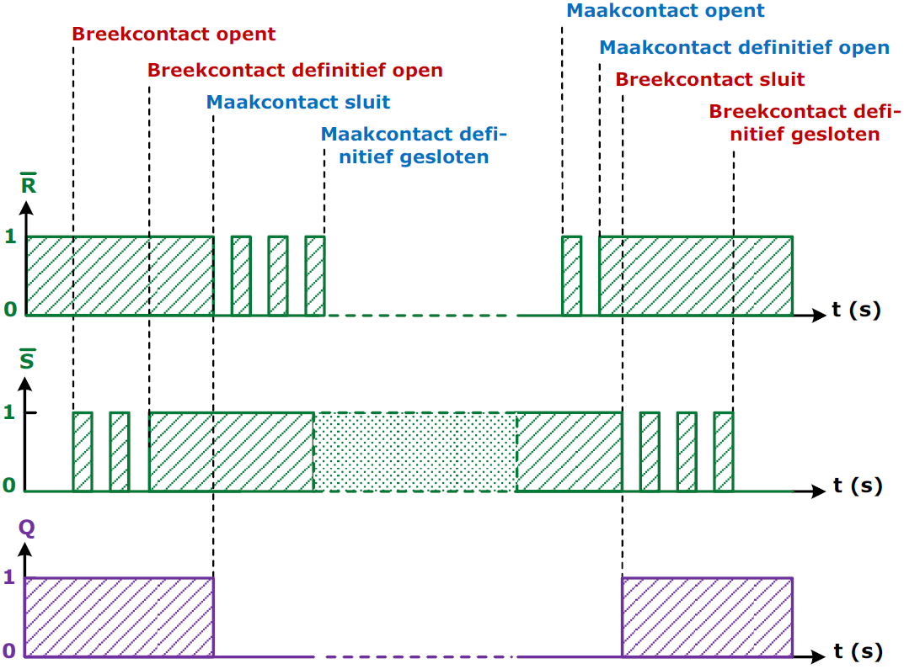

---
mathjax:
  presets: '\def\lr#1#2#3{\left#1#2\right#3}'
---

# Dender hardwarematig oplossen met een flip-flop

Door de dender te verwijderen, gedraagt het systeem zich alsof de schakelaar een ideale respons heeft. Dit kan worden gedaan met verschillende hardware- en softwaremethoden.

Een voorbeeld van een klassieke hardware-anti-denderschakeling zijn twee kruiselings gekoppelde NAND-poorten die een zeer eenvoudige Set-Reset (SR) -vergrendeling vormen.

Een ander voorbeeld van een software-anti-denderschakeling is het zoeken naar een aantal opeenvolgende aflezingen van de schakelaar, bijv. als de ingang verandert van 0 naar 1 en dan 1 blijft voor de volgende tien samples, dan is de schakelaar ingedrukt.

