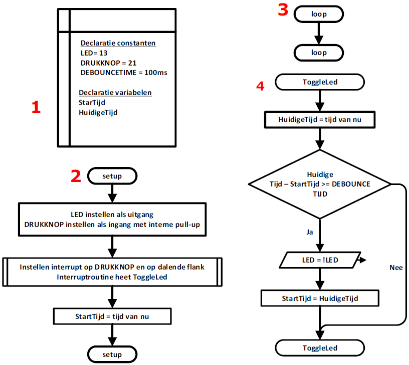
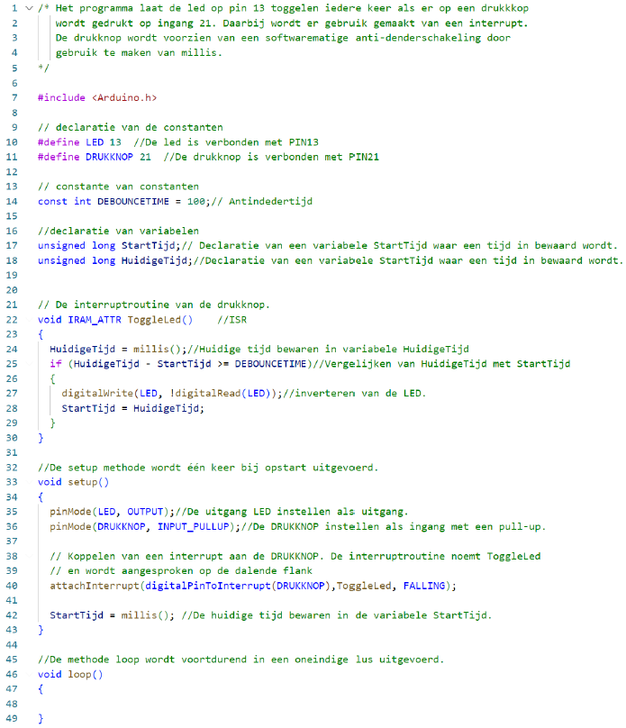

---
mathjax:
  presets: '\def\lr#1#2#3{\left#1#2\right#3}'
---

# Dender softwarematig oplossen

We gaan hierbij eveneens gebruik maken van een externe interrupt. In de interruptroutine gaan we de tijd van het vorig voorkomen van de interrupt vergelijken met de huidige tijd. Als dit te snel is gaan we de code van de interrupt niet uitvoeren. Om de tijd te vergelijken maken we gebruik van de methode millis.

## Flowchart

Bij de declaratie (1) wordt de naam LED gekoppeld aan aansluiting 13 en DRUKKNOP aan aansluiting 21.
Er wordt een constante DEBOUNCE aangemaakt met een waarde 100 die gelijk staat aan 100ms.
Er worden ook nog twee variabelen gedeclareerd. Deze zijn StartTijd en HuidigeTijd.
In de setup-methode wordt de LED ingesteld als uitgang en de drukknop als ingang met een pull-up weerstand. Op de ingang wordt er een interrupt gekoppeld die de routine ToggleLed uitvoert wanneer er een dalende flank is.
De StartTijd wordt geladen met de tijd van nu.
Als de interrupt zich voordoet wordt er gekeken als de vorige keer dat de interrupt werd aangeroepen gelijk of langer geleden is dan de tijd DEBOUNCE (=100ms). Is de tijd korter dan is het dender. Is de tijd langer dan wordt de toestand van de LED geïnverteerd.

## Software

