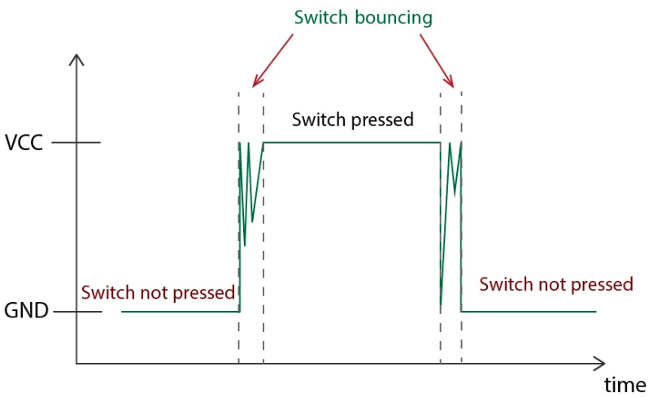

---
mathjax:
  presets: '\def\lr#1#2#3{\left#1#2\right#3}'
---

# Debouncing van een Pushbutton dmv een Timer
https://randomnerdtutorials.com/micropython-timer-interrupts-ep32-esp8266/

Dender bij een drukknop is wanneer de drukknop meer dan één druk telt, terwijl u in werkelijkheid slechts één keer hebt ingedrukt. Dit is heel gebruikelijk bij mechanische knoppen zoals drukknoppen.



Let wel in vorige figuur dat dit over een schakeling gaat die actief hoog is. In de meeste gevallen zal dit echter actief laag geschakeld zijn. Dan staat de vorige figuur op zijn kop. Laag niveau bij het indrukken. Dit is ook zo bij de extension shield.

Dit gebeurt omdat de elektrische contacten in de knop zeer snel verbinding maken en ontkoppelen voordat ze een stabiele toestand bereiken, waardoor het systeem meerdere drukgebeurtenissen registreert, waardoor een onnauwkeurige telling ontstaat. Om dit probleem te voorkomen, kunnen we enkele debouncing-technieken toevoegen met behulp van vertragingen of timers.

In dit voorbeeld bekijken we hoe u timers en gebeurtenissen kunt gebruiken om een ​​drukknop te debouncen.

## Circuit Diagram

Voor dit voorbeeld sluit u een LED (GPIO 13) en een drukknop (GPIO12) aan op de ESP32.

> - LED (GPIO 13)
> - Drukknop (GPIO 12)

U kunt de volgende schematische diagrammen als referentie gebruiken.


## Software code

```python
from machine import Pin, Timer
import time

led = Pin(13, Pin.OUT)
button = Pin(12, Pin.IN)
counter = 0  # Initialize the button press count
debounce_timer = None

def button_pressed(pin):
    global counter, debounce_timer  # Declare variables as global

    if debounce_timer is None:
        counter += 1
        print("Button Pressed! Count: ", counter)
        
        # Toggle the LED on each button press
        led.value(not led.value())

        # Start a timer for debounce period (e.g., 200 milliseconds)
        debounce_timer = Timer(1)
        debounce_timer.init(mode=Timer.ONE_SHOT, period=200, callback=debounce_callback)

def debounce_callback(timer):
    global debounce_timer
    debounce_timer = None

# Attach the interrupt to the button's falling edge
button.irq(trigger=Pin.IRQ_FALLING, handler=button_pressed)

try:
    # Main loop (optional)
    while True:
        print("Loop is running")
        time.sleep(5)
except KeyboardInterrupt:
    # Keyboard interrupt occurred, deinitialize the timer
    debounce_timer.deinit()
    # Turn off the LED
    led.value(0)
```

## Werking

In dit voorbeeld wordt een eenmalige timer (`debounce_timer`) gebruikt die bij elke druk op de knop wordt gestart met een gespecificeerde debounce-periode, in dit voorbeeld 200 milliseconden. U kunt de debounceperiode verlengen als u nog steeds valse positieven vast stelt.

```python
debounce_timer.init(mode=Timer.ONE_SHOT, period=200, callback=debounce_callback)
```

Om het indrukken van een drukknop te detecteren, gebruiken we externe interrupts. De functie button_pressed wordt geactiveerd in de `dalende flank` (wanneer de knop wordt ingedrukt => actieve lage schakeling met een pull-up weerstand!!).

```python
button.irq(trigger=Pin.IRQ_FALLING, handler=button_pressed)
```

Wanneer de knop wordt ingedrukt, wordt de functie `button_pressed` aangeroepen, waarbij de teller wordt verhoogd, de LED wordt omgeschakeld en de one-shot timer voor debounce wordt gestart.

```python
counter += 1
print("Button Pressed! Count: ", counter)
        
# Toggle the LED on each button press
led.value(not led.value())

# Start a timer for debounce period (e.g., 200 milliseconds)
debounce_timer = Timer(1)
debounce_timer.init(mode=Timer.ONE_SHOT, period=200, callback=debounce_callback)
```

De `debounce_callback` functie van de timer wordt aangeroepen wanneer de eenmalige timer afloopt, waardoor de `debounce_timer` wordt gereset naar `None`.

```python
def debounce_callback(timer):
    global debounce_timer
    debounce_timer = None
```

Als de timer nog niet is verlopen en er opnieuw een actieve flank zich voordoet, wordt er geen rekening mee gehouden omdat de `debounce_timer` niet is teruggezet op `None`:

```python
if debounce_timer is None:
```
Merk op dat we gebruik maken van globale variabelen, zodat we er toegang toe hebben in alle delen van de code, inclusief binnen de functies:

```python
global counter, debounce_timer  # Declare variables as global
```

Dit is slechts een van de vele manieren om een ​​drukknop te debouncen.

## Het gebruik van `None`

In Python/MicroPython wordt `None` vaak gebruikt als tijdelijke aanduiding of standaardwaarde om de afwezigheid van een betekenisvolle waarde aan te geven. In dit vorige voorbeeld helpt `None` ons bij het beheren van de status van de `debounce_timer` variabele.

De debounce_timer is aanvankelijk ingesteld op `None` om aan te geven dat er momenteel geen `debounce-timer` actief is.

```python
debounce_timer = None
```

In de functie `button_pressed` controleert de volgende voorwaarde of er geen actieve debounce-timer is.

```python
if debounce_timer is None:
```

Als er geen actieve timer is (`None`), worden de acties voor het indrukken van de knop uitgevoerd en wordt een nieuwe eenmalige timer, `debounce_timer`, geïnitialiseerd.

```python
debounce_timer = Timer(1)
debounce_timer.init(mode=Timer.ONE_SHOT, period=200, callback=debounce_callback)
```

Wanneer de eenmalige timer afloopt, wordt de `debounce_callback` functie aangeroepen en wordt `debounce_timer` teruggezet op `None`, wat aangeeft dat de `debounce-periode` is geëindigd.

```python
def debounce_callback(timer):
    global debounce_timer
    debounce_timer = None
```

