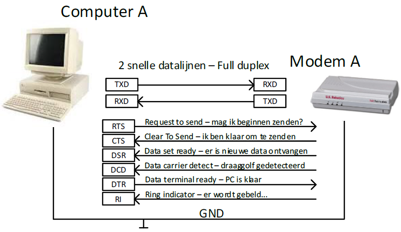
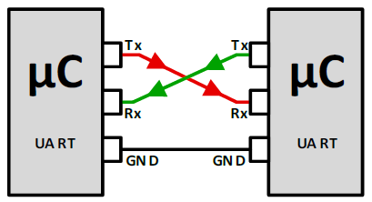

---
mathjax:
  presets: '\def\lr#1#2#3{\left#1#2\right#3}'
---

# Verbindingen bij een seriële communicatie

Het oorspronkelijke RS232 protocol diende om computers te laten communiceren met modems.

De **twee belangrijkste** aansluitingen zijn daarbij de **TXD- en RXD-lijnen**. Over de TXD-lijn wordt de data verzonden, over de RXD-lijn wordt de data ontvangen. Merk op dat de TXD-pin van de zender verbonden is met de RXD-pin van de ontvanger. Bij moderne RS232 communicatie zijn de RXD en TXD-lijnen dikwijls de enige die nog gebruikt worden.
De GND moet ook aan beide zijden verbonden worden zodat er minimum 3 draden nodig zijn.
Hoe twee toestellen verbonden worden is weergegeven in de volgende figuur.

Naast de TXD- en RXD-lijnen beschreef de RS232 standaard ook een set van ‘hand shakelijnen’. Deze lijnen werden niet gebruikt om data op hoge snelheid te verzenden, maar dienden enkel als ondersteuning om een goede en betrouwbare communicatie op te zetten tussen de PC en de modem. Zo is er de RTS of request-to-send lijn die door de PC actief werd gemaakt om aan de modem te vragen of er nieuwe data mocht verstuurd worden. Als de buffer van de modem op dat moment leeg was en er was aan alle andere voorwaarden voldaan, dan maakt de modem de CTS (clear to send) lijn actief om aan de PC aan te geven dat de aanvraag werd goedgekeurd.
De 6 meest gebruikte handshakelijnen zijn in de eerste figuur vermeld. 

:::warning
Op de COM-poort van een klassieke PC zijn deze hand-shake lijnen nog steeds beschikbaar.
:::

