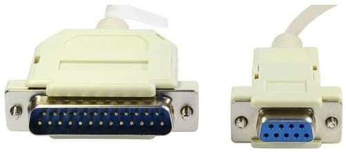
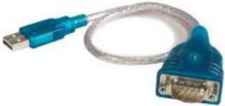
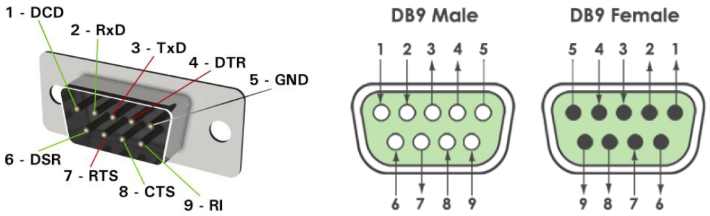

---
mathjax:
  presets: '\def\lr#1#2#3{\left#1#2\right#3}'
---

# Connectoren

De originele standaard beschreef enkel de DB25 connector (linkse connector in volgende figuur), die wij vandaag enkel nog kennen als de parallelle poort van een PC. De kleinere DB9 connector (rechtse connector in de figuur) is vandaag het meest gebruikt als RS232 connector.

:::warning
Moderne PC’s worden nagenoeg niet meer uitgerust met een COM-poort. Via een USB naar COMkabel kan je echter via een USB-poort een COM-poort emuleren.
:::

| Pinnr   | Short    |  Name  | Werking |
|----------|:-------------|:------|:------|
| 1 |  DCD | Data Carrier Detect | Draaggolf gedetecteerd |
| 2 |  RxD | Receive Data   | Ontvangen data |
| 3 |  TxD | Transmit Data | Verzenden data |
| 4 |  DTR | Data Terminal Ready | Terminal is klaar voor ontvangst |
| 5 |  GND | Ground | Massa |
| 6 |  DSR | Data Set Ready | Er kan nieuwe data worden verzonden |
| 7 |  RTS | Request To Send | Aanvraag tot verzenden |
| 8 |  CTS | Clear To Send | Klaar om te zenden |
| 9 |  RI | Ring Indicator | Oproep |

