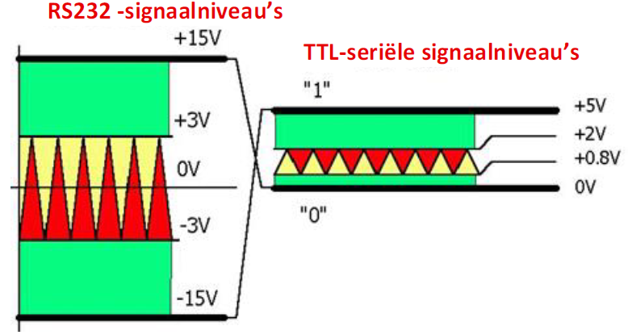
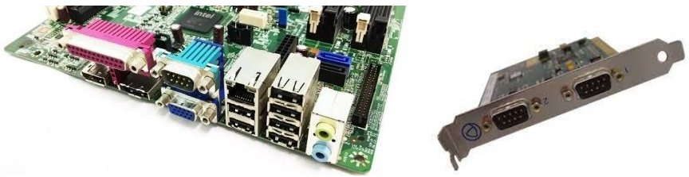
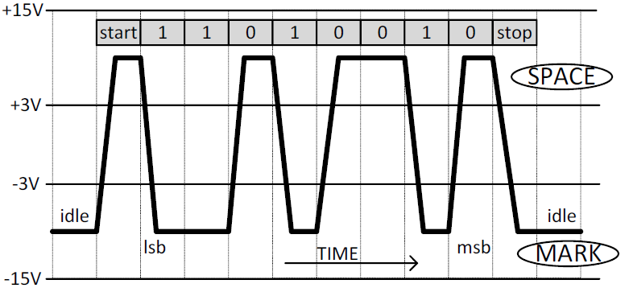

---
mathjax:
  presets: '\def\lr#1#2#3{\left#1#2\right#3}'
---

# RS232 signaalniveaus

De spanning van een RS232-signaal varieert tussen +15V en -15V.

Bij de meeste vaste PC’s is er meestal nog een COM-poort aanwezig, bij laptops niet meer.
Als er te weinig COM-poorten zijn kan je die altijd uitbreiden. Bij veel embedded PC’s zijn er meestal meerdere COM-poorten aanwezig. Bij een PC is het altijd een seriële verbinding met spanningen tussen +15V en -15V.

De RS232 standaard definieert de signaalniveaus die overeenkomen met een logische één of een logische nul als volgt:

> - Logische één | AAN | MARK | tussen -3 en -15V
> - Logische nul | UIT | SPACE | tussen +3 en +15V

Deze symmetrische spanning, die dus nooit 0 volt kan worden biedt een grotere storings-ongevoeligheid dan klassieke TTL-signalen. Dit maakt dat RS232 over grotere afstanden data kan overdragen. Afhankelijk van de gebruikte voeding worden veelal signaalniveaus van ±5V, ±10V, ±12V en ±15V gebruikt. Ook de snelheid waarmee de signalen moeten veranderen (stijg- en daaltijd of slew-rate) is vastgelegd in de norm.

:warning: **Warning:** Do not push the big red button.

> :memo: **Note:** Sunrises are beautiful.

> :bulb: **Tip:** Remember to appreciate the little things in life.