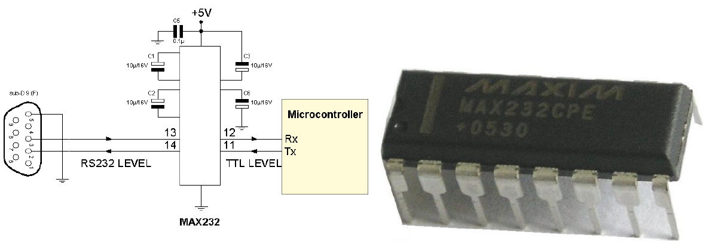
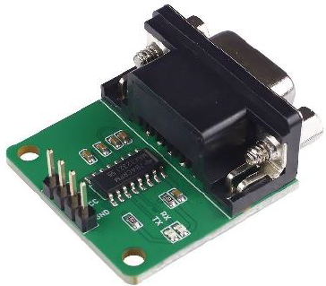

---
mathjax:
  presets: '\def\lr#1#2#3{\left#1#2\right#3}'
---

# TTL-seriële signaalniveaus

Omdat een microcontroller werkt met signaalniveaus tussen GND (0V) en een voedingsspanning van 5V of 3,3V en niet met +12V en -12V wordt er met RS232-TTL-spanningsniveaus gewerkt waarbij een logische 0 overeenkomt met 0V en waarbij een logische 1 een 5V of 3,3V is.
Om vervolgens gebruik te maken van langere leidingen wordt het TTL-niveau omgezet naar de +12V en -12V niveaus.
Een bekende omzetter om RS232-signaalniveaus om te zetten van en naar een TTL-niveau is de MAX232 van Maxim Semiconductors. Rond deze IC dienen enkele condensatoren aangesloten te worden. Deze worden gebruikt om de voedingsspanning van slechts 5 Volt op te slingeren naar 12 Volt.

Er zijn ook kant en klare printjes te krijgen die RS232 omzet naar serieel-TTL die maar enkele euro’s kosten zodat je de schakeling met het IC en de condensatoren niet zelf hoeft te bouwen.

