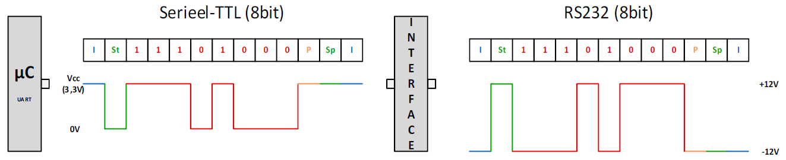
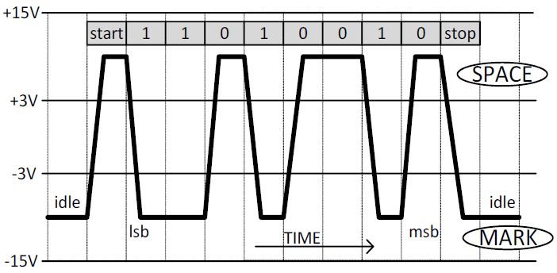
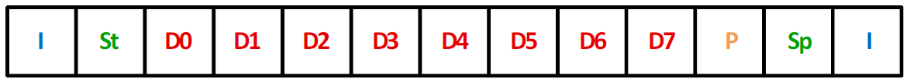

---
mathjax:
  presets: '\def\lr#1#2#3{\left#1#2\right#3}'
---

# Seriële communicatie

## Asynchroon

U ziet dat er in de seriële standaard geen plaats is voor een kloklijn. Dat maakt dat het serieel protocol een asynchroon protocol is. Een asynchroon protocol houdt altijd in dat de synchronisatie tussen zender en ontvanger zal moeten geregeld worden via zeer duidelijke afspraken tussen de zender en ontvanger over o.a. bit-snelheid, start-bit, stop-bit, aantal bits, pariteit bit, …

## Point-to-point / Full duplex

Bij de seriële standaard wordt er enkel gecommuniceerd tussen twee toestellen.
Men noemt dit van punt naar een ander punt (=point to point).
De communicatie is een full-duplex verbinding. Dit wil zeggen dat een toestel tegelijkertijd data kan versturen (via de TxD) en data kan ontvangen (via de RxD).

## Serieel-protocol

Een ander punt dat we hier zeker moeten bespreken is het protocol dat het meest wordt toegepast. Dit protocol maakt echter geen deel uit van de RS232 signaalstandaard, maar we bespreken het hier omdat dit protocol nagenoeg altijd wordt toegepast in combinatie met RS232.

Data die vanuit een microcontroller komt of van het moederbord van een PC zal altijd een serieel TTL signaal zijn zoals links voorgesteld is in Figuur 93. Het signaal zal omgezet worden naar de RS232 spanningsniveaus via een interface (IC met aantal condensatoren) dat rechts is voorgesteld in de volgende figuur.

Een protocol zegt iets over het aantal data-bits, start en stop-bits, wel of geen pariteit, aantal bps, …
Een signaalstandaard beschrijft het aantal lijnen, de signaalniveau ’s, de gebruikte connectoren, de slew-rate, …

De verschillende onderdelen van het protocol worden voorgesteld in de volgende figuur.

### Idle-toestand (I)

Als we naar het protocol kijken en er wordt geen data verstuurd (=idle-toestand), dan is het signaal logisch 1. Bij serieel-TTL is dit gelijk aan de voedingsspanning en bij de RS232 standaard ligt dit tussen -3V en -15V. De Idle-toestand wordt in Figuur 95 voorgesteld door het blokje met de blauwe letter ‘I’.

### Start-bit (St)

Vanaf dat er data wordt verstuurd, wordt er eerst een start-bit verstuurd. Een start-bit wordt bij alle asynchrone signalen gebruikt om aan te geven dat er begonnen wordt met het versturen van data.
De start-bit duurt 1 bit-lengte en is altijd gelijk aan 0V bij serieel TTL. Bij de RS232 signaalniveaus is deze spanning tussen de +3V en +15V.
De start-bit wordt in vorige figuur voorgesteld door het blokje met de groene letters ‘St’.

### Data-bits (Dx)

Het aantal data-bits zal in de meeste gevallen gelijk zijn aan 8. Hierbij is er in het protocol wel de mogelijkheid om 5, 6, 7, 8 of 9 data-bits te versturen (5 keuzemogelijkheden).
De data-bits worden in vorige figuur voorgesteld door de blokjes met de rode tekst.

### Pariteit (P)

Binnen het protocol kan er gekozen worden voor wel of geen pariteit-bit. Voorts kan er zelfs bepaald worden of het een even- of oneven pariteitscontrole is. (3 keuzemogelijkheden).

Pariteit is een fout-ontdekkend systeem. Als er door storing een bit 0 is geworden die normaal 1 is zal deze gedetecteerd worden. Alhoewel dit systeem niet volledig waterdicht is. Als er twee bits door een storing een andere waarde hebben gekregen zullen deze niet ontdekt worden.

Als we werken met even pariteit wordt de pariteit-bit een waarde zodat het aantal enen van de databits een even aantal zijn. Zijn er 3 data-bits één, dan zal de pariteit-bit 1 moeten zijn bij een even pariteit. Zijn er 4 data-bits één, dan zal de pariteit-bit 0 moeten zijn bij even pariteit om een even aantal enen te bekomen.

Als we werken met oneven pariteit wordt de pariteit een waarde gegeven zodat het aantal enen van de data-bits een oneven aantal zal zijn.

De pariteit-bit wordt in vorige figuur voorgesteld door het blokje met de oranje letter ‘P’.
:
### Stop-bit (Sp)

De stop-bit geeft aan dat er gestopt wordt met zenden. Een stop-bit kan 1, anderhalve of twee bit-lengtes duren. (3 mogelijkheden). Meestal is het gewoon 1 stop-bit. (3 keuzemogelijkheden). Vroeger werd er 1,5 en 2 stopbits gebruikt om de ontvager meer verwerkingstijd te geven. Door de snelle controllers van vandaag is dit niet meer nodig.
Bij serieel-TTL is de stop-bit altijd gelijk aan 0V. Bij RS232 zal het signaal een spanning aannemen tussen +3V en +15V.
De stop-bit wordt in de vorige figuur voorgesteld door het blokje met de groene letters ‘Sp’.

### Bit-snelheid (Baudrate)

De datasnelheid (Baudrate) wordt uitgedrukt in bit per seconde bps. Meestal heb je de keuze uit een aantal standaardwaarden: 110, 300, 1200, 2400, 4800, 9600, 19200, 38400, 57600, 115200, 230400, 460800, 921600 (13 keuzemogelijkheden).
De bit-snelheid geeft de bit-lengte weer. Bijvoorbeeld bij 9600bps duurt 1 bit-lengte 104,167μs. 

$$ 1bit_{tijd} = \frac{1} {9600bps} = 104,167.10^{-6}sec = 104,167μs $$

Hoe langer de RS232-kabel is, hoe minder bits per seconde men data zal versturen. De maximaal toegestane kabellengte bij RS232 is ongeveer een 15 meter (kabellengte die overeenkomt met een capaciteit van 2500pF).
Soms gaat men toestellen verbinden via serieel-TTL en daarbij zal de kabel meestal niet langer zijn dan 1 meter en zal de baudrate niet hoog zijn. Bij het verbinden van twee toestellen moet men altijd opletten welke spanningsniveaus er gebruikt worden (Serieel TTL of RS232).
Zoals eerder vermeld is het bij asynchrone datatransmissie cruciaal dat de zender en ontvanger exact hetzelfde staan ingesteld. Stel voor dat de zender steeds 8 data-bits verzendt en dat de ontvanger er slechts 7 verwacht. Vermits dit protocol zoveel keuzemogelijkheden heeft is het zeer belangrijk dat je dit zeer nauwgezet instelt.

