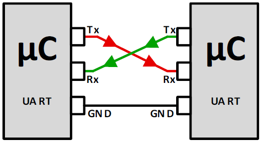
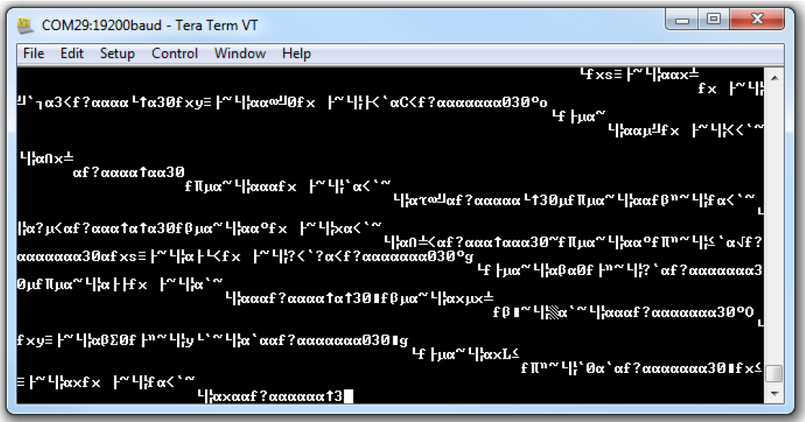

---
mathjax:
  presets: '\def\lr#1#2#3{\left#1#2\right#3}'
---

# Veel voorkomende fouten

## Rx-to-Tx en Tx-to-Rx

Het verkeerd verbinden van zenders met ontvangers komt heel regelmatig voor. Let hier op, het kan de UART ook stuk maken. Let vooral op wanneer je twee Tx-lijnen aan elkaar zou leggen. Dit kan de UART stuk maken!! Gebruik dus steeds een cross-kabel.

## Baudrate mismatch

Foutieve instellingen/afspraken tussen de beide toestellen op vlak van de baudrate, wel of geen pariteit of het aantal stopbits kan leiden tot een foute data overdracht.

Als twee toestellen niet volgens dezelfde afspraken werken, dan begrijpen de toestellen elkaar niet doordat de data telkens foutief zal worden gelezen. De ingelezen data zal eruit zien als garbage. Zorg dus dat de baudrate op elkaar is afgestemd.

In de volgende figuur is het resultaat van garbage getoond waarbij de parameters van de verzender niet kloppen met deze van de ontvanger.

