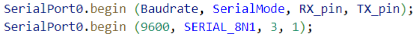
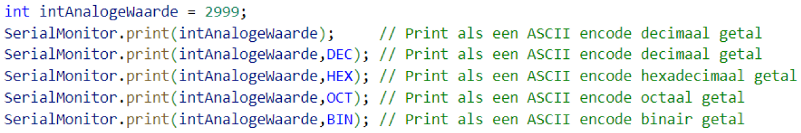

---
mathjax:
  presets: '\def\lr#1#2#3{\left#1#2\right#3}'
---

# ESP32 en seriële communicatie

De ESP32 heeft drie universal asynchronous receivers en transmitters (UART) poorten die UART0, UART1 en UART2 heten die werken op een 3,3V TTL niveau. Deze drie seriële interfaces zijn hardwarematig uitgevoerd. Elk van hen hebben 4 aansluitpinnen, namelijk: Rx, Tx, RTS, CTS

Natuurlijk moet de GND van de twee communicerende apparaten ook verbonden worden.
Alleen de Arduino IDE gebruikt enkel de RX en TX pinnen.
Bij default kunnen enkel UART0 en UART2 gebruikt worden. De aansluitingen van UART1 worden gedeeld met de aansluitingen van de SPI-interface die intern verbonden zijn met het SPI flash memory. Enkel op sommige ESP32 boards is UART1 naar buiten gebracht op een pinout haeders.
De ESP32 feather van Adafruit kan enkel UART0 en UART2 gebruikt worden. UART0 is de micro-USB aansluiting en UART2 is pin 16 en 17 die zijn weergegeven in het roze van volgende figuur.

## Configuratie van de UART

Om de seriële poorten te gebruiken wordt de HardwareSerial bibliotheek gebruikt. Ten eerste zal de bibliotheek moeten toegevoegd worden aan het programma.

Na het toevoegen van de bibliotheek zal er een object gedeclareerd moeten worden van de klasse HardwareSerial waarbij de gebruikte poort meegegeven kan worden. Bij de aanroep moet worden meegegeven welke UART je object zal aansturen. Bij de ESP32 is er de mogelijkheid UART0, 1 en 2. Bij de ESP32 feather van Adafruit kan enkel UART0 en 2 gebruikt worden. In het onderstaande voorbeeld zijn twee objecten gemaakt met de namen SerialPort0 en SerialPort2.

Vervolgens zal de poort in de setup-routine ingesteld moeten worden door de begin methode op te roepen.

Aan de beginmethode worden er 4 parameters meegegeven. De eerste parameter is de Baudrate? Veel gebruikte snelheden zijn :
300, 600, 1200, 2400, 4800, 9600, 13400, 19200, 28800, 31250, 38400, 57600, 115200

De tweede parameter is de seriële mode:
>- die begint met de tekst ‘SERIAL_’ :
>- gevolgd door het aantal databits. Dit is een cijfer tussen 5 en 9.
>- Daarachter een letter dat de pariteit weergeeft. Dit kan N(=none parity), E (=Even parity) of O (=Odd parity) zijn.
>- Als laatste wordt het aantal stopbytes weergegeven. Dit kunnen er 1 of 2 zijn.

In de volgende figuur wordt weergegeven hoe deze instelling kan meegegeven worden.

De derde parameter is de Rx-pin (receive pin) en de vierde pin is de TX-pin (transmit pin).

## Ontvangen van data via de UART

Om te kijken of er data ontvangen is wordt er regelmatig in de loop-methode gecontroleerd of er data ontvangen is. Dit wordt gedaan met de methode .available() die het aantal ontvangen bytes teruggeeft.

Als er data ontvangen is kan deze byte per byte gelezen worden met de methode read().

Er zijn nog een tal van methodes die kunnen gebruikt worden zoals:
>- ReadBytes()
>- ReadBytesUntil
>- ReadString()
>- ReadStringUntil()

## Versturen van data via de UART

Om data te versturen kan je de methode print of println. Het verschil tussen beide is dat er bij println na de tekst nog twee bytes meer verstuurd worden, namelijk:
>- Carriage return (=CR). Dit is de waarde 13 in de ASCII-tabel. Wordt ook voorgesteld door \r Letterlijk betekent dit terugloop. Dit wil zeggen dat de cursor terug gaat naar het begin.
>- LineFeed of newline (=LF). Dit is de waarde 10 in de ASCII-tabel. Wordt ook voorgesteld door \n.

Bij print en println kunnen twee parameters meegegeven worden waarvan de tweede optioneel:
>- De eerste parameters is de te versturen data.
>- De tweede parameter geeft het format weer.

De write-methode kan ook gebruikt worden. Met de write-methode kan alleen één byte verstuurd worden volgens het type uint_8t. Deze kunnen ook in verschillende formaat worden weergegeven als de te versturen byte als een constante wordt meegegeven.

