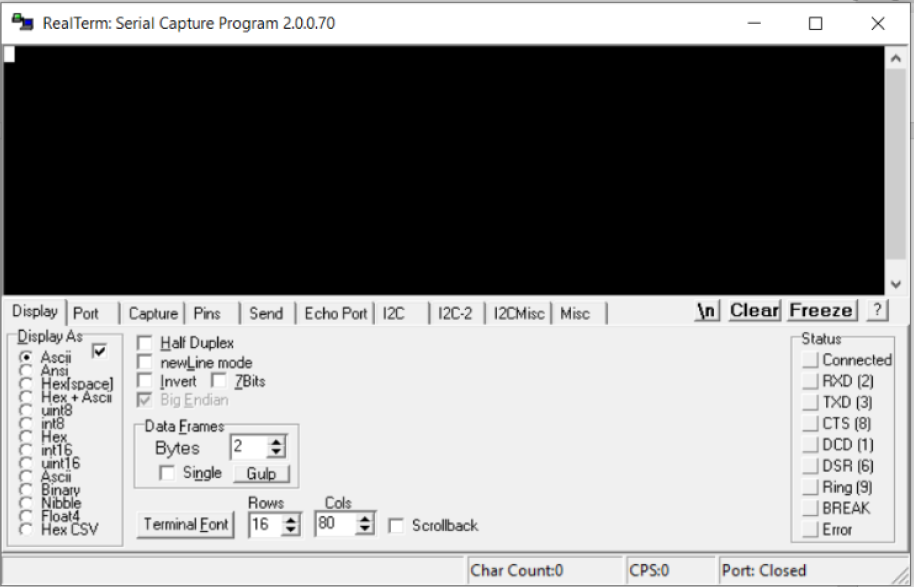
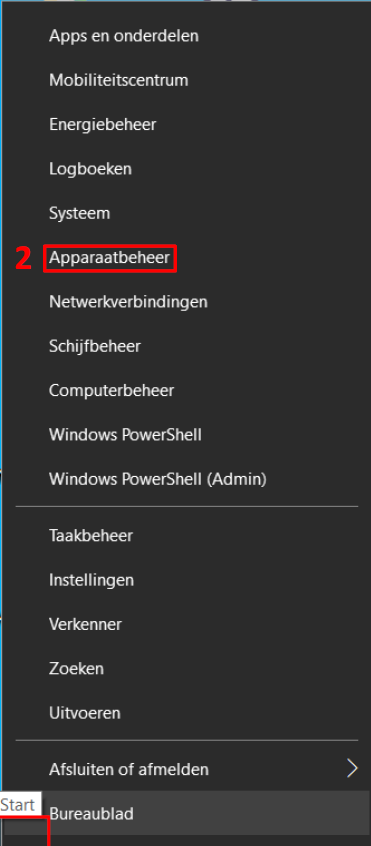
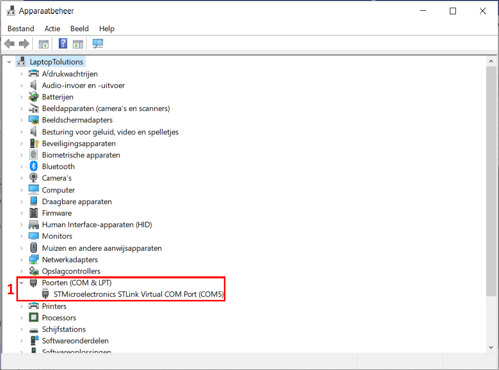
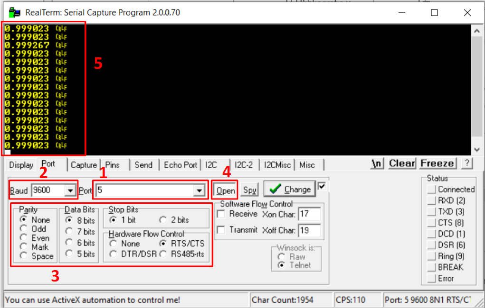
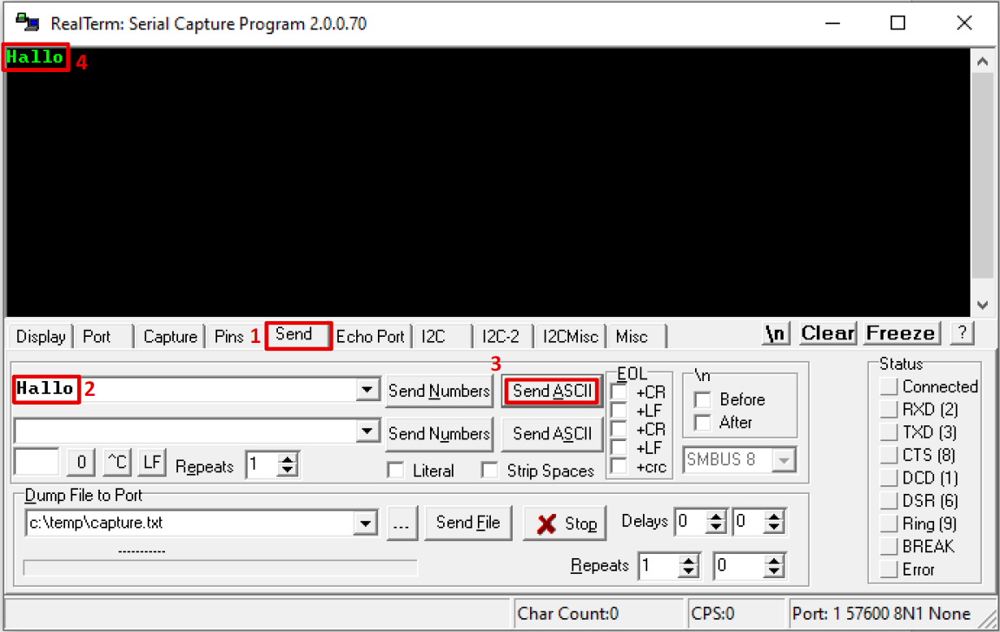

---
mathjax:
  presets: '\def\lr#1#2#3{\left#1#2\right#3}'
---

# Terminal APP

Het komt zeer veel voor dat wanneer we een seriële communicatie willen opzetten dat we nood hebben aan een programma op de computer om effectief te zien wat de microcontroller aan data allemaal verstuurt. Maar ook om eventueel data terug te sturen naar de microcontroller.

Vooraleer we dit laten doen door een applicatie, kunnen we daar als test een terminal programma voor gebruiken. Dit wordt zeer veel gedaan bij de ontwikkeling van systemen en is dus een uiterst belangrijke stap in de ontwikkeling van een werkend systeem.

:::tip
Een terminal applicatie wordt veel gebruikt als Debug-tool. Veel IDE ontwikkelapplicaties voor microprocessoren bezitten niet de mogelijkheden om code te debuggen (tijdelijk onderbreken van de code en step by step mogelijkheden). Als alternatief kunnen tijdelijk waarden of toestanden van variabelen weggeschreven worden naar een termina applicatie. 
:::

Er bestaan wel meer dergelijke programma's. De verzamelnaam voor die programma's is een terminal programma of editor. Voorbeelden zijn Putty of RealTerm. In de ontwikkelomgeving Visual Studio Code wordt dit de serial monitor genoemd zoals in vorige hoofdstukken al gebruikt. De serial monitor is verbonden met UART0 van de ESP32 feather van Adafruit.
Verder wordt er het programma RealTerm gebruikt dat gratis op internet te vinden is. Dit programma kan je gebruiken om bijvoorbeeld data te versturen en ontvangen via UART2.

Na het opstarten van het programma RealTerm moeten een aantal instellingen in het programma gedaan worden, waaronder de COM-poort die de PC-gebruikt.
Als je een PC-gebruikt met een vaste COM-poort kan je direct instellen welke COM-poort er gebruikt wordt. Gebruik je een USB naar serieel converter zoals in Figuur 86 of gebruik je een microcontroller met een USB-poort die een USB-naar serieel converter aan boord heeft, dan wordt er automatisch een COM-poort toegewezen door de PC vanaf dat je de USB-kabel met het aangesloten toestel verbindt met de PC.

Om te weten te komen welke poort de PC heeft toegewezen, kan je dit bij apparaatbeheer te weten komen. Ga met de muistoets boven het startsymbool van Windows staan (1) en druk op de rechtermuis toets. Selecteer vervolgens ‘Apparaatbeheer’ (2).

Bij Poorten (COM & LPT) kan je zien welke COM-poort of COM-poorten er gebruikt worden. In de volgende figuur is dit COM5 (1).

Nu je weet welke COM poort er gebruikt wordt, kan je de juiste instellingen maken in het programma RealTerm.

:::warning
De communicatie tussen een microcontroller en de computer via de COM-poort kan maar door één programma op de computer worden uitgevoerd. Dus RealTerm en de Serial Monitor terzelfdertijd laten communiceren via eenzelfde COM-poort met een microcontroller zal uw laptop/computer niet toelaten. Er kan maar 1 programma gebruik maken van dit communicatiekanaal.
:::

Selecteer de juiste COM-poort (1). Vul vervolgens de juiste baudrate in (2). Dit is hier 9600bps. De overige instellingen (3) staan normaal gezien juist.
Als laatste klik je op ‘Open’ (4) om de communicatie te starten.
De gegevens die de microcontroller verstuurt komen nu op het ontvangstvenster (5) tevoorschijn.

Wil je met RealTerm data versturen naar de microcontroller dan doe je volgende:
Selecteer het tabblad ‘Send’ (1). De te versturen tekst vul je in het veld (2). Vervolgens druk je op ‘Send ASCII’ (3) om de tekst te versturen naar de microcontroller. De verstuurde tekst komt ook in het ontvangstvenster (4) terecht.

