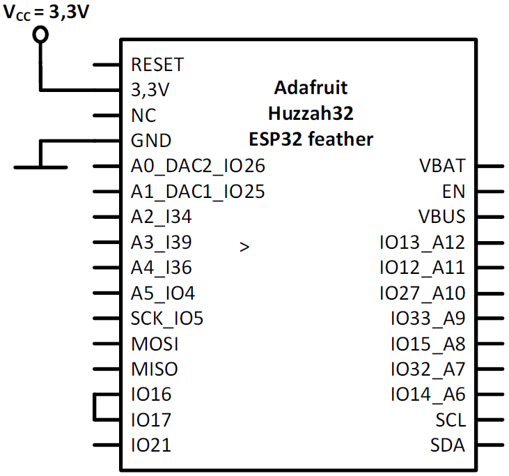
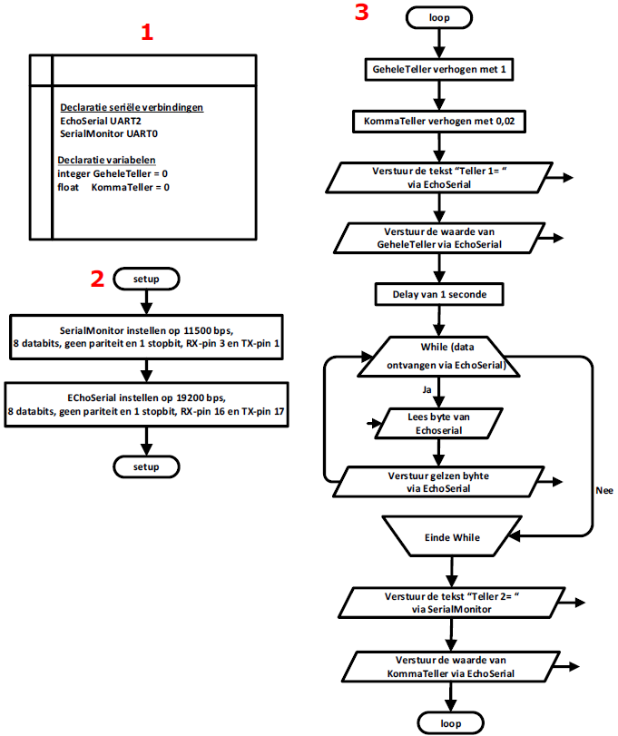
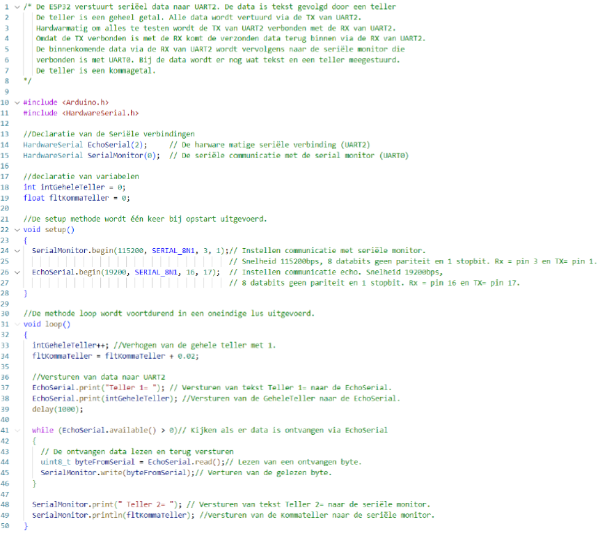
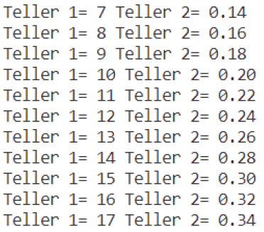

---
mathjax:
  presets: '\def\lr#1#2#3{\left#1#2\right#3}'
---

# Voorbeeld seriële communicatie bij de ESP32

In het voorbeeld gaan we tekst versturen via de seriële monitor in Visual code naar de ESP32.
De seriële monitor verstuurt de data en komt binnen in de ESP32 via de RX van UART0. Deze data wordt doorgestuurd via UART2 waarbij er een teller en tekst aan de data wordt toegevoegd. De teller is een geheel getal. Alle data wordt doorgestuurd via de TX van UART2.

Hardwarmatig om alles te testen wordt de TX van UART2 verbonden met de RX van UART2 zoals in volgende figuur. Omdat de TX verbonden is met de RX komt de verzonden data terug binnen via de RX van UART2.

De binnenkomende data via de RX van UART2 wordt vervolgens terug doorgestuurd naar de seriële monitor die verbonden is met UART0. Bij de data wordt er nog wat tekst en een teller meegestuurd.
De teller is een kommagetal.

## Schema

## Flowchart

## Software

## Testen van het programma

Na het starten van het programma zie je in de seriële monitor iedere seconde een lijn bijkomen.

