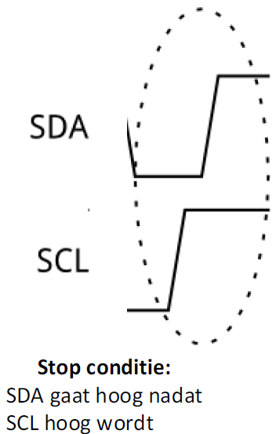

---
mathjax:
  presets: '\def\lr#1#2#3{\left#1#2\right#3}'
---

# Wat is I²C?

In dit deel van de cursus wordt het I²C communicatieprotocol belicht. Waarom je dit zou gebruiken en hoe het te implementeren komt hier aan bod.
De Inter-integrated Circuit I²C Protocol is een protocol die meerdere slave devices op de bus toelaat.

In de meeste gevallen wordt er met één master gewerkt zoals te zien in volgende figuur. Men noemt dit een point to multi-point communicatie. In ons geval zal de master onze ESP32 microcontroller zijn.

Alhoewel meerdere master van de bus kunnen gebruik maken, zullen wij enkel deze bespreken met één master en meerdere slaves zoals in de meeste gevallen wordt gebruikt. De bus wordt toegepast waar afstanden heel beperkt zijn binnen een elektrisch toestel dus.
Een master is het toestel dat bepaald op welk moment en naar wie er gecommuniceerd wordt.

De I²C bus wordt ook IIC of Inter IC-bus genoemd. Soms spreekt men ook over een Two Wire Interface afgekort TWI.
De standaardversie 1.0 heeft een snelheid van 400kbp. De versie 4.0 gaat tot 5MHz.

Zoals te zien in vorige figuur zijn er naast de voeding (Vcc en GND) twee signalen SDA voor de seriële data en SCL voor de seriële klok.

Het is een synchroon protocol. Dit wil zeggen dat de master een kloksignaal voorziet waarmee de snelheid van zender en ontvanger wordt bepaald. Bij een asynchroon protocol is er nooit een kloksignaal voorzien maar wordt de timing in de data verwerkt.

Er is maar één datalijn maar de data kan door de master verstuurd worden naar de slave, maar de data kan ook in de richting van de slave naar de master gaan. Men noemt dit een half-duplex verbinding. De communicatie kan in twee richting verlopen maar niet op hetzelfde moment.
Een simplex verbinding is als de communicatie van de data maar in één enkele richting kan gaan (van zender naar ontvanger)
Een full-duplexverbinding is als de communicatie in twee richtingen kan gaan en dat op hetzelfde moment.

## Geschiedenis

I²C is oorspronkelijk in 1982 door Philips ontwikkeld voor verschillende Philips-chips. De oorspronkelijke specificaties stonden alleen voor communicatie van 100 kHz toe en alleen voor 7-bits adressen, waardoor het aantal apparaten op de bus naar 112 werd beperkt (er zijn verschillende gereserveerde adressen die nooit voor geldige I²C-adressen zullen worden gebruikt). In 1992 werd de eerste openbare specificatie gepubliceerd, met een 400 kHz snelle modus en een uitgebreide 10-bits adresruimte. Op dit punt is er in de meeste gevallen (bijvoorbeeld in het ATMega328-apparaat op veel Arduino-compatibele kaarten) ondersteuning voor I²C.

> Er zijn drie extra modi gespecificeerd:
>- Fast-mode plus, op 1 MHz;
>- High-speed modus, op 3,4 MHz;
>- Ultrasnelle modus, op 5 MHz.

Naast de originele I²C introduceerde Intel in 1995 hierop een variant: "System Management Bus" (SMBus). SMBus is een strakker gecontroleerd formaat, bedoeld om de voorspelbaarheid van communicatie tussen ondersteunende IC's op pc-moederborden te maximaliseren.

Het belangrijkste verschil tussen SMBus is dat het snelheden beperkt van 10 kHz tot 100 kHz, terwijl I²C apparaten van 0 kHz tot 5 MHz ondersteunt. SMBus bevat een klok-timeoutmodus die operaties met een lage snelheid onwettig maakt, hoewel veel SMBus-apparaten het toch zullen ondersteunen om de interoperabiliteit met ingesloten I²C-systemen te maximaliseren.

## Hardware

Elke I²C-bus bestaat uit twee signalen: SCL en SDA. SCL is het kloksignaal en SDA is het datasignaal. Het kloksignaal wordt altijd gegenereerd door de huidige master. Sommige slave-apparaten kunnen de klok soms te laag maken om de master te vertragen om meer gegevens te verzenden (of om meer tijd nodig te hebben om gegevens voor te bereiden voordat de master deze probeert uit te klokken). Dit wordt "clock stretching" genoemd en wordt verder beschreven.
In tegenstelling tot UART- of SPI-verbindingen zijn de I²C-busdrivers "open drain", wat betekent dat ze de bijbehorende signalen laag kunnen trekken, maar niet hoog kunnen forceren. Er kan dus geen bus conflict zijn waarbij een apparaat de lijn probeert te besturen terwijl een ander probeert hem laag te trekken, waardoor de kans op schade aan de stuurprogramma's of overmatige vermogensdissipatie in het systeem wordt geëlimineerd. De data- en kloklijn hebben een pull-upweerstand om het signaal hoog te trekken wanneer geen apparaat het signaal bewerkt (stuurt).

De weerstandsselectie varieert met apparaten op de bus en de voedingsspanning. Typische waarden zijn 4,7k voor 5V en 2,4k voor 3,3V. I²C is een redelijk robuust protocol en kan worden gebruikt met korte series draad (2-3 m). Voor lange leidingen en systemen met veel apparaten zijn kleinere weerstanden beter.

## Spanningsniveaus

Omdat de apparaten op de bus de signalen niet echt aansturen, biedt I²C enige flexibiliteit bij het aansluiten van apparaten met verschillende I/O-spanningen. Over het algemeen is het mogelijk dat in een systeem waarin het ene apparaat op een hogere spanning staat dan in het andere, de twee apparaten via I²C kunnen worden verbonden zonder daartussen een niveauverschuivingsschakeling. De truc is om de pull-up weerstanden aan te sluiten op de laagste van de twee voltages. Dit werkt alleen in sommige gevallen, waarbij de laagste van de twee systeemspanningen de hoge ingangsspanning van het hoog spanningsniveau overschrijdt, bijvoorbeeld een 5V Arduino en een 3,3V accelerometer.
Als het spanningsverschil tussen de twee systemen te groot is (bijvoorbeeld 5V en 2,5V), zijn er eenvoudige I²C-niveau omzetter schakelingen op de markt te vinden zoals in de volgende figuur.

## Protocol

Communicatie via I²C is complexer dan met een UART- of SPI-oplossing. De signalering moet voldoen aan een bepaald protocol voor de apparaten op de bus om het te herkennen als geldige I²C-communicatie. Gelukkig zorgen de meeste apparaten voor alle onhandige details voor u, zodat u zich kunt concentreren op de gegevens die u wilt uitwisselen. Als er geen data wordt verstuurd zijn de spanningsniveaus van zowel de klok (=SCL) als de data (=SDA) hoog. Als de master data wil versturen naar een slave of data wil vragen van een slave zal hij een startconditie initiëren (1). Vervolgens zal hij het adres van de slave op de bus plaatsen met wie hij data wil uitwisselen (2). Dit wordt het adresframe genoemd. Dan zal de master met een bit weergeven of hij data wil versturen of data wil vragen (3).

De slave zal zijn aanwezigheid bevestigen met een bevestiging door de datalijn laag te maken als hij klaar is om data te ontvangen (4). Dit noemt men de acknowledge/not acknowledge.

Vanaf nu zal er data worden uitgewisseld (5). Dit noemt men een gegevensframe. Als men gedaan heeft met data uit te wisselen zal de master een stopconditie (6) versturen om de communicatie te beëindigen.

### Start conditie

Om het adresframe te initiëren, brengt de master de SDA laaghoog en trekt dan SCL laag.

Dit zet alle slave-apparaten in de start-conditie, wat wil zeggen dat de slaves nu op de hoogte zijn dat
de master wenst te starten.
Het is mogelijk om herhaalde starts uit te voeren, een nieuwe communicatiereeks te initiëren zonder de besturing van de bus aan een andere master te geven; daar later meer over.

### Adresframe

Het kloksignaal SCL wordt altijd door de master gegenereerd en geeft dus de snelheid van het communiceren aan. Bij het adresframe plaatst de master het adres van de slave op de datalijn SDA om weer te geven met welke slave hij wil communiceren.

### Read/Write bit

Via de read/write bit geeft de master weer aan via de geadresseerde bit of hij dat wij versturen naar de slave of data wil lezen van de slave.
Als de master data wil schrijven zal de R/W bit een laag niveau hebben (=0). Als de master data wil lezen van de slave zal het niveau hoog zijn (=1).

### Acknowledge: Ack/Nack-bit na het adresframe

Na een verstuurd adres zal de slave een bevestiging sturen door de SDA-lijn laag te maken om aan de master te vertellen dat hij klaar is om te communiceren. Via deze bevestiging weet de master of een slave aanwezig is op de bus en dat hij in staat is om te communiceren.

### Dataframe + Ack/Nack-bit

Als de master data wil schrijven zal de master de data op de SDA-lijn plaatsen. De snelheid van communiceren wordt weergegeven door het kloksignaal dat de master genereerd. Nadat de 8 bits verstuurd zijn zal de slave het ontvangen bevestigen. Als de slave de data goed heeft ontvangen zal hij een 0 versturen.

Als de master data wil ontvangen van een slave zal de master 8 kloksignalen genereren. De slave zal de 8 databits op de SDA-lijn plaatsen op het ritme van de klok. Als de master de databits goed heeft ontvangen zal de master een bevestigingsbit versturen door de SDA-lijn laag te maken.

Het aantal dataframes is willekeurig en de meeste slave-apparaten zullen het interne register automatisch verhogen, wat betekent dat de volgende lees- of schrijfbewerkingen van het volgend register in de rij komt.

### Stop conditie

Nadat alle dataframes zijn verzonden, genereert de master een stopconditie en deze wordt gedefinieerd door de SDA- lijn hoog te maken nadat het SCL-signaal hoog is gemaakt.

Tijdens normaal communiceren mag de waarde van SDA niet veranderen als SCL hoog is om verkeerde stopcondities te voorkomen.

> :bulb: **Tip:** Het I²C protocol is door zijn populariteit gegroeid met de jaren. Zo zijn er *Advanced protocol topics* op te zoeken. Daarbinnen kan er gewerkt worden met 10-bit adressering (ipv 7) om de functionaliteit van het protocol uit te breiden. Zo bestaan er ook technieken zoals **Repeated Start Conditie** en **Clock stretching** die efficiënte communicatie mogelijk maken. Indien meer info nodig is, kan dit op het internet worden opgezocht. Verder valt dit buiten de scope van deze cursus.
