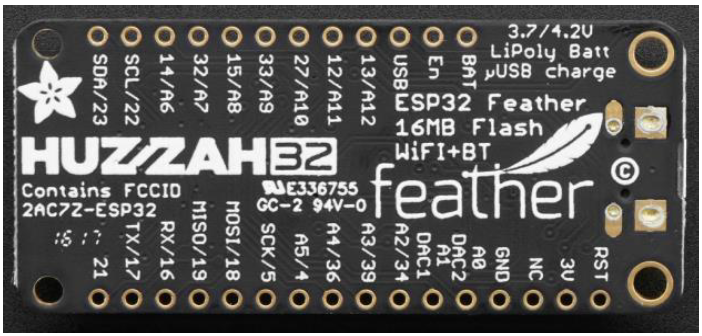
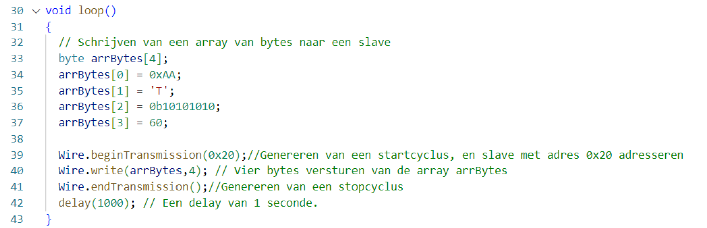
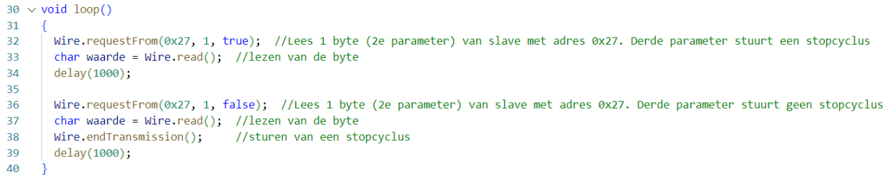
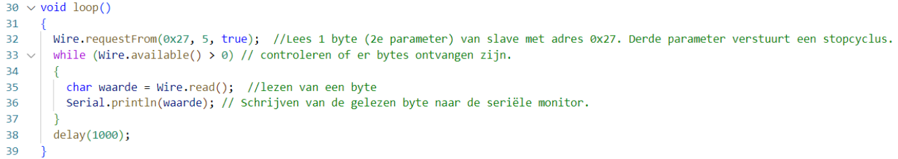
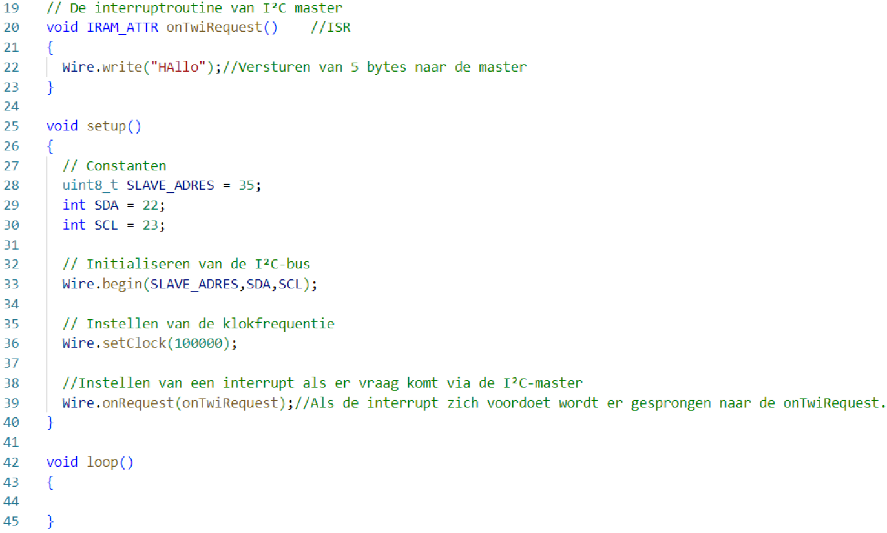
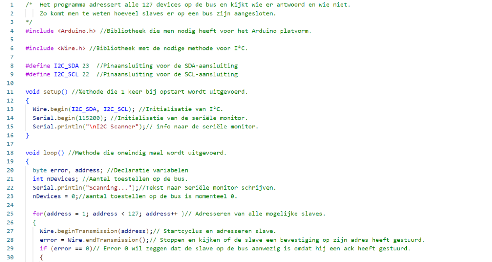
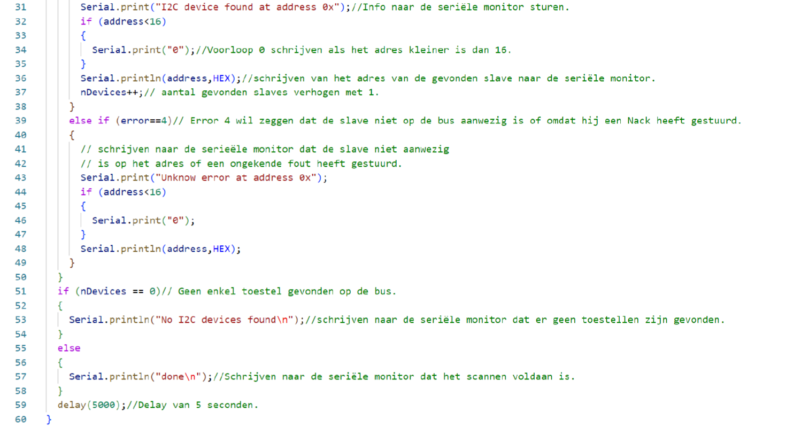

---
mathjax:
  presets: '\def\lr#1#2#3{\left#1#2\right#3}'
---

# I²C met de ESP32

De ESP32 ondersteunt I²C communicatie door gebruik te maken van twee I²C bussen die zowel als master of als slave gebruikt kunnen worden afhenkelijk van de instellingen van de gebruiker.
De I²C bussen ondersteunen:
> - Standard mode (100 kbit/s)
> - Fast mode (400 kbit/s)
> - Tot 5MHz
> - 7 bit/10 bit adressen

:::warning
Bij de ESP32 feather van Adafruit zijn de pull-up weerstanden niet voorzien en deze moeten zelf hardwarematig geplaatst worden (2,4k).
:::

In de volgende figuur zijn de digitale IO-pinnen afgebeeld. Standaard wordt er bij de feather van Adafruit pin 22 gebruikt als SCL en pin 23 als SDA. Je bent daar niet aan gebonden maar je kan gemakkelijk andere pinnen gebruiken door dit te configureren.




## Include Wire-bibliotheek

Om TWI (Two wire interface) of I²C te gebruiken moet je de bibliotheek wire.h includen in het begin van het programma.

```cpp
#include <Arduino.h>
#include <Wire.h>
```

## I²C-objecten maken
Het volgende is een object maken van de klasse TwoWire om een I²C bus te maken. Er kunnen maximum twee bussen gemaakt worden omdat de ESP32 er twee heeft. 

```cpp
TwoWire I2C_bus1 = TWoWire(0);
TwoWire I2C_bus2 = TWoWire(1);
```
:warning: **Warning:** Vorige moet niet uitgevoerd worden al er maar 1 I²C bus wordt gebruikt.

## Initialiseren van de I²C bus(sen)
In de setup-methode gaat men de I²C-bus initialiseren. Bij het initialiseren gebruikt men de begin-methode. Bij deze methode worden er twee argumenten meegegeven. Het eerste is de IO-pin van de SDA en de tweede de IO-pin van de SCL.
De klok stelt men in met de methode setClock.

```cpp
#include <Arduino.h>
#include <Wire.h>
#define I2C_SDA 23
#define I2C_SCL 22
void setup() 
{
  Wire.begin(I2C_SDA, I2C_SCL);
  Wire.setClock(400000);
}
```

```cpp
#include <Wire.h>
#define I2C_SDA 23
#define I2C_SCL 22
```
## Schrijven van een byte naar een slave

Om een byte te schrijven naar een slave moeten er drie methodes uitgevoerd worden, namelijk:
>- Een beginTransmission waarbij de startcuclus gegenereerd wordt en het adres van de slave wordt meegegeven waarna een byte zal worden geschreven.
>- De te schrijven byte met de methode write.
>- Het eindigen van de communicatie waar de stopcyclus wordt gegenereerd.

```cpp
void loop() 
{
  Wire.beginTransmission(0x20);
  Wire.write(0xAA);
  Wire.endTransmission();
  delay(250);
  Wire.beginTransmission(0x20);
  Wire.write(0x55);
  Wire.endTransmission();
  delay(250);
 }
```
## Schrijven van een aantal bytes naar een slave

Om een aantal bytes te schrijven naar een slave is het handig om de bytes te plaatsen in een array van bytes (= lijn 33 tot en met lijn 37).
Vervolgens worden er terug gestart met de beginTransmission methode (lijn 39) en geëindigd met de endTransmission methode (= lijn 41).
Om de bytes te versturen wordt de methode write gebruikt zoals in lijn 40 van onderstaande figuur. Het eerste argument is de array waaruit de data moet opgehaald worden en de tweede byte is het aantal te versturen bytes.



## Lezen van een byte van een slave

Om een byte te lezen van een slave wordt de methode requestFrom gebruikt waarbij het eerste argument het adres is van de slave waarvan gelezen wil worden. Het tweede argument is het aantal bytes die men wil lezen en is hier natuurlijk 1. Het derde argument is optioneel en geeft weer dat er na het ontvangen een stopcyclus verstuurd moet worden of niet (lijn 32 en 36). Als men geen stopcyclus via deze methode verstuurt, dan kan die wel verstuurd worden met de methode endTransmission zoals op lijn 38.



## Lezen van meerdere bytes van een slave

Als men meerdere bytes wil lezen gebruikt men de requestFrom methode waarbij men als tweede argument het aantal bytes weergeeft (lijn 32).
Vervolgens zal men in een while-lus controleren of de bytes ontvangen zijn (lijn 33). Als er bytes ontvangen zijn zal men deze lezen door de functiemethode read te gebruiken.



## Een I²C slave maken met een ESP32

Om een I²C slave te maken wordt er een aantal constanten aangemaakt waaronder het adres van de slave, de gebruikte SDA en SCL pinnen van de I²C-bus (lijn 28, 29 en 30).
Vervolgens is het belangrijk dat de slave geïnitialiseerd wordt door de methode begin aan te roepen waarbij het adres en de gebruikte communicatiepinnen worden meegegeven (lijn 33).
Vervolgens wordt de kloksnelheid ingesteld (lijn 36).
Als laatste wordt de interruptroutine meegegeven die moet uitgevoerd worden als er gevraagd wordt om te communcieren (lijn 39).
De interruptroutine staat op lijn 19 t.e.m. 23. Waarbij de slave, onze controller, 5 bytes verstuurd met de tekst ‘Hallo’. Wat er verstuurd moet worden zal afhankelijk zijn van wat de master wil.



> :memo: **Note:** In de meeste gevallen zal de ESP32 gebruikt worden als MASTER en niet als SLAVE binnen een I²C bus. Met gevolg dat vorige code in labo toepassingen niet zal gebruikt worden.

## Voorbeeld: scannen van een I²C-bus

Het onderstaande voorbeeld is een programma die handig kan zijn om alle adressen van de slave te weten die op een bus aanwezig zijn.





