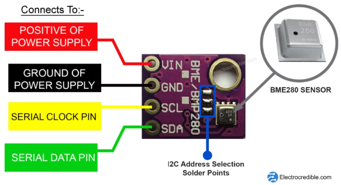
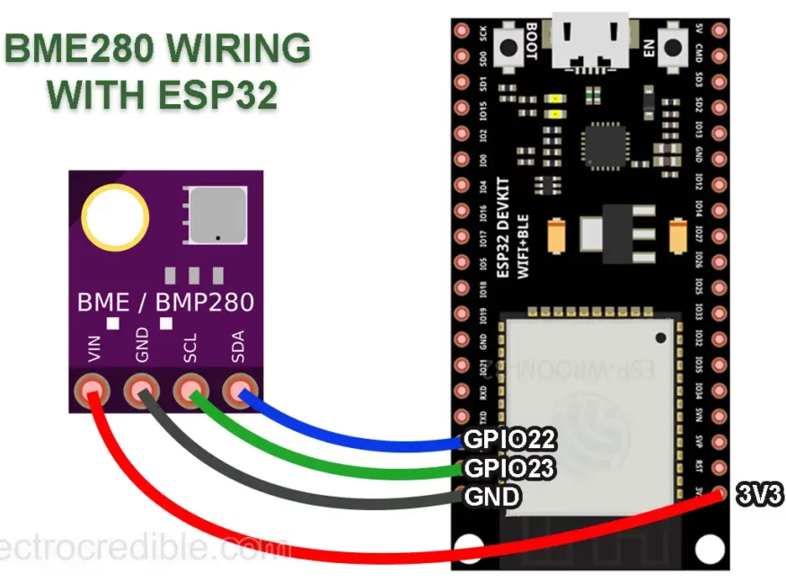
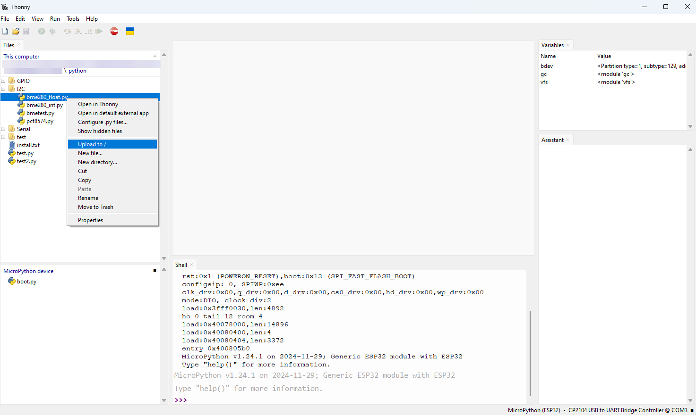
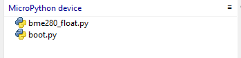

---
mathjax:
  presets: '\def\lr#1#2#3{\left#1#2\right#3}'
---

# I²C met de ESP32

De ESP32 ondersteunt I²C communicatie door gebruik te maken van twee I²C bussen die zowel als master of als slave gebruikt kunnen worden afhenkelijk van de instellingen van de gebruiker.
De I²C bussen ondersteunen:
> - Standard mode (100 kbit/s)
> - Fast mode (400 kbit/s)
> - Tot 5MHz
> - 7 bit/10 bit adressen

:::warning
Bij de ESP32 feather van Adafruit zijn de pull-up weerstanden niet voorzien en deze moeten zelf hardwarematig geplaatst worden (2,4k).
:::

In de volgende figuur zijn de digitale IO-pinnen afgebeeld. Standaard wordt er bij de feather van Adafruit pin 22 gebruikt als SCL en pin 23 als SDA. Je bent daar niet aan gebonden maar je kan gemakkelijk andere pinnen gebruiken door dit te configureren.


In dit deel komen volgende items aan bod:
> - De I²C bus scannen
> - Lezen en schrijven van I²C data
> - Het connecteren van meerdere devices (slaves) op de bus.

:::warning
Hier wordt de ESP32 gebruikt als I²C master, wat in werkelijk ook meestal zo zal zijn. Het is echter mogelijk om de ESP32 als slave te configureren op een I²C bus met een andere master. Er is meestal ook maar één master die de bus onder zijn beheer het dataverkeer erop, laat gebeuren.
:::

## MicroPython Methods voor I²C

Er bestaan heel wat methodes die kunnen gebruikt worden voor de I²C bus communicatie. Hier wordt van de bibliotheek 'machine' 'SoftI2C' gebruikt om de I²C communicatie te verzorgen door middel van specifieke commando's. SoftI2C is een op opvolger van I2C.

```python
from machine import Pin, SoftI2C

# Initialize I2C communication, toekenning pinnen en frequentie
i2c = SoftI2C(scl=Pin(22), sda=Pin(23), freq=100000)

i2c.scan()   #Scan for peripherals, and returns a list of 7-bit addresses.
i2c.writeto(42, b'123') #Write 3 bytes to the device. The device’s address is 42.
i2c.readfrom(0x3a, 4) # Read 4 bytes from the peripheral that has a 7-bit address of 0x3a.
i2c.start()   #Generate a START condition on the bus.
i2c.stop() #Generate a STOP condition on the bus.
```

## Scannen I²C devices
Omdat I²C-apparaten unieke adressen hebben, zal het kennen van hun adressen ons helpen om met een of meer apparaten te communiceren. Het scannen van I²C-apparaten helpt ook om te weten of de bedrading correct is.

Beschouw het voorbeeld van een microcontroller die is aangesloten op een sensor die via I²C kan communiceren. We kunnen de volgende code gebruiken om het I²C-adres van de sensor te scannen.

```python
from machine import Pin, SoftI2C

# Initialize the SDA-SCL pins for I2C communication
sdaPIN = Pin(23)
sclPIN = Pin(22)
# Initialize the I2C interface with the specified pins and frequency
i2c = SoftI2C(sda=sdaPIN, scl=sclPIN, freq=400000)
# Scan for devices connected to the I2C bus
devices = i2c.scan()
# Check if any devices are found
if len(devices) != 0:
    # If devices are found, print the number of devices found
    print('Number of I2C devices found=',len(devices))
    # Iterate through each device found and print its hexadecimal address
    for device in devices:
        print("Device Hexadecimel Address= ",hex(device))
# If no devices are found, print a message
else:
    print("No device found")
```

Het voorbeeld in de vorige sectie hierboven laat zien hoe u deze code kunt gebruiken om I²C-apparaten te scannen. Als er meerdere apparaten op een I²C-bus zijn aangesloten, worden de adressen van elk apparaat afgedrukt.

## I²C example BME-280 slave

Laten we een eenvoudig voorbeeld proberen van hoe sensoren kunnen worden gekoppeld aan een ESP32-ontwikkelbord met behulp van I²C- en MicroPython-code.

Zorg er eerst voor dat de MicroPython-firmware naar uw ESP32 is geflasht. Onze handleidingen voor het flashen en uitvoeren van MicroPython op ESP32 met behulp van Thonny IDE en aan de slag gaan met ESP32 op Thonny IDE zijn nuttige bronnen.

ESP32 heeft twee hardware I²C-modules die worden gemultiplext naar de GPIO's. In dit voorbeeld wordt de BME280-omgevingssensor gebruikt om te demonstreren hoe we met behulp van I²C gegevens van een sensor kunnen lezen.

BME280 is een 3-in-één omgevingssensor van Bosch Sensortech. Het voert digitale gegevens uit met informatie over temperatuur, druk en vochtigheid. Het is algemeen verkrijgbaar in de vorm van breakout-bordmodules. De GY-BME280-module wordt geleverd met 4 pinnen voor aansluiting zoals hieronder weergegeven.



### Bedrading BME-280

Dit project maakt gebruik van een ESP-WROOM-32-ontwikkelbord, maar je kunt elk ander bord kiezen. Houd er rekening mee dat de gebruikte pinnen kunnen verschillen voor andere ESP32-kaarten!!



:warning: **Warning:** Let op, bij de Adafruit ESP32 feather liggen alle pinnen op andere plaatsen en op andere nummers dan hier weergegeven!!

| ESP32 Pin | BME280 Pin | 
| --------------- | --------------- |
| GPIO 22 | SDA |
| GPIO 23 | SCL | 
| 3V3 | VIN | 
| GND | GND |

### Code om BME-280 te lezen

Er kan gebruikt gemaakt worden van een bibliotheek om deze communicatie te verzorgen. Je kan die vinden op te github: [BME-280 bibliotheek](https://github.com/robert-hh/BME280).
Download bme280_float.py of bme280_int.py en plaats dit bestand eerst in uw Thonny werkmap op uw computer.

Daarna kan het gewenste bestand vanuit Thonny op het MicroPython device worden geïnstalleerd. Dit kan als volgt:





Volgende code zorgt dan voor het lezen van de sensor waarden:

```python
from machine import SoftI2C, Pin
from bme280_float import *
from utime import sleep

i2c = SoftI2C(scl=Pin(22), sda=Pin(23), freq=400000)

bme280 = BME280(i2c=i2c)
while True:
    print(bme280.values)
    sleep(1)
```

Op github is meer info te lezen omtrent het gebruik van de sensor.

> :memo: **Note:** In de meeste gevallen zal de ESP32 gebruikt worden als MASTER en niet als SLAVE binnen een I²C bus. 

## Opdrachten:

<div style="background-color:darkgreen; text-align:left; vertical-align:left; padding:15px;">
<p style="color:lightgreen; margin:10px">
Opdracht1: ESP32 als I²C Master en een BME280 slave.
<ul style="color: white;">
<li>Zorg ervoor dat je met het I²C scan programma de bus kan afscannen op zoek naar het juiste adres van de slave (BME280)</li>
<li>Als dit gevonden is, gebruik dan een routine die de waarden van de sensor kan weergeven op de Terminal.</li>
</ul>
</p>
</div>

***

