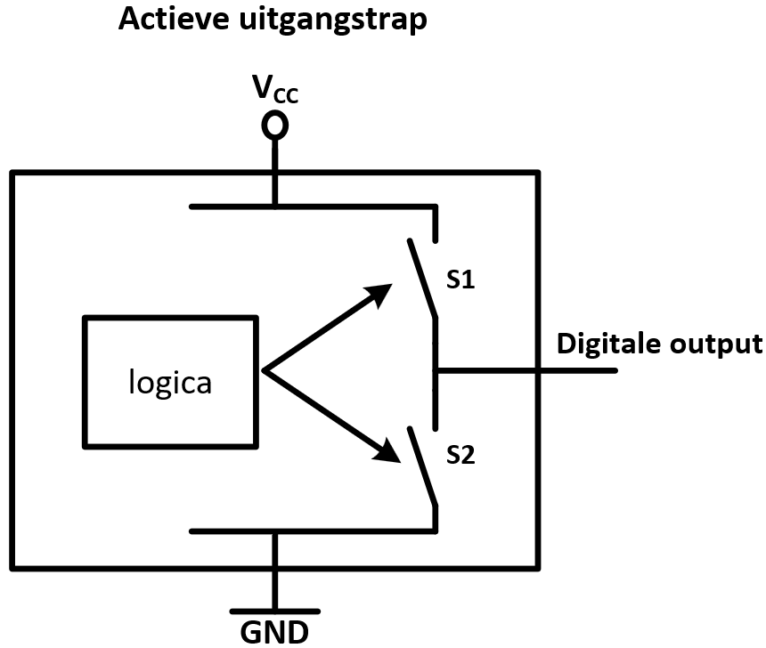
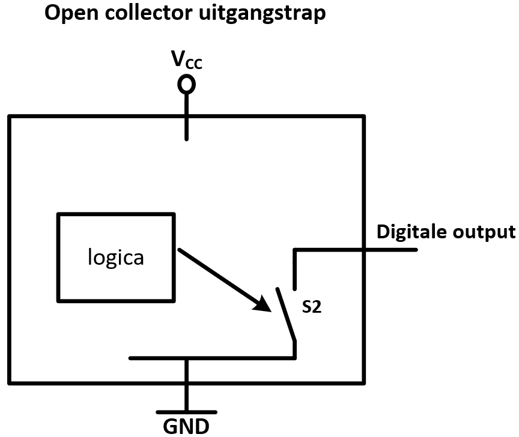
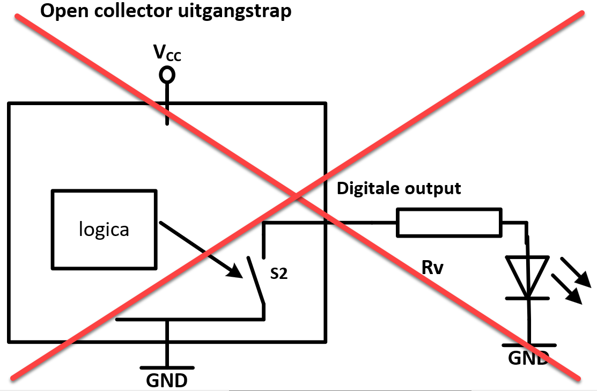
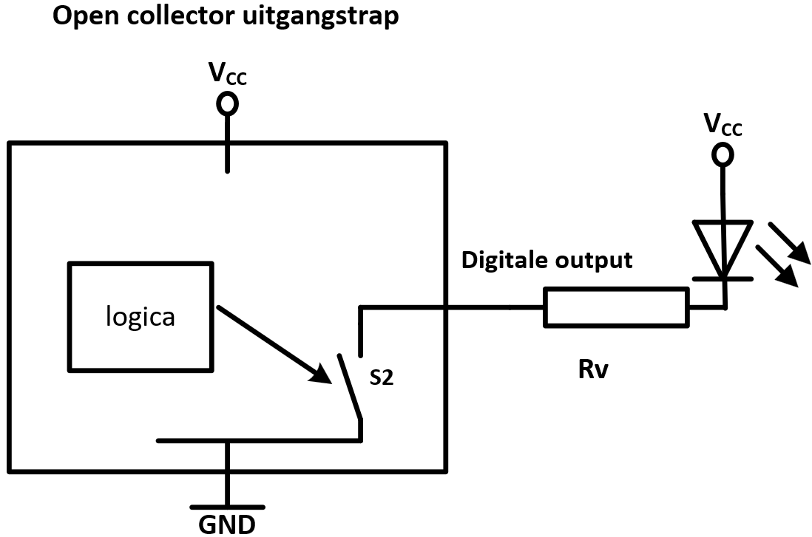

---
mathjax:
  presets: '\def\lr#1#2#3{\left#1#2\right#3}'
---

# ESP32 als I²C Master en een 8bit GPIO slave (PCF8574)

## Voorbeeld: schrijven naar een PCF8574

Een PCF8574 is een 8 bit IO-expander en wordt gebruikt om het aantal IO-pinnen uit te breiden met 8 bits. De interne werking van deze 8bit GPIO I²C slave is in volgende figuur weergegeven.


:::warning
Er bestaat ook een variant op dit IC nl. de PCF8574A en daar is het adres anders. Zoek dit desnoods op.
:::

```python
PCF8574_ADDR = 0x??????

for value in range(256):
    #schrijf 1 byte naar de slave
    i2c.writeto(PCF8574_ADDR, bytes([value]))
    #lees alle uitgangen van de slave in de vorm van 1 byte
    byte_val = (i2c.readfrom(PCF8574_ADDR, 1))
    # converting to int
    # byteorder is big where MSB is at start
    int_val = int.from_bytes(byte_val, "big") 
    #print(int_val)
    sleep(0.05)

```

> :bulb: **Opmerking:** De uitgangen van een PCF8574 zijn geen ACTIEVE UITGANGSTRAPPEN, maar OPENCOLLECTOR uitgangen!!!

## Actieve uitgangstrap versus Opencollector outputs.

Bij digitale IC's bestaan er verschillende uitvoeringsvormen van de output. De twee meest voorkomende vormen zijn ofwel een 'Actieve Uitgangstrap' of een 'Open Collector Uitgangstrap'. 

Wat is het verschil?

### Actieve Uitgangstrap

Bij een actieve uitgangstrap is inwendig in het IC bij een digtale output uitgevoerd met twee transistoren of MOSFet's. Beide componenten kan vereenvoudigd worden in een schema door schakelaars. In de volgende tekening door S1 en S2 die worden bediend door de interne logica van het IC. Als het inwendige beslist dat de output LOW moet zijn, dan wordt S2 gesloten (S1 is dan open). Beslist echter het IC dat de output HIGH moet zijn, dan wordt S1 gesloten met een open S2. Op die manier komt de output op 0 of 1 te staan.



### Open Collector uitgangstrap

Een ander IC kan dan zo uitgevoerd zijn dat de outputs ervan, als Open Collector Uitgangstrap zijn uitgevoerd. Het valt op te merken dat bij deze uitvoering de aanwezigheid van de S1 transistor-schakelaar ontbreekt.



Als de uitgang een LOW moet zijn zal de inwendige logica S2 sluiten. Als de uitgang een HIGH moet zijn, dan zal de inwendige logica S2 openen. 

Er zijn verschillende voordelen aan dit soort uitgang tov de actieve uitgangstrap. Een voordeel is dat de voedingsspanning van de aan te sturen belasting niet perse dezelfde moet zijn als de voedingsspanning van het IC zelf. Er zijn nog andere voordelen, maar hier wordt niet verder op ingegaan.

> [!IMPORTANT]  
> Er zijn wel enkele aandachtspunten wanneer een belasting (meest eenvoudig is een LED) moet worden aangestuurd. Deze kan niet geschakeld worden naar de GND. Die zou nooit oplichten. Maw een ACTIEF HOGE schakeling kan nooit werken bij een Opencollector uitgang. Actief hoog wil zeggen dat de LED zal oplichten bij een HOOG zijn van de uitgang. Er kan dus noiit een SOURCE stroom vloeien!!!



Vorige schakeling kan nooit werken.
Om een LED, of een andere belasting of verbruiker, aan te sturen kan dit enkel in een ACTIEF LAGE schakeling, dus een SINK stroom. zoals in volgende opstelling.




## Opdrachten:

<div style="background-color:darkgreen; text-align:left; vertical-align:left; padding:15px;">
<p style="color:lightgreen; margin:10px">
Opdracht1: ESP32 als I²C Master en een 8bit GPIO slave.
<ul style="color: white;">
<li>Zorg ervoor dat je met het I²C scan programma de bus kan afscannen op zoek naar een slave</li>
</ul>
</p>
</div>

***

<div style="background-color:darkgreen; text-align:left; vertical-align:left; padding:15px;">
<p style="color:lightgreen; margin:10px">
Opdracht2: ESP32 als I²C Master en een 8bit GPIO slave.
<ul style="color: white;">
<li>Schakel 8 leds op de GPIO pinnen van de slave (Rv!!!)</li>
<li>Programmeer op de 8 Leds een continu lopend looplicht.</li>
<li><b>!!!Let wel, de uitgangen zijn open-collector uitgangen. Verklaar wat dit is, en hoe moeten de Leds dan geschakeld worden?</b></li>
<li>Hoe moet een uitgang aangestuurd worden zodat de Leds oplichten?</li>
</ul>
</p>
</div>

***

<div style="background-color:darkgreen; text-align:left; vertical-align:left; padding:15px;">
<p style="color:lightgreen; margin:10px">
Opdracht3: ESP32 als I²C Master en twee 8bit GPIO slave's.
<ul style="color: white;">
<li>Schakel 8 leds op de GPIO pinnen van de ene slave.</li>
<li>Schakel 2 drukknoppen (Pullup R!!) actief laag op de andere slave.</li>
<li>Programmeer op de 8 Leds, op de ene slave de toestand van ingangen van de andere slave.</li>
</ul>
</p>
</div>

