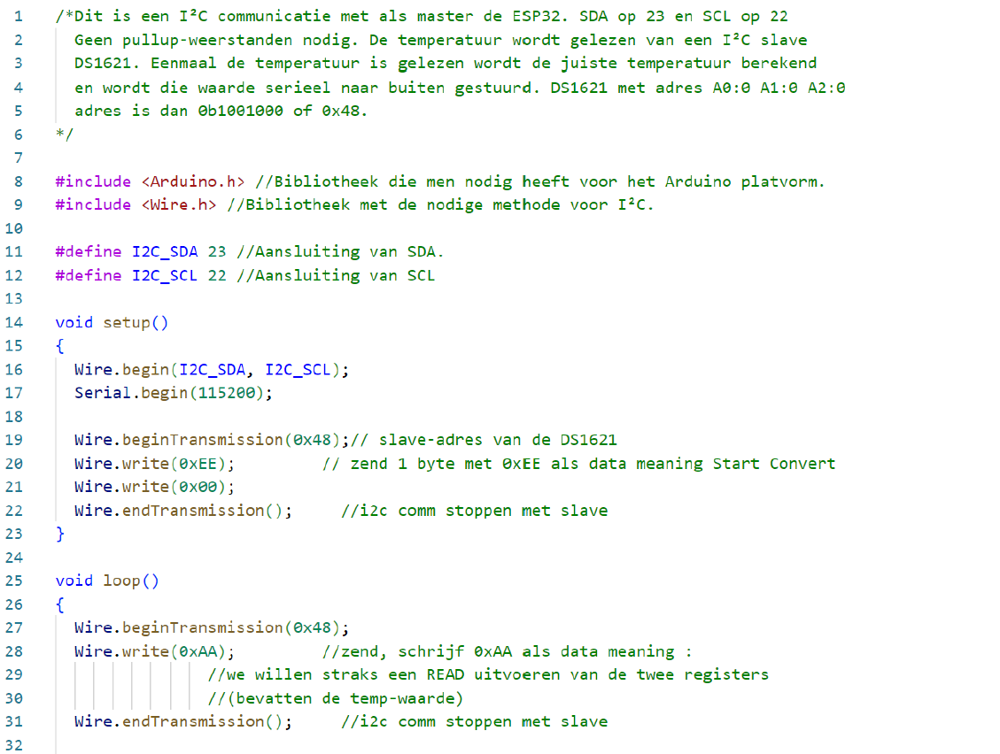

---
mathjax:
  presets: '\def\lr#1#2#3{\left#1#2\right#3}'
---

# ESP32 als I²C Master en een temperatuur sensor (DS1621)

## Voorbeeld temperatuursensor DS1621

De DS1621 is een I²C temperatuursensor waarvan het blokschema is afgebeeld in de volgende figuur. In het voorbeeld wordt het IC ingesteld op adres 0x48 door de drie adresingangen te verbinden met de voedingsspanning (=3,3V) dat resulteert in een hoog signaal dat overeenkomt met een logisch 1.

Om de temperatuur te vragen moet de slave (DS1621) geadresseerd worden. Vervolgens moet het commando gegeven worden om de temperatuur te vragen 0xEE00. Als laatste worden er twee byte gelezen met de temperatuur. De gekregen bytes staan in een **twee-complement** waarde zoals weergegeven in de volgende figuur.
Als de MSB (meest linkse bit) 1 is, dan is het een negatief getal en moet er het twee-complement genomen worden van de achterliggende bits.

:::warning
De MSB van de rechtse byte geeft weer of er een halve graad is.
:::

## Voorbeeld: software DS1621

In het onderstaande figuur wordt de code gegeven om de temperatuur van de slave door de master te laten opvragen en deze te displayen via de seriële USB communicatie.

## Opdrachten:

Opdracht: ESP32 als I²C Master en een DS1621 als slave.
<ul style="color: white;">
<li>Realiseer het programma zoals hierboven beschreven.</li>
<li>Uitbreiding1: Display de temperatuur op een LCD scherm</li>
<li>Uitbreiding2: Display de temperatuur op Gauche wijzer in NodeRed op uw laptop</li>
</ul>

