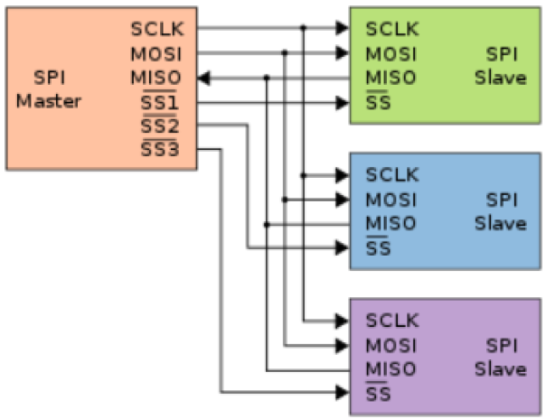
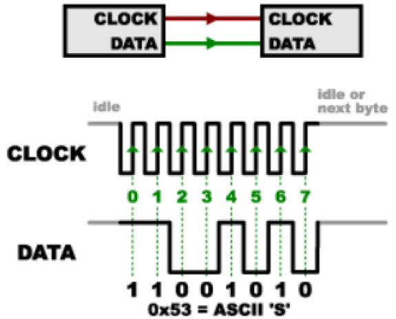
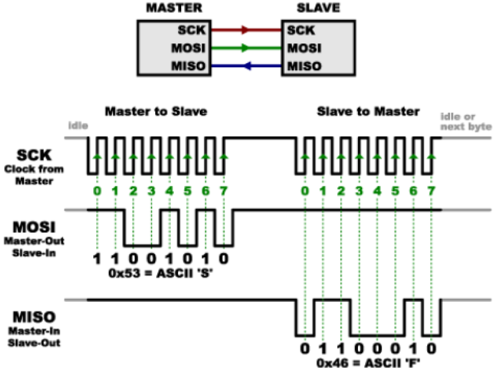
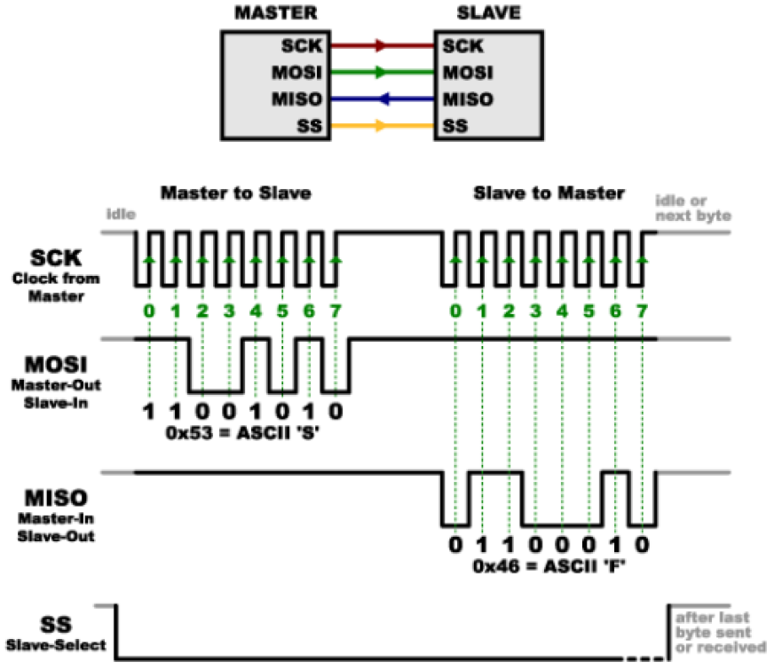
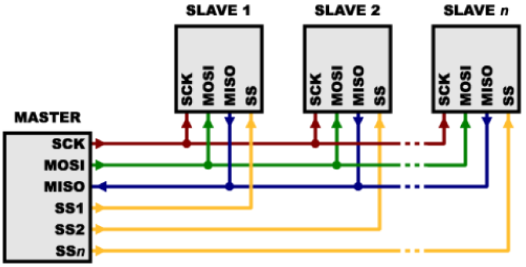
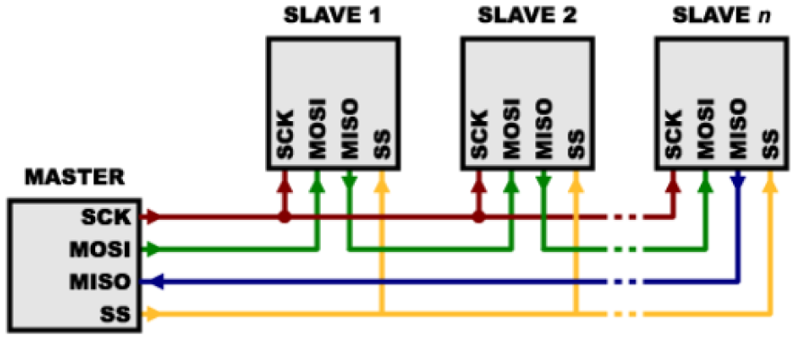

---
mathjax:
  presets: '\def\lr#1#2#3{\left#1#2\right#3}'
---

# Wat is SPI?

Serial Peripheral Interface (SPI) is een bus-interface die in de meeste gevallen bedoeld is om data uit te wisselen tussen een microcontroller en kleine randapparaten (small peripherals) zoals schuifregisters, sensoren, SD-cards, …. 

Deze bus gebruikt een afzonderlijke lijn voor clock en data. Er kunnen zich meerdere van deze randapparaten bevinden op dezelfde bus (dit in tegenstelling tot een asynchrone seriële bus). Vanuit de microcontroller wordt het device geselecteerd waarmee er moet gecommuniceerd worden door gebruik te maken van selectielijnen (=SS) zoals in de volgende figuur.

## Een Synchrone oplossing

SPI wordt een synchrone bus genoemd omdat de data synchroon op het ritme van een klok wordt verzonden. De klok is een oscillerend signaal zodat een zendend en ontvangend device perfect weet wanneer een nieuwe bit (op de datalijn) moet worden verzonden, maar ook bij de ontvanger, wanneer een nieuwe bit aangeboden wordt.
Het tijdstip dat een nieuwe bit stabiel op de datalijn aanwezig staat kan worden aangegeven door een stijgende- of dalende flank van het kloksignaal. In de datasheet wordt aangegeven welke flank er wordt gebruikt. Wanneer de ontvanger deze flank detecteert zal deze onmiddellijk de waarde op de datalijn inlezen, en zal bepalen of dit een nul of een één is afhankelijk van de waarde van de spanning op de datalijn.
Doordat de data wordt verzonden op het ritme van de klok, zijn afspraken omtrent de datasnelheid tussen zender en ontvanger hier niet nodig. Natuurlijk ligt de minimum en maximumwaarde van de klok binnen gespecifieerde grenzen en kan niet eindeloos hoger worden gemaakt.

Een reden waarom SPI zo populair is komt doordat de ontvangende hardware heel eenvoudig kan worden uitgevoerd door de implementatie van een schuifregister. Dit is veel eenvoudiger en goedkoper dan een volledige instelbare UART bij een seriële verbinding of dan bij I²C.

## Verzenden en ontvangen van data

Dit ziet er op het eerste zicht eenvoudig uit voor de verzendende data. Maar hoe zit dit in elkaar voor de ontvangende data als je bi-directioneel wil werken? Het terugsturen van data zit iets complexer in elkaar.
Bij SPI zal de master de klok genereren die wordt aangegeven door CLK of SCK (= Serial ClocK). Er is steeds één en slechts één master op de bus aanwezig. Meestal is dit de gebruikte microprocessor of microcontroller. Het is duidelijk dat er hier meerdere slaves zich op de bus kunnen bevinden zoals in de volgende figuur. Dit wil zeggen dat het een point to multipoint communicatie is omdat de data gaat van 1 punt (=de master) naar meerdere punten (= de slaves).
Wanneer er data wordt verzonden van de master naar een slave, dan wekt de master een kloksignaal op. Op het ritme van dit kloksignaal wordt de data verzonden via de MOSI (Master Out/ Slave In) lijn.
Als de data van een slave wordt verzonden naar een master dan genereert de master het kloksignaal en plaatst da slave de data op de MISO-lijn (Master In/ Slave Out).

:::warning
Let wel dat wanneer er binnen eenzelfde actie bi directioneel moet worden gewerkt dat de master de klok blijft genereren zodat de slave zijn te verzenden data hierop kan synchroniseren. Dit wil natuurlijk zeggen dat de slave zijn data op tijd moet klaar hebben want de master zal die data op specifieke klokpulsen verwachten. Een slave moet dus snel genoeg zijn.
:::

Ook de hoeveelheid data die er terug moet gestuurd worden moet op voorhand gekend zijn zodat de master voldoende lang zijn kloksignaal blijft genereren. Dit is heel verschillend bij asynchrone transmissie waar de hoeveelheid data niet moet gekend zijn waar de hoeveelheid data random kan zijn. Bij SPI is bij een READ actie dit niet het geval. Meestal is dit ook geen probleem, omdat wanneer de master een sensorwaarde wenst te weten, dan is op voorhand gekend uit hoeveel bytes die waarde zal bestaan. Een slave zal enkel zijn gegevens kunnen meedelen aan de master als de master dit vraagt. Dus op commando van de master (dit is een vorm van polling).

Als bijvoorbeeld een commando read data naar een device wordt gezonden, dan weet je dat dit device data zal terugsturen met het antwoord. Je weet ook uit hoeveel bytes het antwoord zal bestaan. Als je echter in bepaalde omstandigheden niet zou weten uit hoeveel data het antwoord bestaat, dan zou er kunnen afgesproken worden met de slave dat bijvoorbeeld de eerste twee bytes zullen aangeven uit hoeveel databytes het antwoord bestaat.

In principe is de SPI-bus full-duplex (hebben gescheiden send en receive lijnen), en er kan dus in bepaalde omstandigheden simultaan bi directioneel gecommuniceerd worden (gelijktijdig zenden en ontvangen). Bijvoorbeeld: er zou aan een SPI-sensor een nieuwe waarde kunnen worden opgevraagd terwijl die sensor nog bezig is met het terugzenden van een vorige waarde. Datasheets van SPI-devices verklaren of dit mogelijk is.

## Selecteren van slaves (Slave Select) 

Er is nog een belangrijke lijn die moet verklaard worden. Dit is de SS-lijn en staat voor Slave Select. Deze lijn zal door de master worden geactiveerd wanneer men met een specifieke slave wenst te communiceren. Het is ook een soort Wake-Up lijn voor een bepaalde slave. Bij gebruik van meerdere slaves op de SPI-bus zal de master hiermee ook de juiste slave selecteren. Niet geselecteerde slaves luisteren dan niet naar wat er als data op de bus gebeurt.

De SS-lijn wordt normaal hoog gehouden. Dit zorgt ervoor dat de slave gedisconnecteerd is van de SPI-bus. Een dergelijke logica is gekend als actief laag (=active low), dit is heel frequent voor bij enable- en reset lijnen. Net voordat de master wenst data te sturen naar de slave wordt deze lijn laag gebracht (dus actief). Dit activeert de slave. De slave luistert nu naar alle data die er op de bus wordt geplaatst. Eventueel stuurt de slave ook data terug. Wanneer de master klaar is met de slave, en er geen data meer moet uitgewisseld worden, zal deze lijn opnieuw hoog worden gemaakt. Op eenzelfde tijdstip mogen er nooit twee of meerdere slave select lijnen laag zijn.

## Meerdere slaves
Er zijn twee manieren om meerdere slaves aan te sluiten op en SPI-bus:
>- Normale mode
>- Daisy-chain mode

### Normale mode
In normale werking zal iedere slave een aparte SS-lijn hebben tussen de master en de slave. Om te communiceren met een specifieke slave, zal de master die specifieke SS-lijn naar slave actief laag maken, een kloksignaal opwekken en data uitwisselen met die slave. Alle andere SS-lijnen naar alle andere slaves moeten hoog (niet actief) gemaakt zijn gedurende het voorgaande proces. Dit wil zeggen dat bij gebruik van vele slaves er dus vele SS-lijnen nodig zullen zijn.

### Daisy-chain mode
In de daisy-chain mode worden de slaves na elkaar aangesloten en de eerste slave is verbonden met de master. Hierbij loopt de MOSI-lijn van de master naar de eerste slave in het device. De MISO van deze slave is dan op zijn beurt verbonden met de MOSI van de tweede slave, en zo verder. Bij de laatste slave is dan de MISO-uitgang verbonden met de MISO-ingang van de master (wordt wel heel regelmatig weggelaten, in de veronderstelling dat dit type device enkel data kan ontvangen van de master). Alle selectielijnen van alle slaves hangen hier aan elkaar. Om de verschillende slaves aan te spreken wordt dus data ingeschoven via de eerste slave tot bij de noodzakelijke slave. Eens alle data is verzonden vanuit de master kan de selectielijn inactief worden gemaakt. Een typisch voorbeeld van een dergelijke opstelling is terug te vinden bij een adresseerbare SPI Led-strip.

Er is dus data overloop (overflow) van de ene slave naar de andere. Als dus bepaalde data een specifieke slave moet bereiken, dan moet er genoeg data gestuurd worden opdat die op de specifieke slave kan aankomen. Het is ook duidelijk dat de eerst verzonden data de laatste slave zal bereiken als voor iedere slave data is verzonden.

Dit type layout is typisch voor een output-only opstelling, zoals het aansturen van LEDs, waar er geen nood is aan het terugontvangen van data door de master. In deze gevallen wordt meestal de master’s MISO-line niet geconnecteerd. Is er in bepaalde gevallen wel nood aan terugkerende data, dan moet de daisy-chain verbinding gesloten worden door de MISO van de master te verbinden met de laatste slave. Let er wel op dat gedurende het inschuiven van de data er allemaal enen zullen worden ingeschoven in de MISO van de Master. Er moet dus voldoende data worden ingeschoven om data terug te kunnen inlezen door de master.

## Voordelen SPI
>- Het is sneller dan asynchrone seriële communicatie (hoge kloksnelheid mogelijk tot 12,5 MHz);
>- De hardware is eenvoudig;
>- Het protocol ondersteunt meerdere slaves.
## Nadelen SPI
>- Er zijn meer lijnen nodig dan bij een seriële communicatie waarbij er enkel een TX en RX is;
>- De communicatie moet volgens vaste patronen gebeuren. Er kan niet zomaar data worden verstuurd;
>- De master moet alle communicatie regelen. Slaves kunnen niet zelfstandig communiceren;
>- Er zijn meestal gescheiden SS-lijnen nodig, voor iedere slave één.

Er dient nog opgemerkt te worden dat er respect moet zijn op vlak van de spanningsniveaus. Wanneer een microcontroller op een voedingsspanning werkt van 5V, dan zal zijn SPI-bus ook met die spanningen werken. Dus ook de slaves werken best op deze spanning. Er zijn ook meer en meer processoren die met een voedingsspanning werken van 3,3V. Dus zal de bus hier met deze spanningen werken. Als er een mix is van voedingsspanningen dient er op gelet te worden dat er zich geen conflicten voordoen. Zo'n conflict kan de hardware van devices beschadigen. Wees hier voorzichtig.

