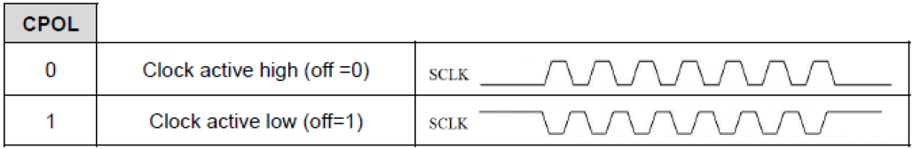

---
mathjax:
  presets: '\def\lr#1#2#3{\left#1#2\right#3}'
---


# SPI met een ESP32

De ESP32 heeft 4 SPI-bussen, namelijk SPI0, SPI1, SPI2 en SPI3. SPI0 en SPI1 worden intern gebruikt voor het communiceren met het ingebouwde flash-geheugen en kan je niet gebruiken. SPI2 en SPI3 kan je gebruiken. SPI2 wordt ook wel HSPI genoemd en SPI3 VSPI.

Beide bussen kunnen gebruikt worden. Standaard wordt er meestal gebruik gemaakt van VSPI of SPI3. Daarbij zijn de aansluitingen:
>- SCK = pin 5
>- MOSI = pin 18
>- MISO = pin 19
>- SS = pin 33

Als er gebruik gemaakt wordt van HSPI, dan zijn de aansluitingen:
>- SCK = pin 14
>- MOSI = pin 13
>- MISO = pin 12
>- SS = pin 15


De SPI gaan wij bij de ESP32 bijna altijd gebruiken als master en daarbij worden de standaard SPI-aansluitingen gebruikt.

## Includen van de SPI- bibiotheek
Om de SPI-interface te gebruiken moet je de bibliotheek ‘SPI.h’ includen in het begin van het programma zoals in volgende code.

```cpp
#include <Arduino.h>
#include <SPI.h>
```

## Initialisatie van de SPI
In de setup wordt de init gedaan. Daarbij is het belangrijk om alle Chip-selects in te stellen als uitgang en deze actief hoog te maken.
Vervolgens worden de SPI-bus instellingen zoals SCK,MOSI, MISO geïnitialiseerd door de methode begin te gebruiken.

```cpp
  SPI.begin();
```

Vervolgens zal je per SPI-device die je wil aansturen een object voor de instellingen maken. Dit is een object van het type SPI-settings:


Meer over de data-richting en modes wordt behandeld in paragraaf De klokpolariteit (CPOL) en de klokfase (CPHA)

## De klokpolariteit (CPOL) en de klokfase (CPHA)
De master moet ook de ‘clock polarity’ (CPOL) en de ‘Clock phase’ instellen.
Bij de klokpolariteit moet de master instellen of het kloksignaal actief-hoog of actief laag moet zijn. Dit is afhankelijk van de slave waarmee men wil communiceren.



De fase van de klok moet eveneens door de master ingesteld worden en dit is afhankelijk van de slave waarmee men wil communiceren.


De instellingen van CPOL en CPHA leiden tot 4 modes zoals in Tabel


Over het algemeen zijn SPI-apparaten ontworpen om in een van de vier modi te werken en dit wordt beschreven in de datasheet van de slave.

## Versturen van data naar een SPI-slave
Om een byte te versturen naar een slave wordt de methode transfer gebruikt. Aan de methode wordt de versturen data meegegeven als argument zoals lijn 23 in de volgende figuur.


## Ontvangen van data naar een SPI-slave.
Om een byte te lezen van een slave wordt de methode transfer gebruikt. Er wordt data meegegeven aan de methode. De waarde van de data is niet van belang. Er moet data meegestuurd worden zodat de microcontroller de klok genereerd zodat de slave de data op de MISO kan plaatsen. De methode transfer geeft de gelezen byte terug en deze wordt in een variabele geplaatst zoals lijn 24 in de volgende figuur.


## Een eenvoudige SPI-communicatie
Er wordt bij de master (onze microcontroller) een SPI-instantie van de SPI-klasse aangemaakt waarbij er wordt weergegeven welk IO-pinnen er gebruikt worden voor de SCLK, MISO en MOSI.
Een SPI-gegevensoverdracht wordt als volgt door het masterapparaat geïnitieerd:
>- De master configureert eerst de SPI-klok (SCLK) met een frequentie die wordt ondersteund door de ontvangende slave (tot 70 MHz), samen met de datarichting en de mode.
>- De master stelt het chip-select signaal (CS) van de ontvangende slave in op 0V zodat de slave weet dat de aankomende data voor hem is.
>- De master start vervolgens met de klokpulsen door de klok SCLK te genereren om aan te geven dat er gegevens moeten worden overgedragen.
>- De master verzendt gelijktijdig gegevens als opeenvolgende bits op de MOSI.
>- De slaaf retourneert gegevens op dezelfde manier op de MISO-aansluiting.
>- Na het zenden maakt de master het chip-select signaal (CS) van de ontvangende hoog (= 3,3V° zodat de slave weet dat de communicatie wordt beëindigd.


