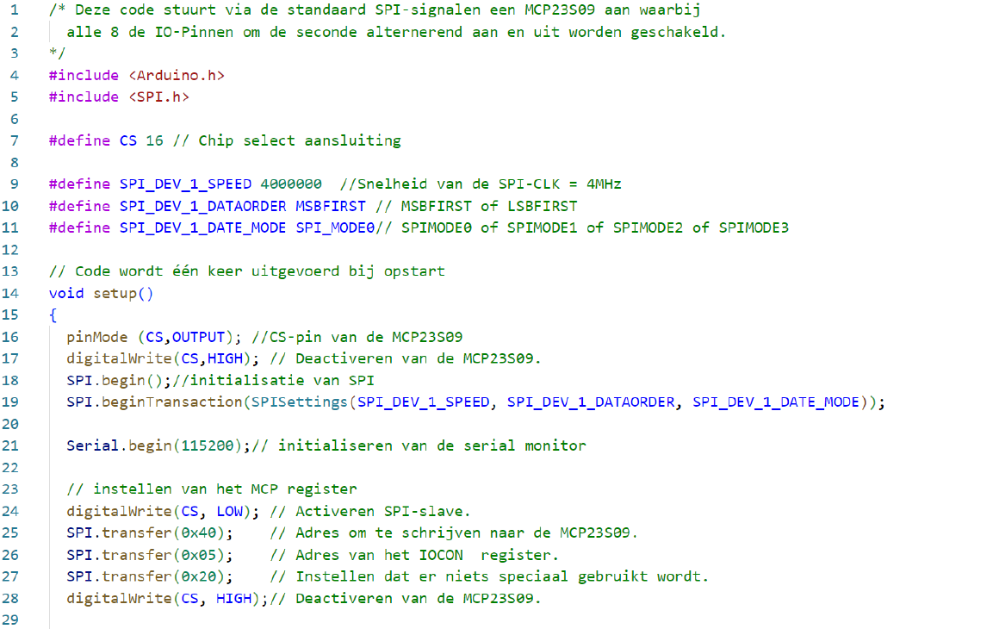
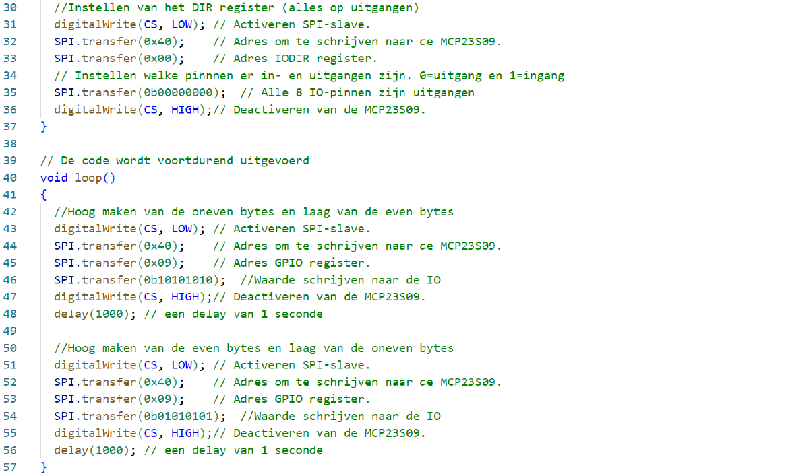

---
mathjax:
  presets: '\def\lr#1#2#3{\left#1#2\right#3}'
---

# Aansturen van een MCP23S09 SPI-IO-expander

In de volgende figuur wordt een blokschema van MCP23S09 weergegeven. Het IC kan gebruikt worden om via SPI of I²C het aantal IO-pinnen uit te breiden met 8.

Met volgende code:

## Opdrachten:

Opdracht1: ESP32 als SPI Master en een 8bit GPIO slave.
<ul style="color: white;">
<li>Voor een ontwerp met een ESP32 feather van Adafruit heeft men te weinig uitgangen en wil men deze uitbreiden met een MCP23S09.</li>
<li>Bouw een schema met de ESP32 feather van Adafruit, de ESP32 shield en een MCP23S09 waarbij men de toestand van 2 drukknoppen op de shield weergeeft op 2 leds die aangesloten zijn op de IO-expander.</li>
<li>Sluit 2 rode leds aan met een voorschakelweerstand. Zorg dat de stroom door de leds niet groter wordt dan 5mA. Bereken zelf de voorschakelweerstand.</li>
<li>Sluit een led aan op GP0 en op GP7.</li>
<li>Gebruik SW1 en SW4 van de ESP32 shield.</li>
<li>Als de drukknop SW1 wordt ingedrukt moet de led op GP0 branden. Als SW1 wordt ingedrukt niet is ingedrukt moet GP0 niet branden.</li>
<li>Als de drukknop SW4 wordt ingedrukt moet de led op GP7 branden. Als SW4 wordt ingedrukt niet is ingedrukt moet GP7 niet branden.</li>
<li>Men gebruikt wel SPI maar de adressen moeten hier ook juist aangesloten zijn. Zowel hardwarematig als softwarematig.</li>
<li>Bouw, programmeer en test</li>
</ul>

