---
mathjax:
  presets: '\def\lr#1#2#3{\left#1#2\right#3}'
---

# Aansturen van een adresseerbare ledstrip (daisy-chain)

## Inleiding
De adresseerbare ledstrip met referentie APA102 is een ledstrip waarvan iedere kleur apart is in te stellen. Deze ledstrip is afgebeeld in de volgende figuur.

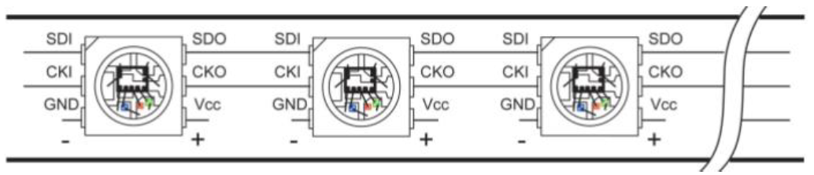

De ledstrip is aan te sturen via de SPI-interface waarbij er enkel gebruik gemaakt wordt van het klok -en MOSI-signaal. Iedere led wordt aan elkaar verbonden wat men Daisy-chain noemt. De data-out (DO) (1) van een led wordt verbonden met de data-in (DI) (2) van de volgende led. Iedere led heeft ook een voeding (Vcc = 5V en GND).

## Werking
Via SPI wordt het kloksignaal en de data via de MOSI verstuurd. Een ChipSelect heeft men in daisy-chain mode niet nodig.

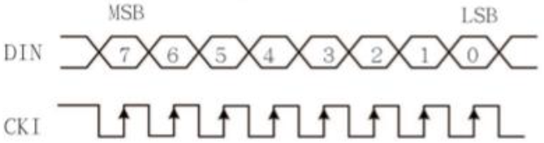

Meerdere slave’s kan men in deze mode niet besturen.
Bij het begin van aansturen begint men altijd met een Startframe, vervolgens de Data van de leds en op het einde een End Frame zoals in de volgende figuur.

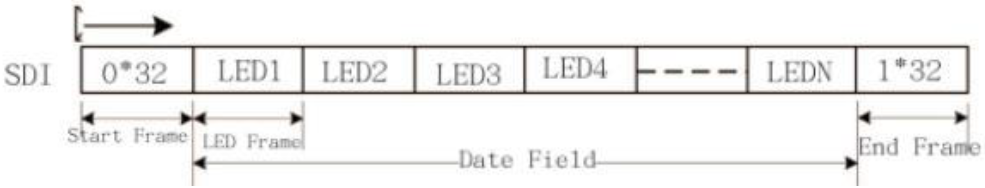

### Start Frame
Een start Frame bestaat uit 32 bits. Deze kan je opsplitsen in 4 keer 8 bits. Alle 32 bits hebben de waarde 0.

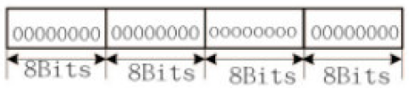

### Data Field
Het datafield bestaat uit N-aantal led frames, waarbij N staat voor het aantal leds waaruit de lestrip bestaat. Een led frame bestaat uit 32 bits. Die 32 bits bestaan uit 4 blokken van 8 bit.

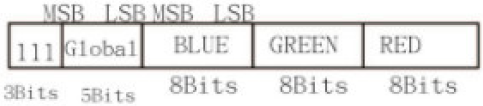

Het eerste blok van 8 bit stelt de helderheid van de led voor. De eerste 3 bit zijn altijd 1. De volgende 5 bit stelt de helderheid van de led voor. Met 5 bit kan men 25^5 = 32 verschillende getallen kan maken van 0 tot en met 31. Waarbij 0 gelijk staat aan 0/31e van de maximum helderheid en waarbij 31 staat voor 31/31e van de maximumhelderheid (= volle lichtsterkte).

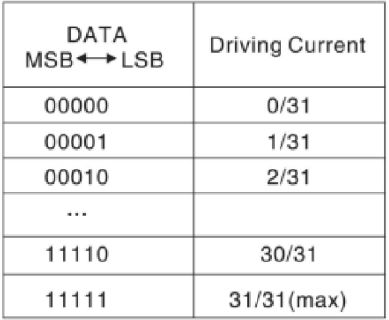

De volgende 3 blokken stellen de waarde van de kleur blauw, groen en rood voor. Iedere kleur wordt voorgesteld door 8 bit. Dit wil zeggen dat men 28 = 256 verschillende getallen kan maken van 0 tot en met 255.

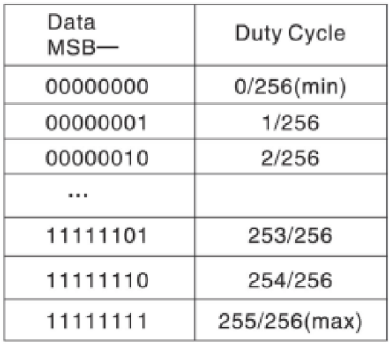

### End Field
Een start Frame bestaat uit 32 bits. Deze kan je opsplitsen in 4 keer 8 bits. Alle 32 bits hebben de waarde 1.

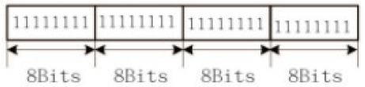

## Hardware

Om de ledstrip te sturen heeft men een SPI-interface nodig. De SPI-interface kan men enkel voor de ledstrip gebruiken en niet voor nog eventuele andere SPI-slaves omdat de leds van de strips in daisy-chain zijn verbonden. De leds hebben een voedingspanning nodig van 5V. Het vermogen van de 5V is afhankelijk uit hoeveel leds de ledstrip bestaat. Op de ledstrip staan er 60/leds per meter en één meter verbruikt maximum 14W. Dit wil zeggen dat 1 led maximum 233,33mW verbruikt (=14𝑊60). De stroom dat één led nodig heeft is 46,67mA (=233,33𝑚𝑊5𝑉).
Ieder kleur van één led verbruikt maximum 15,55mA (=46,67𝑚𝐴3).

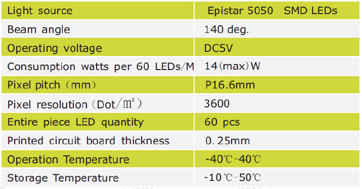

We gebruiken een ledstrip die bestaat uit 5 leds. Het schema is afgebeeld in volgende figuur.

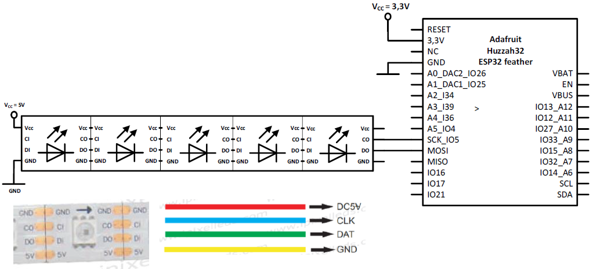

## Flowchart

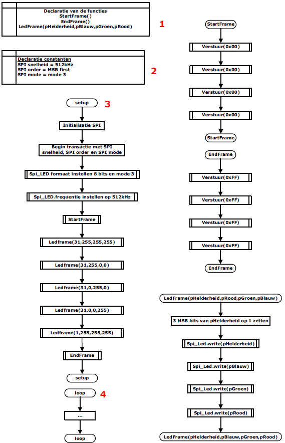

## Software

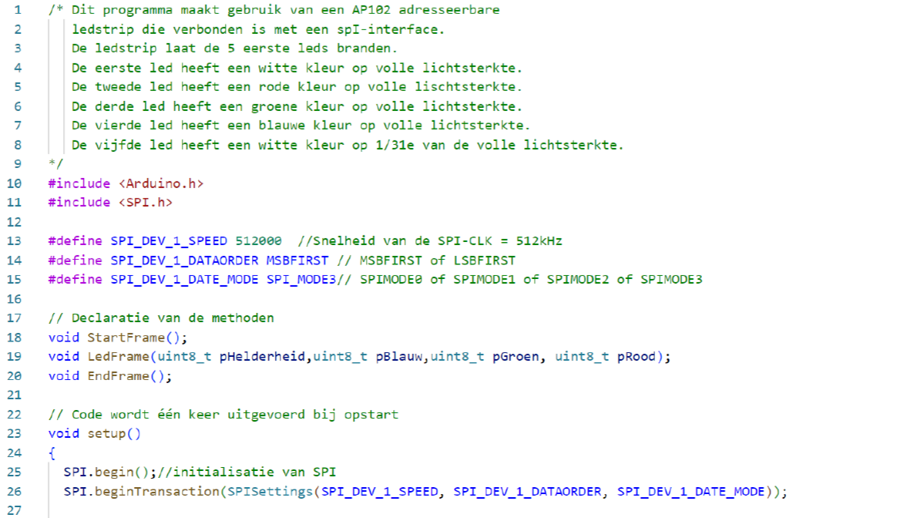
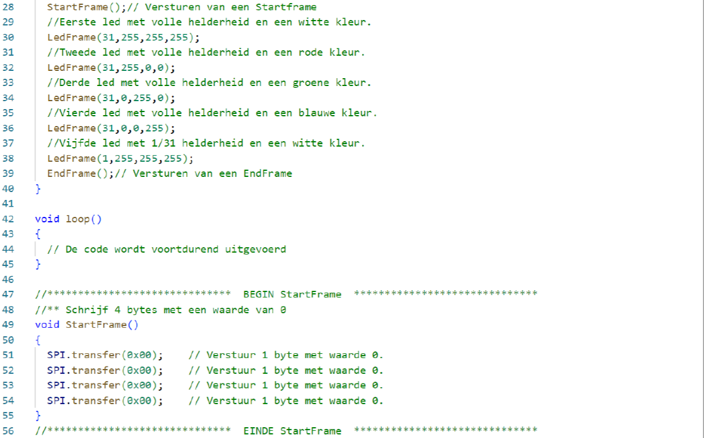
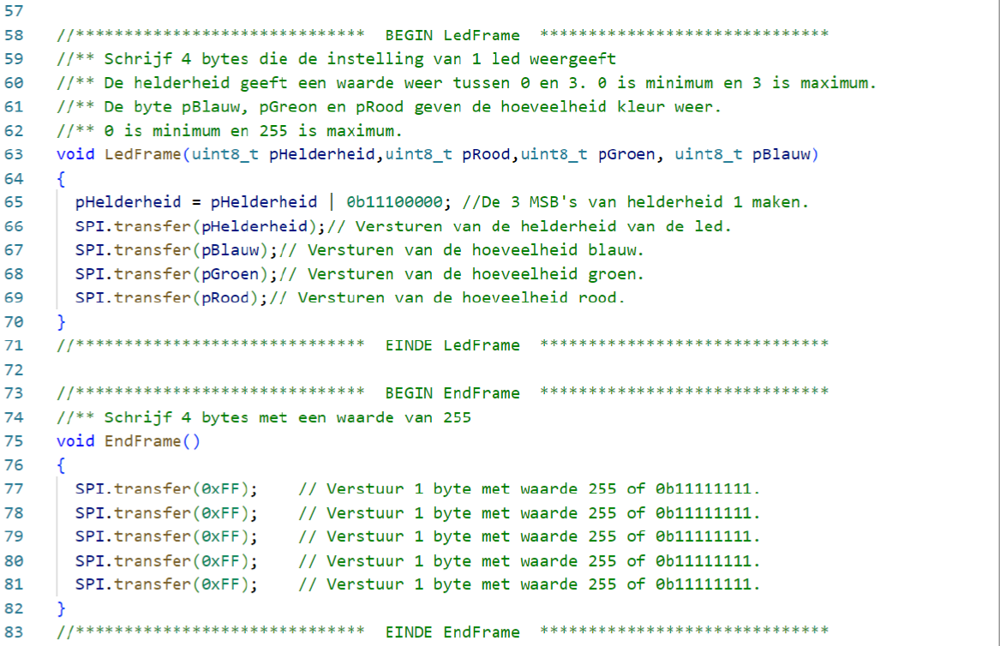

## Opdrachten:

Opdracht1: ESP32 als SPI Master en een SPI Ledstrip.
<ul style="color: white;">
<li>Sluit een adresseerbare ledstrip van 5 leds aan op de ESP32 microcontroller.</li>
<li>Maak een looplicht met de kleur rood zodat er telkens maar 1 led brandt die gaat van links naar rechts. Laat de led 4 keer heen en weer lopen. De led loopt met een interval van 100msec.</li>
<li>Nadien doe je hetzelfde voor de blauwe, groene en rode kleur.</li>
<li>Al het voorgaande doe je in een oneindige lus.</li>
<li>Gebruik de hoogste lichtsterkte.</li>
<li>Bouw, programmeer en test</li>
</ul>

