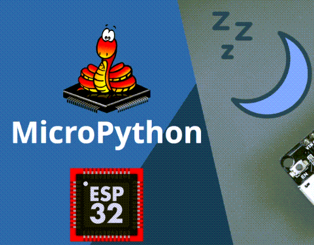
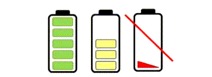

---
mathjax:
  presets: '\def\lr#1#2#3{\left#1#2\right#3}'
---

# Introductie?

This tutorial shows how to put the ESP32 in deep sleep mode and wake it up using different wake up sources using MicroPython firmware. We’ll cover timer wake up and external wake up.

The ESP32 can also be awaken from deep sleep using the touch pins by defining a threshold.

## Wat is Deep Sleep?

Having your ESP32 running on active mode with batteries it’s not ideal, since the power from batteries will drain very quickly.

If you put your ESP32 in deep sleep mode, it will reduce the power consumption and your batteries will last longer. Having the ESP32 in deep sleep mode means cutting with the activities that consume more power while operating but leave just enough activity to wake up the processor when something interesting happens.

When operating in deep sleep mode, the ESP32 have a current consumption on the μA range. With a custom and carefully designed board you can get a minimal comsumption of only 5 μA. However, if you use a full-feature ESP32 development board with built-in programmer, on-board LEDs, and so on (like the ESP32 DOIT board) you won’t be able to achieve such a low power state, but you can still save power.

## Wake Up Sources

After putting the ESP32 into deep sleep mode, there are several ways to wake it up:

> - You can use the timer: waking up the ESP32 after predefined periods of time.
> - You can use an external wake up: this means the ESP32 can wake up when a change in the state of a pin occurs.
> - You can use the touch pins: implemented, but not working as expected at the time of writing, so we won’t cover this at the moment;
> - You can use the ULP co-processor to wake up: we haven’t tested this feature yet.

